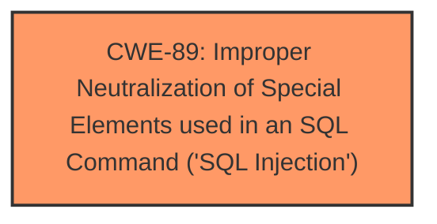

# Raw Analyzer Response for CVE-2025-3973

# Summary

| CWE ID  | CWE Name                                                                          | Confidence | CWE Abstraction Level | CWE Vulnerability Mapping Label | CWE-Vulnerability Mapping Notes |
| :-------- | :---------------------------------------------------------------------------------- | :--------- | :---------------------- | :------------------------------ | :------------------------------ |
| CWE-89  | Improper Neutralization of Special Elements used in an SQL Command ('SQL Injection') | 1.0        | Base                    | Primary                         | Allowed                         |

## Evidence and Confidence

*   **Confidence Score:** 1.0
*   **Evidence Strength:** HIGH

## Relationship Analysis

The primary relationship is that CWE-89 stands alone as the root cause of the SQL injection vulnerability described. No parent-child or chain relationships are directly relevant in this simplified scenario. The focus is solely on the **improper neutralization** of input leading to SQL injection.

## Vulnerability Chain

The vulnerability chain is simple:
1.  **Root Cause:** **Improper neutralization** of input (`mobnumber`) leading to CWE-89.
2.  **Impact:** SQL Injection.

## Summary of Analysis

The analysis is based on the provided vulnerability description, which explicitly states that the manipulation of the `mobnumber` argument leads to **SQL injection** in `/check_availability.php`. The **weakness** is directly identified as **SQL injection**.

The evidence from the vulnerability description key phrases:
- **weakness:** **sql injection**
- **vector:** manipulation of argument mobnumber

The Retriever Results also strongly suggest CWE-89 as the primary candidate, with a score of 1.0.

CWE-89 is selected because the vulnerability description clearly indicates an **SQL injection** due to the **improper neutralization** of the `mobnumber` argument. This aligns directly with the definition of CWE-89, which focuses on the **improper neutralization** of special elements used in an SQL command. The abstraction level is Base, which is the preferred level.

Other CWEs Considered and Rejected:

*   CWE-79 (Improper Neutralization of Input During Web Page Generation ('Cross-site Scripting')): While input neutralization is a general concern, the specific vulnerability is **SQL injection**, making CWE-89 a more precise fit.
*   CWE-434 (Unrestricted Upload of File with Dangerous Type): This is not relevant because the vulnerability does not involve file uploads.
*   CWE-74 (Improper Neutralization of Special Elements in Output Used by a Downstream Component ('Injection')): CWE-74 is a class-level CWE and is too generic. The specific case is **SQL injection**, and CWE-89 is a better fit.

Relevant CWE Information:

# Enhanced Context (25 CWEs)
The following CWEs were identified as potentially relevant to this vulnerability:

## CWE-89: Improper Neutralization of Special Elements used in an SQL Command ('SQL Injection')
**Abstraction Level**: Base
**Similarity Score**: 0.78
**Source**: dense

**Description**:
The product constructs all or part of an SQL command using externally-influenced input from an upstream component, but it does not neutralize or incorrectly neutralizes special elements that could modify the intended SQL command when it is sent to a downstream component. Without sufficient removal or quoting of SQL syntax in user-controllable inputs, the generated SQL query can cause those inputs to be interpreted as SQL instead of ordinary user data.

**Mapping Guidance**:
- Usage: Allowed
- Rationale: This CWE entry is at the Base level of abstraction, which is a preferred level of abstraction for mapping to the root causes of vulnerabilities.