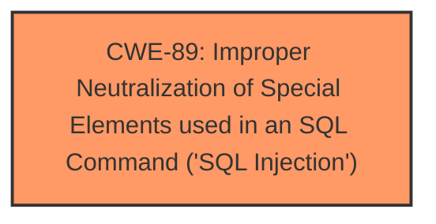

# Analysis Report for CVE-2025-3976

# Vulnerability Analysis Report: CVE-2025-3976

## Description

A vulnerability was found in PHPGurukul COVID19 Testing Management System 1.0. It has been classified as critical. Affected is an unknown function of the file /new-user-testing.php. The manipulation of the argument mobilenumber leads to **sql injection**. It is possible to launch the attack remotely. The exploit has been disclosed to the public and may be used. Other parameters might be affected as well.

## Vulnerability Description Key Phrases

- **Weakness:** sql injection
- **Vector:** manipulation of mobilenumber argument
- **Product:** PHPGurukul COVID19 Testing Management System
- **Version:** 1
- **Component:** /new-user-testing.php

## Analysis (with Relationship Data)

# Summary
| CWE ID | CWE Name | Confidence | CWE Abstraction Level | CWE Vulnerability Mapping Label | CWE-Vulnerability Mapping Notes |
|---|---|---|---|---|---|
| **CWE-89** | **Improper Neutralization of Special Elements used in an SQL Command ('SQL Injection')** | 1.0 | Base | Primary | Allowed |

## Evidence and Confidence

*   **Confidence Score:** 1.0
*   **Evidence Strength:** HIGH

## Relationship Analysis
The primary relationship identified is that CWE-89 stands alone as the root cause. No other parent-child or chain relationships are relevant in this case. The abstraction level is Base, which is the preferred level.



## Vulnerability Chain
The vulnerability chain starts with the **improper neutralization of special elements used in an SQL command**, leading directly to **SQL Injection**.

## Summary of Analysis
The vulnerability description clearly states that the manipulation of the `mobilenumber` argument leads to **sql injection** in the `/new-user-testing.php` file of the PHPGurukul COVID19 Testing Management System 1.0. The vulnerability can be exploited remotely.

The Retriever Results list CWE-89 as the top candidate with a score of 1.0, which aligns perfectly with the vulnerability description.

CWE-89 (Improper Neutralization of Special Elements used in an SQL Command ('SQL Injection')) is the most appropriate CWE because the vulnerability description explicitly mentions **SQL Injection** as the weakness.

Other CWEs such as CWE-79 (Improper Neutralization of Input During Web Page Generation ('Cross-site Scripting')), CWE-434 (Unrestricted Upload of File with Dangerous Type), and CWE-1336 (Improper Neutralization of Special Elements Used in a Template Engine) were considered, but they do not align with the specific details of this vulnerability, which is focused on **SQL Injection**. CWE-74 (Improper Neutralization of Special Elements in Output Used by a Downstream Component ('Injection')) is a Class level CWE and per mapping guidance, it is discouraged when a lower-level weakness is more appropriate.


## CWE Relationship Analysis

Current CWEs represent these abstraction levels: .


### Vulnerability Chain Analysis

**Chain starting from CWE-89:**
- 89 (Improper Neutralization of Special Elements used in an SQL Command ('SQL Injection')) - ROOT


**Chain starting from CWE-79:**
- 79 (Improper Neutralization of Input During Web Page Generation ('Cross-site Scripting')) - ROOT


### CWE Relationship Diagram

```mermaid
graph TD
    classDef primary fill:#f96,stroke:#333,stroke-width:2px
    classDef secondary fill:#69f,stroke:#333
    classDef tertiary fill:#9e9,stroke:#333
```


*Report generated on 2025-07-14 22:32:53*
