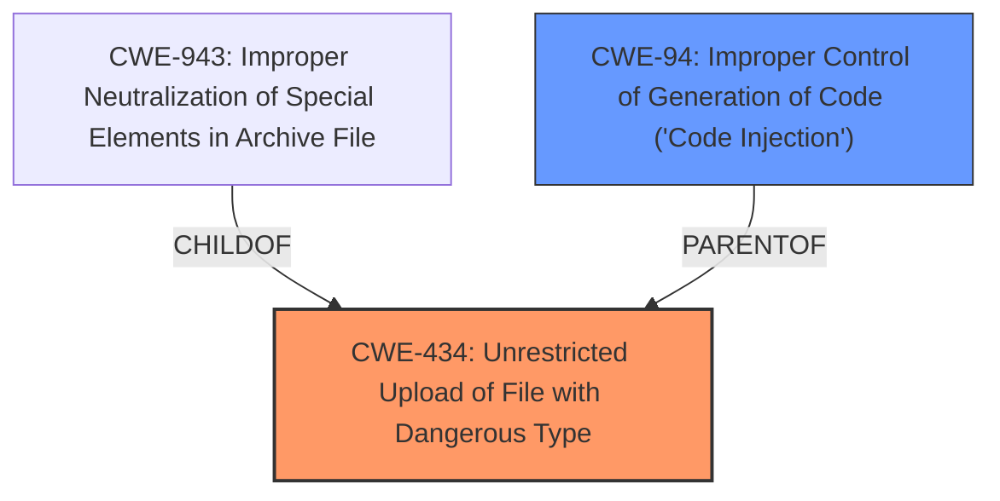

# Analysis Report for CVE-2025-4006

# Vulnerability Analysis Report: CVE-2025-4006

## Description

A vulnerability classified as critical has been found in youyiio BeyongCms 1.6.0. Affected is an unknown function of the file /admin/theme/Upload.html of the component Document Management Page. The manipulation of the argument File leads to **unrestricted upload**. It is possible to launch the attack remotely. The exploit has been disclosed to the public and may be used.

## Vulnerability Description Key Phrases

- **Weakness:** unrestricted upload
- **Vector:** File argument
- **Product:** youyiio BeyongCms
- **Version:** 1.6.0
- **Component:** /admin/theme/Upload.html

## Analysis (with Relationship Data)

# Summary
| CWE ID | CWE Name | Confidence | CWE Abstraction Level | CWE Vulnerability Mapping Label | CWE-Vulnerability Mapping Notes |
|---|---|---|---|---|---|
| CWE-434 | Unrestricted Upload of File with Dangerous Type | 1.0 | Base | Allowed | Primary CWE |
| CWE-94 | Improper Control of Generation of Code ('Code Injection') | 0.5 | Base | Allowed-with-Review | Secondary Candidate |

## Evidence and Confidence

*   **Confidence Score:** 0.75
*   **Evidence Strength:** MEDIUM

## Relationship Analysis
The primary relationship that influenced the selection was the direct match of the "**unrestricted upload**" to CWE-434. While CWE-94 is a parent, the details provided in the vulnerability description point more directly to a dangerous file upload issue than generic code injection. The retriever results supported this, with CWE-434 having a high relevance score.



## Vulnerability Chain
The vulnerability chain starts with the **unrestricted upload** (CWE-434), which allows an attacker to upload a malicious file. If the server executes this file, it leads to code execution.

## Summary of Analysis
The initial assessment strongly points to CWE-434 due to the direct mention of "**unrestricted upload**" in the vulnerability description, and the CVE reference further details how this leads to remote code execution. The retriever results also support this, with CWE-434 having a high relevance score.

The evidence from the "Vulnerability Description Key Phrases" section is:
*   **weakness:** **unrestricted upload**

The evidence from the "CVE Reference Links Content Summary" section is:
*   Two file upload vulnerabilities exist in BeyongCms 1.6.0.
*   The first vulnerability is in the admin/controller/Theme upload method. An attacker can upload a zip file containing a malicious PHP file via the document management section after logging into the backend. The file is then extracted based on a file ID. An attacker can exploit this by crafting a request to the /admin/theme/upload.html endpoint with a known or bruteforced fileId, leading to arbitrary file upload and remote code execution (RCE).
*   The second vulnerability is in the common/controller/File upload method, utilizing the ThinkPHP native file upload function. While file extensions are restricted, the `exts` parameter in the request allows an attacker to specify the allowed file extensions, bypassing the original restrictions. An attacker can upload a file with an extension like `.html` by setting the `exts` parameter to html via a POST request. If the server supports parsing of the uploaded extension, this can lead to remote code execution (RCE).

CWE-94 was considered because an "**unrestricted upload**" of a file can lead to code injection/execution. However, without further information explicitly detailing code injection, CWE-434 is the more accurate and specific classification. I am including CWE-94 as a secondary candidate with a lower confidence.

Relevant CWE Information:

## CWE-434: Unrestricted Upload of File with Dangerous Type
**Technical Explanation:** The vulnerability allows an attacker to upload files without proper restrictions on the file type. This can lead to the execution of malicious code on the server if the uploaded file is a script or executable.
**Security Implications:** Remote code execution, server compromise.
**Relationship Analysis:** CWE-434 is a base-level CWE.
**Mapping Guidance Influence:** The MITRE mapping guidance allows the use of this CWE.

## CWE-94: Improper Control of Generation of Code ('Code Injection')
**Technical Explanation:** The product receives input from an upstream component, but it does not neutralize or incorrectly neutralizes code syntax before inserting the input into an executable resource, such as a library, configuration file, or template.
**Security Implications:** Code Injection.
**Relationship Analysis:** ParentOf CWE-96, CWE-95, CWE-1336
**Mapping Guidance Influence:** Usage: Allowed-with-Review - This entry is frequently misused for vulnerabilities with a technical impact of "code execution," which does not by itself indicate a root cause weakness, since dozens of weaknesses can enable code execution.

## Other CWEs Considered But Not Used:
CWE-79, CWE-89, CWE-1336, CWE-306, and CWE-425 were considered but not ultimately selected because they did not directly describe the **unrestricted file upload** aspect of the vulnerability as clearly as CWE-434. They represent potential consequences or related weaknesses but are not the primary root cause.


## CWE Relationship Analysis

Current CWEs represent these abstraction levels: .


### Vulnerability Chain Analysis

**Chain starting from CWE-89:**
- 89 (Improper Neutralization of Special Elements used in an SQL Command ('SQL Injection')) - ROOT


**Chain starting from CWE-94:**
- 94 (Improper Control of Generation of Code ('Code Injection')) - ROOT


### CWE Relationship Diagram

```mermaid
graph TD
    classDef primary fill:#f96,stroke:#333,stroke-width:2px
    classDef secondary fill:#69f,stroke:#333
    classDef tertiary fill:#9e9,stroke:#333
```


*Report generated on 2025-07-14 22:40:08*
