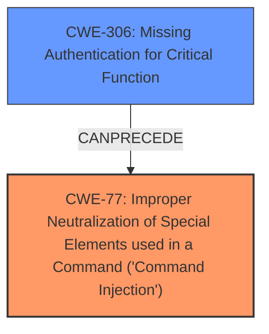

# Raw Analyzer Response for CVE-2025-4008

# Summary
| CWE ID | CWE Name | Confidence | CWE Abstraction Level | CWE Vulnerability Mapping Label | CWE-Vulnerability Mapping Notes |
|---|---|---|---|---|---|
| CWE-77 | Improper Neutralization of Special Elements used in a Command ('Command Injection') | 1.0 | Class | Primary | Allowed-with-Review |
| CWE-306 | Missing Authentication for Critical Function | 0.7 | Base | Secondary | Allowed |

## Evidence and Confidence

*   **Confidence Score:** 0.9
*   **Evidence Strength:** HIGH

## Relationship Analysis
The primary relationship identified is that CWE-77 is a class-level CWE, and it can have more specific base-level CWEs as children, but in this case, CWE-77 directly reflects the **command injection** vulnerability. CWE-306 exists as a separate, but related, vulnerability. While command injection is the primary root cause, the lack of authentication allows unauthenticated attackers to exploit it. This highlights a potential chain where missing authentication can lead to command injection. The abstraction levels influenced the decision to prioritize the class-level CWE-77, because it directly represents the type of injection, while CWE-306 at the Base level identifies the authentication issue.

## Vulnerability Chain
The vulnerability chain starts with **missing authentication (CWE-306)** which allows an unauthenticated attacker to access an endpoint. The endpoint is vulnerable to **command injection (CWE-77)** due to **insecure use of eval calls** with unsanitized user-controlled input. The final impact is **arbitrary command execution with root privileges**.

## Summary of Analysis
The analysis is based on the provided evidence, which is strong. The "CVE Reference Links Content Summary" clearly states the root cause as "**insecure use of eval calls**" and the vulnerability as "**command injection**". This aligns perfectly with CWE-77. The summary also mentions "**Authentication Bypass**", which maps to CWE-306. The graph relationships influenced the decision to include both CWE-77 and CWE-306. CWE-77 represents the direct vulnerability, while CWE-306 represents a prerequisite that enables the vulnerability to be exploited by remote unauthenticated attackers. CWE-77 is at the optimal level of specificity because it directly describes the command injection, whereas moving to CWE-78 is too specific because it implies this is only in an OS command when the vulnerability description does not state that.

Relevant CWE Information:

# Enhanced Context (25 CWEs)
The following CWEs were identified as potentially relevant to this vulnerability:

## CWE-266: Incorrect Privilege Assignment
**Abstraction Level**: Base
**Similarity Score**: 0.79
**Source**: dense

**Description**:
A product incorrectly assigns a privilege to a particular actor, creating an unintended sphere of control for that actor.

**Mapping Guidance**:
- Usage: Allowed
- Rationale: This CWE entry is at the Base level of abstraction, which is a preferred level of abstraction for mapping to the root causes of vulnerabilities.

## CWE-77: Improper Neutralization of Special Elements used in a Command ('Command Injection')
**CWE-77: Improper Neutralization of Special Elements used in a Command ('Command Injection')** is the primary CWE because the root cause is the **insecure use of eval calls** which is a form of **command injection** and this is in the "Vulnerability Description Key Phrases" as a **weakness**.
*   **CWE-77** (Confidence: 1.0)
    *   **Technical Explanation:** The vulnerability description clearly states that the Meteobridge web interface is vulnerable to **command injection**. The provided "CVE Reference Links Content Summary" confirms this by stating the "**Root cause of vulnerability:** Insecure use of `eval` calls in the `template.cgi` script. User-controlled input from `$QUERY_STRING` is parsed and used unsanitized in an `eval` call." This directly matches the characteristics of CWE-77, which involves improper neutralization of special elements used in a command.
    *   **Security Implications:** This allows remote unauthenticated attackers to execute arbitrary commands with elevated privileges (root) on the affected device.
    *   **Relationship Analysis:** CWE-77 is a Class-level CWE. While it can have more specific Base-level CWEs as children, in this case, CWE-77 directly reflects the nature of the vulnerability.
    *   **Mapping Guidance:** CWE-77 is "Allowed-with-Review".
    *   **Primary or Secondary:** Primary. This is the main vulnerability.
    *   **Supporting Evidence:** "Vulnerability Description Key Phrases": - **weakness:** **command injection**; "CVE Reference Links Content Summary": "**Root cause of vulnerability:** Insecure use of `eval` calls in the `template.cgi` script. User-controlled input from `$QUERY_STRING` is parsed and used unsanitized in an `eval` call."

## CWE-306: Missing Authentication for Critical Function
**CWE-306: Missing Authentication for Critical Function** is included as a secondary CWE because the vulnerability can be exploited without authentication.
*   **CWE-306** (Confidence: 0.7)
    *   **Technical Explanation:** The vulnerability description states that "Remote unauthenticated attackers can gain arbitrary command execution...". The "CVE Reference Links Content Summary" states "**Attack vectors:** HTTP GET request to `/cgi-bin/template.cgi` with a malicious `templatefile` parameter." and "**Required attacker capabilities/position:** No authentication required." This indicates a **missing authentication** issue for a critical function (executing commands), which aligns with CWE-306.
    *   **Security Implications:** The absence of authentication allows attackers to directly exploit the command injection vulnerability without needing valid credentials.
    *   **Relationship Analysis:** CWE-306 is a Base-level CWE. It can be seen as a prerequisite for exploiting the command injection vulnerability (CWE-77).
    *   **Mapping Guidance:** CWE-306 is "Allowed".
    *   **Primary or Secondary:** Secondary. This is a contributing factor that enables the primary vulnerability.
    *   **Supporting Evidence:** "Vulnerability Description": "Remote unauthenticated attackers can gain arbitrary command execution..."; "CVE Reference Links Content Summary": "**Required attacker capabilities/position:** No authentication required."

## Other CWEs Considered and Rejected:
*   CWE-78: Improper Neutralization of Special Elements used in an OS Command ('OS Command Injection') - This is more specific than CWE-77, implying the injection happens only in an OS command. The description doesn't limit the scope to just OS commands, therefore CWE-77 is more appropriate.
*   CWE-20: Improper Input Validation - While input validation is often related to injection vulnerabilities, the core issue here is the **insecure use of eval calls** without proper neutralization, making CWE-77 a more direct and accurate representation of the weakness.
*   CWE-22: Improper Limitation of a Pathname to a Restricted Directory ('Path Traversal') - This is not relevant as the vulnerability doesn't involve path manipulation.
*   CWE-269: Improper Privilege Management - While the impact is gaining root privileges, the root cause isn't a privilege management issue, but rather command injection. Therefore, this is not the primary weakness.
*   CWE-306: Missing Authentication for Critical Function - This is a valid secondary vulnerability, but not the root cause.
*   CWE-138: Improper Neutralization of Special Elements - This is a more general CWE, and CWE-77 is more specific and appropriate given the context of command injection.
* CWE-863 Incorrect Authorization, CWE-285 Improper Authorization, CWE-267 Privilege Defined With Unsafe Actions, CWE-266 Incorrect Privilege Assignment, CWE-250 Execution with Unnecessary Privileges - These were considered, but the core issue is not related to authorization or privilege management, but to the command injection via the eval function. They don't fit the root cause of the vulnerability.