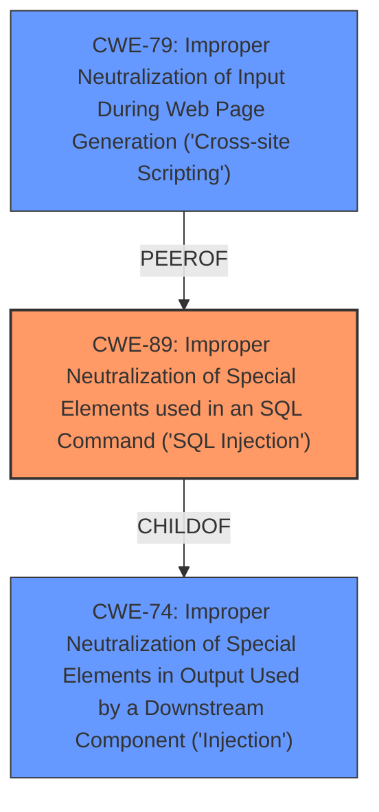

# Enhanced Analysis for CVE-2025-4058

# Summary
| CWE ID | CWE Name | Confidence | CWE Abstraction Level | CWE Vulnerability Mapping Label | CWE-Vulnerability Mapping Notes |
|---|---|---|---|---|---|
| CWE-89 | Improper Neutralization of Special Elements used in an SQL Command ('SQL Injection') | 1.0 | Base | Allowed | Primary CWE. The **weakness** is **sql injection** via manipulation of the argument Pat_BloodGroup1 in the file /Bloodgroop_process.php. |

## Evidence and Confidence

*   **Confidence Score:** 1.0
*   **Evidence Strength:** HIGH

## Relationship Analysis
The primary relationship influencing the decision is the direct match of the vulnerability to the description of CWE-89. The other CWEs considered are related to input validation, output encoding, or other types of injection, but CWE-89 most directly addresses the **SQL Injection** vulnerability described.



## Vulnerability Chain
The vulnerability chain is straightforward:
1.  **Root Cause:** **Improper Neutralization of Special Elements used in an SQL Command ('SQL Injection')** (CWE-89) due to lack of input validation/sanitization.
2.  **Impact:** Unauthorized database access, sensitive data leakage, data tampering, system control, service interruption.

## Summary of Analysis
The analysis is based on the provided evidence, which clearly indicates an **SQL Injection** vulnerability. The description states, "The manipulation of the argument Pat_BloodGroup1 leads to **sql injection**". This directly aligns with CWE-89, which describes **improper neutralization** of special elements used in an SQL command.

The retriever results also list CWE-89 as the top match.

Other CWEs were considered but deemed less relevant because they address different types of vulnerabilities (e.g., Cross-Site Scripting, Unrestricted File Upload).

The selection of CWE-89 is at the optimal level of specificity because it directly describes the type of **injection** vulnerability present.

Relevant CWE Information:

# Enhanced Context (25 CWEs)
The following CWEs were identified as potentially relevant to this vulnerability:

## CWE-89: Improper Neutralization of Special Elements used in an SQL Command ('SQL Injection')
**Abstraction Level**: Base
**Similarity Score**: 0.77
**Source**: dense

**Description**:
The product constructs all or part of an SQL command using externally-influenced input from an upstream component, but it does not neutralize or incorrectly neutralizes special elements that could modify the intended SQL command when it is sent to a downstream component. Without sufficient removal or quoting of SQL syntax in user-controllable inputs, the generated SQL query can cause those inputs to be interpreted as SQL instead of ordinary user data.

**Mapping Guidance**:
- Usage: Allowed
- Rationale: This CWE entry is at the Base level of abstraction, which is a preferred level of abstraction for mapping to the root causes of vulnerabilities.
## CWE-79: Improper Neutralization of Input During Web Page Generation ('Cross-site Scripting')
**Abstraction Level**: Base
**Similarity Score**: 0.74
**Source**: dense

**Description**:
The product does not neutralize or incorrectly neutralizes user-controllable input before it is placed in output that is used as a web page that is served to other users.

**Mapping Guidance**:
- Usage: Allowed
- Rationale: This CWE entry is at the Base level of abstraction, which is a preferred level of abstraction for mapping to the root causes of vulnerabilities.
## CWE-74: Improper Neutralization of Special Elements in Output Used by a Downstream Component ('Injection')
**Abstraction Level**: Class
**Similarity Score**: 0.75
**Source**: dense

**Description**:
The product constructs all or part of a command, data structure, or record using externally-influenced input from an upstream component, but it does not neutralize or incorrectly neutralizes special elements that could modify how it is parsed or interpreted when it is sent to a downstream component.

**Mapping Guidance**:
- Usage: Discouraged
- Rationale: CWE-74 is high-level and often misused when lower-level weaknesses are more appropriate.

## CWE-434: Unrestricted Upload of File with Dangerous Type
**Abstraction Level**: Base
**Similarity Score**: 0.77
**Source**: dense

**Description**:
The product allows the upload or transfer of dangerous file types that are automatically processed within its environment.

**Mapping Guidance**:
- Usage: Allowed
- Rationale: This CWE entry is at the Base level of abstraction, which is a preferred level of abstraction for mapping to the root causes of vulnerabilities.

### Not Used:

*   CWE-74: Improper Neutralization of Special Elements in Output Used by a Downstream Component ('Injection') - This is a more general injection CWE, and CWE-89 is a more specific and appropriate fit. Also, the usage is discouraged.
*   CWE-79: Improper Neutralization of Input During Web Page Generation ('Cross-site Scripting') - This is for Cross-site scripting, not SQL injection.
*   CWE-434: Unrestricted Upload of File with Dangerous Type - This is for unrestricted file uploads, not SQL injection.
*   CWE-472: External Control of Assumed-Immutable Web Parameter - While external control is a factor, the core issue is the lack of neutralization of SQL special elements.
*   CWE-116: Improper Encoding or Escaping of Output - While encoding/escaping is a mitigation technique, the core issue is the lack of neutralization of SQL special elements.
*   CWE-1336: Improper Neutralization of Special Elements Used in a Template Engine - This is for template engine injection, not SQL injection.
*   CWE-73: External Control of File Name or Path - Not relevant to SQL injection.
*   CWE-93: Improper Neutralization of CRLF Sequences ('CRLF Injection') - Not relevant to SQL injection.
*   CWE-117: Improper Output Neutralization for Logs - Not relevant to SQL injection.
*   CWE-471: Modification of Assumed-Immutable Data (MAID) - Not relevant to SQL injection.
*   CWE-113: Improper Neutralization of CRLF Sequences in HTTP Headers ('HTTP Request/Response Splitting') - Not relevant to SQL injection.
*   CWE-621: Variable Extraction Error - Not relevant to SQL injection.
*   CWE-78: Improper Neutralization of Special Elements used in an OS Command ('OS Command Injection') - Not relevant to SQL injection.
*   CWE-639: Authorization Bypass Through User-Controlled Key - Not relevant to SQL injection.
*   CWE-184: Incomplete List of Disallowed Inputs - Not relevant to SQL injection.
*   CWE-425: Direct Request ('Forced Browsing') - Not relevant to SQL injection.
*   CWE-184: Incomplete List of Disallowed Inputs - Not relevant to SQL injection.
*   CWE-99: Improper Control of Resource Identifiers ('Resource Injection') - Not relevant to SQL injection.
*   CWE-1241: Use of Predictable Algorithm in Random Number Generator - Not relevant to SQL injection.
*   CWE-138: Improper Neutralization of Special Elements - This is a class level CWE, not specific enough.


## CWE Relationship Analysis

Current CWEs represent these abstraction levels: .


### Vulnerability Chain Analysis

**Chain starting from CWE-471:**
- 471 (Modification of Assumed-Immutable Data (MAID)) - ROOT


**Chain starting from CWE-93:**
- 93 (Improper Neutralization of CRLF Sequences ('CRLF Injection')) - ROOT


### CWE Relationship Diagram

```mermaid
graph TD
    classDef primary fill:#f96,stroke:#333,stroke-width:2px
    classDef secondary fill:#69f,stroke:#333
    classDef tertiary fill:#9e9,stroke:#333
```