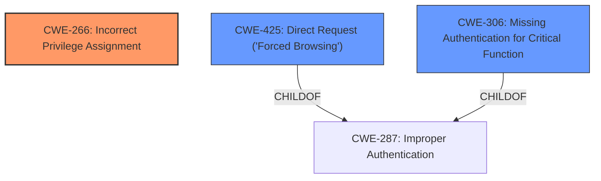

# Analysis for CVE-2025-4067

# Summary
| CWE ID | CWE Name | Confidence | CWE Abstraction Level | CWE Vulnerability Mapping Label | CWE-Vulnerability Mapping Notes |
|---|---|---|---|---|---|
| CWE-266 | Incorrect Privilege Assignment | 0.9 | Base | Allowed | Primary CWE. The vulnerability is due to a product incorrectly assigning a privilege to a particular actor, creating an unintended sphere of control for that actor. |
| CWE-425 | Direct Request ('Forced Browsing') | 0.7 | Base | Allowed | Secondary candidate. The application does not adequately enforce appropriate authorization on all restricted URLs, scripts, or files. |
| CWE-306 | Missing Authentication for Critical Function | 0.6 | Base | Allowed | Secondary candidate. Authentication is missing for a critical function. |

## Evidence and Confidence

*   **Confidence Score:** 0.8
*   **Evidence Strength:** MEDIUM

## Relationship Analysis
The primary CWE is CWE-266, which represents the **incorrect privilege assignment**. CWE-425 (Direct Request) and CWE-306 (Missing Authentication) are related to access control issues and can be considered as potential contributing factors or alternative perspectives on the same problem. CWE-266 is a parent of more specific CWEs, while CWE-425 and CWE-306 can sometimes be child CWEs of CWE-287 (Improper Authentication) which is a Class-level CWE. The base level CWEs are more appropriate.

## Vulnerability Chain
The vulnerability chain starts with **improper access controls**, leading to the ability to manipulate the system remotely.

`Improper Access Control` -> `Remote Manipulation`

CWE-266 represents the root cause (**incorrect privilege assignment**), while the remote manipulation is a consequence of the **improper access controls**.

## Summary of Analysis
The vulnerability description clearly states that the root cause is **improper access controls** leading to remote manipulation. CWE-266 (Incorrect Privilege Assignment) best captures this root cause. The retriever results also list CWE-266 as a candidate. CWE-425 (Direct Request) and CWE-306 (Missing Authentication) are also considered since they relate to access control weaknesses. However, CWE-266 is more specific to the **incorrect assignment** of privileges, which aligns better with the provided description. The evidence is based on the "Vulnerability Description Key Phrases" section, which indicates that the root cause is **improper access controls**.

The selection of CWE-266 is at the optimal level of specificity, as it's a Base level CWE that directly addresses the **incorrect privilege assignment**. Other CWEs like CWE-425 and CWE-306 are related but less specific to the identified root cause.

Relevant CWE Information:
*   "Vulnerability Description Key Phrases"
    *   **rootcause:** **improper access controls**
    *   **product:** ScriptAndTools Online-Travling-System
    *   **version:** 1.0
    *   **component:** /admin/viewpackage.php