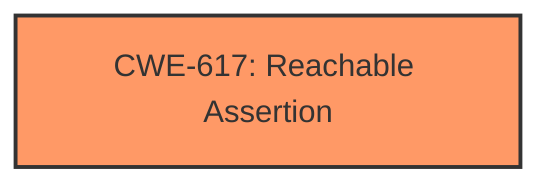

# Analysis Report for CVE-2025-40775

# Vulnerability Analysis Report: CVE-2025-40775

## Description

When an incoming DNS protocol message includes a Transaction Signature (TSIG), BIND always checks it. If the TSIG contains an invalid value in the algorithm field, BIND immediately aborts with an assertion failure. This issue affects BIND 9 versions 9.20.0 through 9.20.8 and 9.21.0 through 9.21.7.

## Vulnerability Description Key Phrases

- **Rootcause:** invalid algorithm field in Transaction Signature (TSIG)
- **Impact:** abort with assertion failure
- **Product:** BIND
- **Version:** 9.20.0 through 9.20.8, 9.21.0 through 9.21.7

## Analysis (with Relationship Data)

# Summary

| CWE ID  | CWE Name                                                      | Confidence | CWE Abstraction Level | CWE Vulnerability Mapping Label | CWE-Vulnerability Mapping Notes |
| ------- | ------------------------------------------------------------- | ---------- | --------------------- | ------------------------------- | ----------------------------- |
| CWE-617 | Reachable Assertion                                           | 0.9        | Base                  | Primary                         | Allowed                       |

## Evidence and Confidence

*   **Confidence Score:** 0.9
*   **Evidence Strength:** HIGH

## Relationship Analysis

The primary relationship influencing the decision is the direct identification of an assertion failure as the impact of the vulnerability. This aligns directly with the description of CWE-617. While other CWEs might be related to the root cause (such as **improper** validation of the algorithm field), the immediate impact of the **invalid** TSIG leading to an assertion is best captured by CWE-617.



## Vulnerability Chain

The vulnerability chain is as follows:

1.  Incoming DNS message with an **invalid** Transaction Signature (TSIG) algorithm field.
2.  BIND checks the TSIG.
3.  Because of the **invalid** value, BIND aborts with an assertion failure.

The root cause appears to be an **invalid** algorithm field in the TSIG. The impact is an assertion failure, which is the primary CWE identified.

## Summary of Analysis

The initial analysis focused on identifying the direct cause-and-effect relationship within the vulnerability description. The description clearly states that an **invalid** algorithm field in the TSIG causes BIND to abort with an assertion failure. The retriever results also highlighted CWE-617 as a potential match. Based on the evidence and the CWE description, CWE-617 is the most appropriate classification.

The analysis is primarily based on the provided evidence, specifically: "If the TSIG contains an **invalid** value in the algorithm field, BIND immediately aborts with an assertion failure."

The graph relationships further supported the decision by highlighting the direct link between the **invalid** input and the assertion failure. CWE-617 is selected as the optimal level of specificity because it accurately describes the immediate impact of the vulnerability.

Relevant CWE Information:

# Enhanced Context (25 CWEs)

## CWE-617: Reachable Assertion
**Abstraction Level**: Base
**Similarity Score**: 0.75
**Source**: dense

**Description**:
The product contains an assert() or similar statement that can be triggered by an attacker, which leads to an application exit or other behavior that is more severe than necessary.

**Mapping Guidance**:
- Usage: Allowed
- Rationale: This CWE entry is at the Base level of abstraction, which is a preferred level of abstraction for mapping to the root causes of vulnerabilities.

**Why Not Used:** This is the selected CWE.

## CWE-923: Improper Restriction of Communication Channel to Intended Endpoints
**Abstraction Level**: Class
**Similarity Score**: 0.69
**Source**: dense

**Description**:
The product establishes a communication channel to (or from) an endpoint for privileged or protected operations, but it does not properly ensure that it is communicating with the correct endpoint.

**Mapping Guidance**:
- Usage: Allowed-with-Review
- Rationale: This CWE entry is a Class and might have Base-level children that would be more appropriate

**Why Not Used:** This CWE is not directly related to the described vulnerability. The vulnerability is about an **invalid** value causing an assertion, not about **improper** communication channels.

## CWE-755: Improper Handling of Exceptional Conditions
**Abstraction Level**: Class
**Similarity Score**: 0.69
**Source**: dense

**Description**:
The product does not handle or incorrectly handles an exceptional condition.

**Mapping Guidance**:
- Usage: Discouraged
- Rationale: This CWE entry is a level-1 Class (i.e., a child of a Pillar). It might have lower-level children that would be more appropriate

**Why Not Used:** While the assertion failure could be considered an exceptional condition, CWE-617 is more specific and directly addresses the assertion failure aspect.

## CWE-347: Improper Verification of Cryptographic Signature
**Abstraction Level**: Base
**Similarity Score**: 0.69
**Source**: dense

**Description**:
The product does not verify, or incorrectly verifies, the cryptographic signature for data.

**Mapping Guidance**:
- Usage: Allowed
- Rationale: This CWE entry is at the Base level of abstraction, which is a preferred level of abstraction for mapping to the root causes of vulnerabilities.

**Why Not Used:** Although the vulnerability involves TSIG (Transaction Signature), the core issue is the **invalid** algorithm field, which leads to an assertion. While **improper** verification might be a contributing factor, the direct impact is better described by CWE-617.

## CWE-407: Inefficient Algorithmic Complexity
**Abstraction Level**: Class
**Similarity Score**: 0.69
**Source**: dense

**Description**:
An algorithm in a product has an inefficient worst-case computational complexity that may be detrimental to system performance and can be triggered by an attacker, typically using crafted manipulations that ensure that the worst case is being reached.

**Why Not Used:** This CWE is irrelevant to the described vulnerability, which is about an **invalid** input causing an assertion failure, not about algorithmic complexity.

## CWE-330: Use of Insufficiently Random Values
**Abstraction Level**: Class
**Similarity Score**: 0.69
**Source**: dense

**Description**:
The product uses insufficiently random numbers or values in a security context that depends on unpredictable numbers.

**Mapping Guidance**:
- Usage: Discouraged
- Rationale: This CWE entry is a level-1 Class (i.e., a child of a Pillar). It might have lower-level children that would be more appropriate

**Why Not Used:** This CWE is not applicable to the described vulnerability, which is related to an **invalid** TSIG algorithm field, not the use of random values.

## CWE-303: Incorrect Implementation of Authentication Algorithm
**Abstraction Level**: Base
**Similarity Score**: 0.69
**Source**: dense

**Description**:
The requirements for the product dictate the use of an established authentication algorithm, but the implementation of the algorithm is incorrect.

**Mapping Guidance**:
- Usage: Allowed
- Rationale: This CWE entry is at the Base level of abstraction, which is a preferred level of abstraction for mapping to the root causes of vulnerabilities.

**Why Not Used:** The vulnerability is not necessarily due to an **incorrect** implementation of the authentication algorithm itself, but rather due to an **invalid** value in the algorithm field of the TSIG.

## CWE-1286: Improper Validation of Syntactic Correctness of Input
**Abstraction Level**: Base
**Similarity Score**: 0.69
**Source**: dense

**Description**:
The product receives input that is expected to be well-formed - i.e., to comply with a certain syntax - but it does not validate or incorrectly validates that the input complies with the syntax.

**Mapping Guidance**:
- Usage: Allowed
- Rationale: This CWE entry is at the Base level of abstraction, which is a preferred level of abstraction for mapping to the root causes of vulnerabilities.

**Why Not Used:** While this could be a contributing factor (i.e., the input is not properly validated), the direct impact of the **invalid** algorithm field causing an assertion failure is better captured by CWE-617.

## CWE-346: Origin Validation Error
**Abstraction Level**: Class
**Similarity Score**: 0.69
**Source**: dense

**Description**:
The product does not properly verify that the source of data or communication is valid.

**Mapping Guidance**:
- Usage: Allowed-with-Review
- Rationale: This CWE entry is a Class and might have Base-level children that would be more appropriate

**Why Not Used:** The vulnerability is not directly related to the origin of the data, but rather the content of the algorithm field within the TSIG.

## CWE-297: Improper Validation of Certificate with Host Mismatch
**Abstraction Level**: Variant
**Similarity Score**: 0.69
**Source**: dense

**Description**:
The product communicates with a host that provides a certificate, but the product does not properly ensure that the certificate is actually associated with that host.

**Mapping Guidance**:
- Usage: Allowed
- Rationale: This CWE entry is at the Variant level of abstraction, which is a preferred level of abstraction for mapping to the root causes of vulnerabilities.

**Why Not Used:** The vulnerability has nothing to do with certificates or host mismatches.

## CWE-327: Use of a Broken or Risky Cryptographic Algorithm
**Abstraction Level**: Class
**Similarity Score**: 790.18
**Source**: sparse

**Description**:
The product uses a broken or risky cryptographic algorithm or protocol.

**Mapping Guidance**:
- Usage: Allowed-with-Review
- Rationale: This CWE entry is a Class and might have Base-level children that would be more appropriate

**Why Not Used:** The provided text doesn'


## CWE Relationship Analysis

Current CWEs represent these abstraction levels: .


### Vulnerability Chain Analysis

**Chain starting from CWE-407:**
- 407 (Inefficient Algorithmic Complexity) - ROOT


**Chain starting from CWE-327:**
- 327 (Use of a Broken or Risky Cryptographic Algorithm) - ROOT


### CWE Relationship Diagram

```mermaid
graph TD
    classDef primary fill:#f96,stroke:#333,stroke-width:2px
    classDef secondary fill:#69f,stroke:#333
    classDef tertiary fill:#9e9,stroke:#333
```


*Report generated on 2025-07-14 22:58:33*
