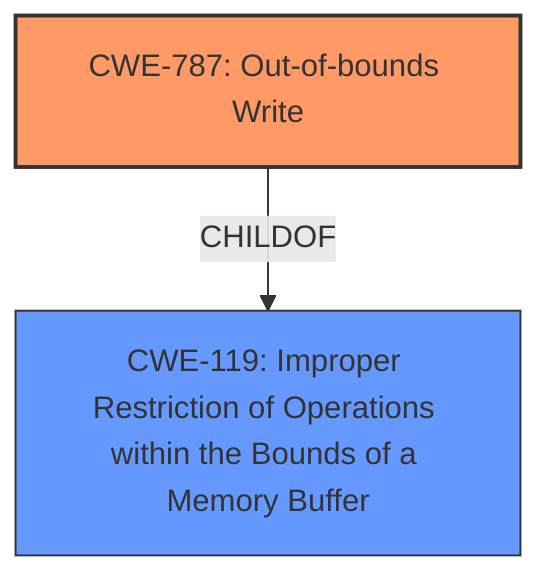

# Analysis for CVE-2025-4091

# Summary
| CWE ID | CWE Name | Confidence | CWE Abstraction Level | CWE Vulnerability Mapping Label | CWE-Vulnerability Mapping Notes |
|---|---|---|---|---|---|
| CWE-787 | Out-of-bounds Write | 0.9 | Base | Primary | Allowed |
| CWE-119 | Improper Restriction of Operations within the Bounds of a Memory Buffer | 0.7 | Class | Secondary | Discouraged |

## Evidence and Confidence

*   **Confidence Score:** 0.8
*   **Evidence Strength:** MEDIUM

## Relationship Analysis
The primary relationship that influences the CWE selection is the child-of relationship between CWE-787 and CWE-119, with CWE-787 being a more specific instance of the memory corruption described. The selection of CWE-787 is further strengthened by its higher similarity score in the Retriever Results. The relationships such as CanPrecede and CanFollow are not relevant in this case.

## Vulnerability Chain
The vulnerability chain starts with **memory safety bugs**, leading to **memory corruption** (specifically, out-of-bounds write), and ultimately allowing an attacker to run arbitrary code.

## Summary of Analysis
The initial analysis focused on identifying the root cause of the vulnerability, which is related to **memory safety bugs** and **memory corruption**. The retriever results and the vulnerability description both point towards memory corruption issues.

The primary CWE selected is CWE-787 (Out-of-bounds Write) because it directly relates to **memory corruption**, which is writing outside the intended memory boundaries. This is supported by the vulnerability description and the CVE reference content summary. While CWE-119 (Improper Restriction of Operations within the Bounds of a Memory Buffer) is a broader category, CWE-787 provides a more specific classification.

The selection is based on the evidence provided in the "Vulnerability Description Key Phrases" and the "CVE Reference Links Content Summary" sections, which explicitly mention memory corruption.

Relevant CWE Information:

# Enhanced Context (25 CWEs)
The following CWEs were identified as potentially relevant to this vulnerability:

## CWE-787: Out-of-bounds Write
**Abstraction Level**: Base
**Similarity Score**: 0.79
**Source**: dense

**Description**:
The product writes data past the end, or before the beginning, of the intended buffer.

**Mapping Guidance**:
- Usage: Allowed
- Rationale: This CWE entry is at the Base level of abstraction, which is a preferred level of abstraction for mapping to the root causes of vulnerabilities.

## CWE-119: Improper Restriction of Operations within the Bounds of a Memory Buffer
**Abstraction Level**: Class
**Similarity Score**: 0.800

**Description**:
The product performs an operation that reads or writes to a memory buffer, but it does not properly restrict the operation within the bounds of that buffer.

**Mapping Guidance**:
- Usage: Discouraged
- Rationale: This CWE entry is a level-0 Class, and might have lower-level children that would be more appropriate.

## CWE-787: Out-of-bounds Write
**Abstraction Level**: Base
**Similarity Score**: 1069.39
**Source**: sparse

**Description**:
The product writes data past the end, or before the beginning, of the intended buffer.

**Mapping Guidance**:
- Usage: Allowed
- Rationale: This CWE entry is at the Base level of abstraction, which is a preferred level of abstraction for mapping to the root causes of vulnerabilities.

### CWE Selection Details:

*   **CWE-787: Out-of-bounds Write**
    *   **Explanation:** The vulnerability involves **memory corruption**, which suggests that data is being written outside the intended memory boundaries. CWE-787 directly addresses this scenario, where a product writes data past the end or before the beginning of the intended buffer.
    *   **Security Implications:** This can lead to arbitrary code execution, as indicated in the vulnerability description.
    *   **Relationship:** This is a child of CWE-119 (Improper Restriction of Operations within the Bounds of a Memory Buffer), making it a more specific classification.
    *   **Mapping Guidance:** The usage is "Allowed," and it's at the Base level of abstraction, which is preferred.
    *   **Confidence:** 0.9
*   **CWE-119: Improper Restriction of Operations within the Bounds of a Memory Buffer**
    *   **Explanation:** This CWE is a broader category that encompasses issues where operations on memory buffers are not properly restricted. Given the evidence of **memory corruption**, it is possible that a more specific weakness is involved, such as writing beyond buffer boundaries.
    *   **Security Implications:** Improper restriction can lead to various impacts, including information disclosure, denial of service, or arbitrary code execution.
    *   **Relationship:** Parent of CWE-787.
    *   **Mapping Guidance:** The usage is "Discouraged" because it is a class-level CWE.
    *   **Confidence:** 0.7

### CWEs Considered but Not Used:

*   **CWE-843 (Access of Resource Using Incompatible Type ('Type Confusion')):** While **memory corruption** *could* involve type confusion, there's no explicit evidence to support this.
*   **CWE-125 (Out-of-bounds Read):** The description specifically mentions **memory corruption**, implying writes rather than reads.
*   **CWE-416 (Use After Free):** There is no mention of freeing memory and then using it later.
*   **CWE-120 (Buffer Copy without Checking Size of Input ('Classic Buffer Overflow')):** While this is related to buffer overflows, the description does not indicate that the overflow is specifically due to copying without checking size.
*   **CWE-682 (Incorrect Calculation):** There is no mention of any incorrect calculation