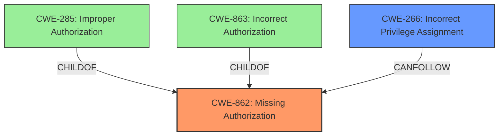

# Raw Analyzer Response for CVE-2025-4103

# Summary
| CWE ID | CWE Name | Confidence | CWE Abstraction Level | CWE Vulnerability Mapping Label | CWE-Vulnerability Mapping Notes |
|---|---|---|---|---|---|
| CWE-862 | Missing Authorization | 1.0 | Class | Allowed-with-Review | Primary CWE |
| CWE-266 | Incorrect Privilege Assignment | 0.5 | Base | Allowed | Secondary Candidate |

## Evidence and Confidence

*   **Confidence Score:** 0.8
*   **Evidence Strength:** MEDIUM

## Relationship Analysis
The primary relationship that influenced my decision was the parent-child relationship between CWE-862 (Missing Authorization) and other potential CWEs like CWE-285 (Improper Authorization) and CWE-863 (Incorrect Authorization). Since the vulnerability description explicitly states a **missing capability check**, CWE-862 is the most appropriate initial classification. However, due to the privilege escalation impact, CWE-266 (Incorrect Privilege Assignment) is a possible secondary candidate, representing a potential consequence of the missing authorization.

## Vulnerability Chain
The vulnerability chain starts with the **missing capability check** (CWE-862), which allows authenticated attackers with Subscriber-level access to elevate their privileges to that of an administrator. This privilege escalation could then be seen as an **incorrect privilege assignment** (CWE-266) as a consequence.

## Summary of Analysis
The primary assessment is based on the explicit mention of a **missing capability check** in the vulnerability description: "The WP-GeoMeta plugin for WordPress is vulnerable to Privilege Escalation due to a **missing capability check** on the wp_ajax_wpgm_start_geojson_import() function in versions 0.3.4 to 0.3.5." This directly aligns with the definition of CWE-862 (Missing Authorization), which describes a situation where the product lacks an authorization check when an actor attempts to access a resource or perform an action.

The relationship analysis shows that while CWE-863 (Incorrect Authorization) and CWE-285 (Improper Authorization) are related, they are less accurate because they imply the presence of an authorization check that is flawed, rather than completely absent. The privilege escalation aspect raises the possibility of CWE-266 (Incorrect Privilege Assignment), which can be considered as a potential outcome, making it a secondary candidate.

The selected CWEs are at the optimal level of specificity. CWE-862 is a Class-level CWE, which is appropriate given the high-level description of the **missing authorization**. While more specific Base-level CWEs could potentially apply if more details were available, the current description is best represented by CWE-862.

Relevant CWE Information:

# Enhanced Context (25 CWEs)
The following CWEs were identified as potentially relevant to this vulnerability:

## CWE-862: Missing Authorization
**Abstraction Level**: Class
**Similarity Score**: 0.426
**Source**: sparse

**Description**:
The product does not perform an authorization check when an actor attempts to access a resource or perform an action.

**Mapping Guidance**:
- Usage: Allowed-with-Review
- Rationale: This CWE entry is a Class and might have Base-level children that would be more appropriate

## CWE-266: Incorrect Privilege Assignment
**Abstraction Level**: Base
**Similarity Score**: 0.340
**Source**: sparse

**Description**:
A product incorrectly assigns a privilege to a particular actor, creating an unintended sphere of control for that actor.

**Mapping Guidance**:
- Usage: Allowed
- Rationale: This CWE entry is at the Base level of abstraction, which is a preferred level of abstraction for mapping to the root causes of vulnerabilities.

## CWE-863: Incorrect Authorization
**Abstraction Level**: Class
**Similarity Score**: 0.388
**Source**: sparse

**Description**:
The product performs an authorization check when an actor attempts to access a resource or perform an action, but it does not correctly perform the check.

**Mapping Guidance**:
- Usage: Allowed-with-Review
- Rationale: This CWE entry is a Class and might have Base-level children that would be more appropriate

## CWE-285: Improper Authorization
**Abstraction Level**: Class
**Similarity Score**: 0.365
**Source**: sparse

**Description**:
The product does not perform or incorrectly performs an authorization check when an actor attempts to access a resource or perform an action.

**Mapping Guidance**:
- Usage: Discouraged
- Rationale: CWE-285 is high-level and lower-level CWEs can frequently be used instead. It is a level-1 Class (i.e., a child of a Pillar).

## CWE-284: Improper Access Control
**Abstraction Level**: Pillar
**Similarity Score**: 0.345
**Source**: sparse

**Description**:
The software does not properly control access to a resource.

**Mapping Guidance**:
- Usage: Discouraged
- Rationale: This is a very general weakness. More specific entries should be used when available.

## CWE-269: Improper Privilege Management
**Abstraction Level**: Class
**Similarity Score**: 0.344
**Source**: sparse

**Description**:
The product does not properly assign, modify, track, or check privileges for an actor, creating an unintended sphere of control for that actor.

**Mapping Guidance**:
- Usage: Discouraged
- Rationale: CWE-269 is commonly misused. It can be conflated with "privilege escalation," which is a technical impact that is listed in many low-information vulnerability reports.

## CWE-639: Authorization Bypass Through User-Controlled Key
**Abstraction Level**: Base
**Similarity Score**: 0.340
**Source**: sparse

**Description**:
The system's authorization functionality does not prevent one user from gaining access to another user's data or record by modifying the key value identifying the data.

### Selection Details for CWE-862

*   **How the vulnerability's details match the CWE's characteristics:** The vulnerability description explicitly mentions a "**missing capability check**," which directly aligns with CWE-862's description: "The product does not perform an authorization check when an actor attempts to access a resource or perform an action."
*   **The security implications and potential impact:** The missing authorization check allows authenticated attackers with Subscriber-level access to elevate their privileges to that of an administrator, leading to a complete compromise of the WordPress site.
*   **Any parent-child relationships or chain patterns that influenced your mapping:** CWE-862 is a parent class of CWE-285 (Improper Authorization) and CWE-863 (Incorrect Authorization). Since the description clearly indicates a *missing* check rather than an *improper* check, CWE-862 is the most appropriate choice.
*   **Whether the weakness is primary or secondary in the vulnerability:** This is the primary weakness, as the absence of an authorization check is the direct cause of the vulnerability.
*   **How the official MITRE mapping guidance influenced your decision:** The MITRE mapping guidance for CWE-862 allows for its usage but suggests reviewing for more specific Base-level children, but in this case the missing check is the root cause, so a child isn't appropriate. The Privileges vs Permissions guidance also supports this by pointing to CWE-862 when authorization logic is completely missing.

### Selection Details for CWE-266

*   **How the vulnerability's details match the CWE's characteristics:** The privilege escalation from subscriber to administrator can be viewed as an incorrect privilege assignment, where the attacker is granted higher privileges than intended.
*   **The security implications and potential impact:** This incorrect assignment allows the attacker to perform administrative actions, potentially leading to further compromise of the system.
*   **Any parent-child relationships or chain patterns that influenced your mapping:** While not a direct parent-child relationship, CWE-266 can be a consequence of CWE-862, where the missing authorization leads to the incorrect assignment of privileges.
*   **Whether the weakness is primary or secondary in the vulnerability:** This is a secondary weakness, as it represents the outcome of the primary weakness (CWE-862).
*   **How the official MITRE mapping guidance influenced your decision:** The MITRE guidance suggests CWE-266 when the root cause is role misassignment, which is a potential interpretation of the privilege escalation.