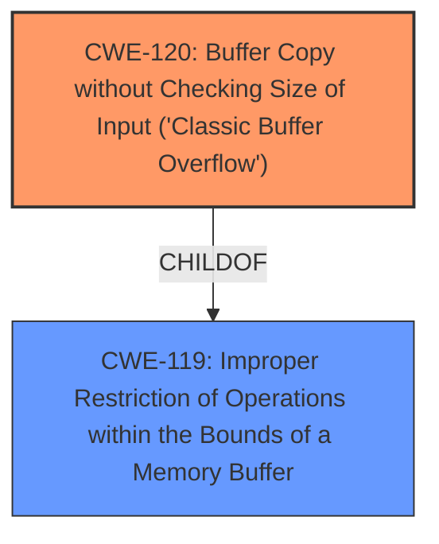

# Enhanced Analysis for CVE-2025-4117

# Summary
| CWE ID | CWE Name | Confidence | CWE Abstraction Level | CWE Vulnerability Mapping Label | CWE-Vulnerability Mapping Notes |
|---|---|---|---|---|---|
| CWE-120 | Buffer Copy without Checking Size of Input ('Classic Buffer Overflow') | 0.8 | Base | Allowed-with-Review | Primary CWE |
| CWE-119 | Improper Restriction of Operations within the Bounds of a Memory Buffer | 0.6 | Class | Discouraged | Secondary Candidate |

## Evidence and Confidence

*   **Confidence Score:** 0.7
*   **Evidence Strength:** LOW

## Relationship Analysis
The primary relationship is between CWE-120 and its parent CWE-119. CWE-120 is a more specific case of CWE-119, as it involves copying a buffer without checking the size of the input, leading to a buffer overflow. While CWE-119 is a broader category that includes other types of buffer-related issues, CWE-120 is a better fit for this vulnerability because the description explicitly mentions a **buffer overflow** due to the manipulation of the host argument, implying a copy operation without proper size validation.



## Vulnerability Chain
The vulnerability chain starts with the **buffer overflow** caused by the manipulation of the 'host' argument, leading to a potential crash or arbitrary code execution.

## Summary of Analysis
The vulnerability description explicitly states that the manipulation of the 'host' argument leads to a **buffer overflow**. Based on the provided information, CWE-120 (Buffer Copy without Checking Size of Input) is the most appropriate primary CWE. This is because the description implies that data is being copied into a buffer without proper size validation, leading to the overflow. CWE-119 is considered as a secondary candidate due to its broader nature, but CWE-120 is more specific and accurately reflects the described weakness.

The evidence is relatively weak, as the provided text only mentions "**buffer overflow**" and the affected function. However, the mention of "**buffer overflow**" makes CWE-120 the most likely candidate.

Other CWEs considered but not used:

*   CWE-119: While related as a parent, it's too general. The description explicitly mentions a "**buffer overflow**", indicating a copy operation without proper size validation, making CWE-120 more appropriate.
*   CWE-121 (Stack-based Buffer Overflow) and CWE-122 (Heap-based Buffer Overflow): There is no information in the vulnerability description to indicate whether the buffer is allocated on the stack or heap.
*   CWE-190 (Integer Overflow or Wraparound): This CWE is not directly related to the **buffer overflow** described in the vulnerability.
*   CWE-125 (Out-of-bounds Read): The vulnerability is a **buffer overflow**, which is a write, not a read.
*   CWE-131 (Incorrect Calculation of Buffer Size): There is no information to suggest that the buffer size calculation is incorrect.
* CWE-790, CWE-134, CWE-755, CWE-912, CWE-923, CWE-252, CWE-288, CWE-89, CWE-79, CWE-77, CWE-128, CWE-1339, CWE-123, CWE-822, CWE-823, CWE-909 are not relevant because they do not match the **buffer overflow** vulnerability described.


## CWE Relationship Analysis

Current CWEs represent these abstraction levels: .


### Vulnerability Chain Analysis

**Chain starting from CWE-125:**
- 125 (Out-of-bounds Read) - ROOT


**Chain starting from CWE-131:**
- 131 (Incorrect Calculation of Buffer Size) - ROOT


### CWE Relationship Diagram

```mermaid
graph TD
    classDef primary fill:#f96,stroke:#333,stroke-width:2px
    classDef secondary fill:#69f,stroke:#333
    classDef tertiary fill:#9e9,stroke:#333
```