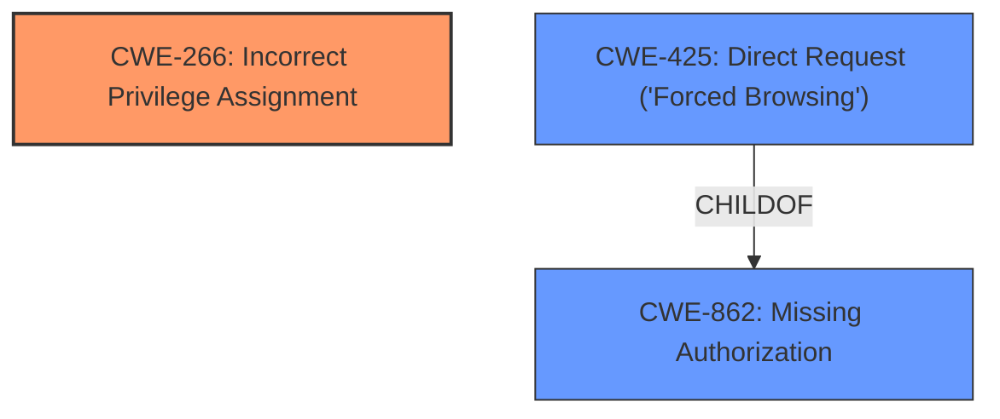

# Analysis Report for CVE-2025-4118

# Vulnerability Analysis Report: CVE-2025-4118

## Description

A vulnerability classified as critical has been found in Weitong Mall 1.0.0. This affects an unknown part of the file /historyList of the component Product History Handler. The manipulation of the argument isDelete with the input 1 leads to **improper access controls**. It is possible to initiate the attack remotely. The exploit has been disclosed to the public and may be used.

## Vulnerability Description Key Phrases

- **Rootcause:** improper access controls
- **Product:** Weitong Mall
- **Version:** 1.0.0
- **Component:** Product History Handler

## Analysis (with Relationship Data)

# Summary
| CWE ID | CWE Name | Confidence | CWE Abstraction Level | CWE Vulnerability Mapping Label | CWE-Vulnerability Mapping Notes |
|---|---|---|---|---|---|
| CWE-266 | Incorrect Privilege Assignment | 0.9 | Base | Allowed | Primary CWE |
| CWE-425 | Direct Request ('Forced Browsing') | 0.7 | Base | Allowed | Secondary Candidate |

## Evidence and Confidence

*   **Confidence Score:** 0.8
*   **Evidence Strength:** MEDIUM

## Relationship Analysis
The primary CWE is CWE-266, a base level CWE that indicates an error in assigning privileges. CWE-425 is related, as it describes a situation where direct requests bypass intended access controls. CWE-425 is a child of CWE-862 (Missing Authorization), suggesting a lack of authorization checks could be a contributing factor.



## Vulnerability Chain
The vulnerability begins with **improper access controls** (CWE-266), allowing direct access to resources (CWE-425). This leads to the exposure of sensitive data, which is the impact of the vulnerability.
  - The chain starts with an incorrect privilege assignment.
  - This leads to direct requests bypassing security mechanisms.
  - Resulting in the disclosure of sensitive information.

## Summary of Analysis
The initial analysis focused on identifying the root cause of the vulnerability based on the description and CVE reference. The description clearly states "**improper access controls**," pointing towards authorization or privilege management issues. The CVE reference strengthens this, mentioning that the `/historyList` endpoint **does not enforce authentication or role-based access control** and that the vulnerability is a Broken Object Level Authorization (BOLA).

Based on this evidence, CWE-266 (Incorrect Privilege Assignment) is the most appropriate primary CWE, representing the root cause. CWE-425 (Direct Request ('Forced Browsing')) could be a secondary CWE, since the endpoint can be directly accessed.

The graph relationships confirm that the vulnerability could be viewed as a chain of weaknesses.

CWE-266 is selected as the primary CWE due to its direct relation to the "**improper access controls**" and the root cause of the vulnerability. It is at the base level of abstraction, making it specific enough to describe the weakness accurately.

Relevant CWE Information:

# Enhanced Context (25 CWEs)
The following CWEs were identified as potentially relevant to this vulnerability:

## CWE-425: Direct Request ('Forced Browsing')
**Abstraction Level**: Base
**Similarity Score**: 0.74
**Source**: dense

**Description**:
The web application does not adequately enforce appropriate authorization on all restricted URLs, scripts, or files.

**Mapping Guidance**:
- Usage: Allowed
- Rationale: This CWE entry is at the Base level of abstraction, which is a preferred level of abstraction for mapping to the root causes of vulnerabilities.

## CWE-266: Incorrect Privilege Assignment
**Abstraction Level**: Base
**Similarity Score**: 0.71
**Source**: dense

**Description**:
A particular privilege, role, capability, or right can be used to perform unsafe actions that were not intended, even when it is assigned to the correct entity.

**Mapping Guidance**:
- Usage: Allowed
- Rationale: This CWE entry is at the Base level of abstraction, which is a preferred level of abstraction for mapping to the root causes of vulnerabilities.

### CWE Selection:

*   **CWE-266: Incorrect Privilege Assignment**
    *   **Explanation:** The vulnerability description and the CVE reference indicate that the application **does not properly restrict access** to the `/historyList` endpoint, allowing unauthorized users to access sensitive data. This aligns with CWE-266, which describes a scenario where a privilege is used to perform unsafe actions. The fact that the endpoint lacks role-based access control and authentication suggests that privileges are not being assigned or checked correctly.
    *   **Security Implications:** Unauthorized access to sensitive data, potential data breaches, and abuse of internal data.
    *   **Relationship:** This is the primary CWE because it represents the root cause of the vulnerability.
    *   **Mapping Guidance:** The usage is "Allowed," and the rationale states that it is at the Base level of abstraction.
    *   **Confidence:** 0.9
*   **CWE-425: Direct Request ('Forced Browsing')**
    *   **Explanation:** CWE-425 describes a scenario where the web application **does not adequately enforce authorization** on restricted URLs. The CVE description and the **lack of authentication** to the endpoint supports that this vulnerability can be triggered by direct requests, by manipulating the `isDelete` parameter.
    *   **Security Implications:** Unauthorized access to restricted resources, information disclosure.
    *   **Relationship:** ChildOf CWE-862 (Missing Authorization).
    *   **Mapping Guidance:** The usage is "Allowed," and the rationale states that it is at the Base level of abstraction.
    *   **Confidence:** 0.7

### CWE Rejection:

*   **CWE-89, CWE-79, CWE-434:** These CWEs relate to SQL injection, Cross-Site Scripting (XSS), and unrestricted file uploads, respectively. None of these are mentioned or implied in the provided vulnerability description or CVE reference.
*   **CWE-471: Modification of Assumed-Immutable Data (MAID):** While this CWE is listed in the Retriever results, the vulnerability does not involve the modification of assumed immutable data. It is more about accessing data without proper authorization.
*   **CWE-93: Improper Neutralization of CRLF Sequences ('CRLF Injection'):** This CWE is related to CRLF injection, which is not relevant to the vulnerability described.
*   **CWE-184: Incomplete List of Disallowed Inputs:** The vulnerability is not due to an incomplete list of disallowed inputs, but rather a lack of proper access controls.
*   **CWE-494: Download of Code Without Integrity Check:** There is no evidence that the vulnerability is caused by downloading code without an integrity check.


## CWE Relationship Analysis

Current CWEs represent these abstraction levels: .


### Vulnerability Chain Analysis

**Chain starting from CWE-89:**
- 89 (Improper Neutralization of Special Elements used in an SQL Command ('SQL Injection')) - ROOT


**Chain starting from CWE-471:**
- 471 (Modification of Assumed-Immutable Data (MAID)) - ROOT


### CWE Relationship Diagram

```mermaid
graph TD
    classDef primary fill:#f96,stroke:#333,stroke-width:2px
    classDef secondary fill:#69f,stroke:#333
    classDef tertiary fill:#9e9,stroke:#333
```


*Report generated on 2025-07-14 23:07:02*
