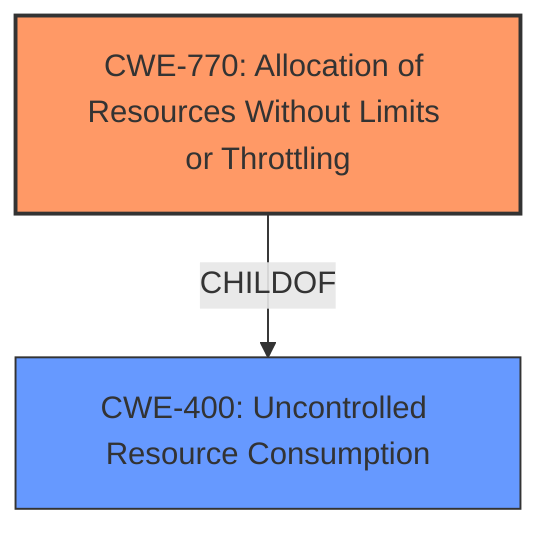

# Raw Analyzer Response for CVE-2025-41227

# Summary
| CWE ID  | CWE Name                                                                    | Confidence | CWE Abstraction Level | CWE Vulnerability Mapping Label | CWE-Vulnerability Mapping Notes |
| :-------- | :-------------------------------------------------------------------------- | :--------- | :---------------------- | :------------------------------ | :------------------------------ |
| CWE-770 | Allocation of Resources Without Limits or Throttling                      | 0.9        | Base                    | Primary                         | Allowed                         |
| CWE-400 | Uncontrolled Resource Consumption                                           | 0.7        | Class                   | Secondary                       | Discouraged                    |

## Evidence and Confidence

*   **Confidence Score:** 0.8
*   **Evidence Strength:** MEDIUM

## Relationship Analysis

The primary CWE is CWE-770, which is a base-level weakness describing the **allocation of resources without limits or throttling**. This can lead directly to CWE-400, **uncontrolled resource consumption**, which is a class-level weakness and represents the impact of the vulnerability. CWE-770 is a child of CWE-400 and represents a specific way in which uncontrolled resource consumption can occur.

## Vulnerability Chain

The vulnerability chain starts with the **uncontrolled allocation of resources** (CWE-770) within the VMware product. A malicious actor within the guest OS leverages guest options to allocate resources without limits, leading to **resource exhaustion** on the host (CWE-400), resulting in a denial-of-service condition.

## Summary of Analysis

The initial analysis focused on identifying the root cause of the denial-of-service vulnerability. The description clearly states that a malicious actor can **exhaust memory of the host process**, indicating **uncontrolled resource consumption**.

The retriever results suggested CWE-400 and CWE-770. Given that the vulnerability description specifies the mechanism (**exhausting memory**), CWE-770 is more precise as it describes the **allocation of resources without limits**. The evidence provided "A malicious actor with non-administrative privileges within a guest operating system may be able to exploit this issue by **exhausting memory of the host process**" supports the **allocation of resources without limits or throttling**, leading to the host's memory exhaustion.

CWE-400 is a class-level CWE and represents the impact (resource exhaustion), making CWE-770 the primary root cause. CWE-770 is at the base level of abstraction, which is a preferred level.

I considered other CWEs, particularly those related to privilege management, but they didn't directly align with the root cause. The vulnerability isn't primarily about privilege escalation or incorrect permissions, but about the ability to exhaust resources due to missing limits on resource allocation.

Therefore, I selected CWE-770 as the primary CWE, representing the **allocation of resources without limits or throttling**, leading to CWE-400 as the secondary CWE, which shows the impact of the vulnerability i.e. **uncontrolled resource consumption** leading to a denial-of-service condition.

Relevant CWE Information:

# Enhanced Context (25 CWEs)
The following CWEs were identified as potentially relevant to this vulnerability:

## CWE-770: Allocation of Resources Without Limits or Throttling
**Abstraction Level**: base
**Similarity Score**: 4.33
**Source**: graph

**Description**:
CWE-770: Allocation of Resources Without Limits or Throttling

**Mapping Guidance**:
- Usage: Allowed
- Rationale: This CWE entry is at the Base level of abstraction, which is a preferred level of abstraction for mapping to the root causes of vulnerabilities.

**Relationships**:
- PARENTOF -> CWE-789
- PARENTOF -> CWE-774
- CANFOLLOW -> CWE-20
- PARENTOF -> CWE-1325
- CHILDOF -> CWE-400