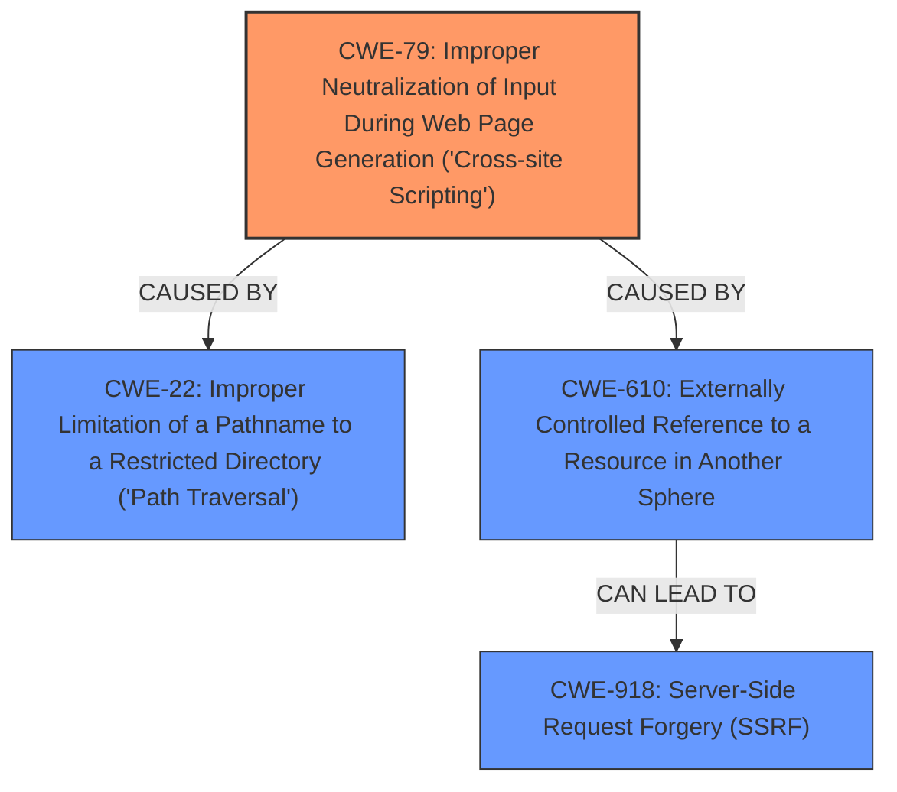

# Analysis Report for CVE-2025-4123

# Vulnerability Analysis Report: CVE-2025-4123

## Description

A **cross-site scripting** (**XSS**) vulnerability exists in Grafana caused by combining a client **path traversal** and **open redirect**. This allows attackers to redirect users to a website that hosts a frontend plugin that will execute arbitrary JavaScript. This vulnerability does not require editor permissions and if anonymous access is enabled, the **XSS** will work. If the Grafana Image Renderer plugin is installed, it is possible to exploit the **open redirect** to achieve a full read SSRF. The default Content-Security-Policy (CSP) in Grafana will block the **XSS** though the `connect-src` directive.

## Vulnerability Description Key Phrases

- **Weakness:** ['cross-site scripting', 'path traversal', 'open redirect', 'XSS']
- **Impact:** ['redirect users to malicious website', 'execute arbitrary JavaScript', 'SSR']
- **Attacker:** attackers
- **Product:** Grafana

## Analysis (with Relationship Data)

# Summary
| CWE ID | CWE Name | Confidence | CWE Abstraction Level | CWE Vulnerability Mapping Label | CWE-Vulnerability Mapping Notes |
|---|---|---|---|---|---|
| **CWE-79** | Improper Neutralization of Input During Web Page Generation ('Cross-site Scripting') | 1.0 | Base | Primary | Allowed |
| CWE-22 | Improper Limitation of a Pathname to a Restricted Directory ('Path Traversal') | 0.9 | Base | Secondary | Allowed |
| CWE-610 | Externally Controlled Reference to a Resource in Another Sphere | 0.8 | Base | Secondary | Allowed |
| CWE-918 | Server-Side Request Forgery (SSRF) | 0.7 | Base | Secondary | Allowed |

## Evidence and Confidence

*   **Confidence Score:** 0.9
*   **Evidence Strength:** HIGH

## Relationship Analysis
The primary weakness is **CWE-79** Improper Neutralization of Input During Web Page Generation ('Cross-site Scripting'), which is caused by a combination of **CWE-22** Improper Limitation of a Pathname to a Restricted Directory ('Path Traversal') and **CWE-610** Externally Controlled Reference to a Resource in Another Sphere, leading to an **open redirect**. The presence of the Grafana Image Renderer plugin then allows for exploiting the **open redirect** to achieve **CWE-918** Server-Side Request Forgery (SSRF).


## Vulnerability Chain
The vulnerability chain starts with the **improper limitation of pathname** (**CWE-22**) and an **externally controlled reference to a resource** (**CWE-610**), which combine to create an **open redirect**. This leads to **improper neutralization of input during web page generation**, resulting in **cross-site scripting** (**CWE-79**). If the Grafana Image Renderer plugin is installed, the **open redirect** can be exploited to achieve **server-side request forgery** (**CWE-918**).

## Summary of Analysis
The analysis focuses on the root causes and the resulting **XSS** vulnerability. The description clearly states the presence of a **cross-site scripting** vulnerability in Grafana due to a combination of **path traversal** and **open redirect**. This allows attackers to redirect users to malicious websites, leading to arbitrary JavaScript execution. The root cause is the **improper neutralization of input** leading to **XSS** (**CWE-79**).

The chain involves:
1.  **CWE-22** Improper Limitation of a Pathname to a Restricted Directory ('Path Traversal')
2.  **CWE-610** Externally Controlled Reference to a Resource in Another Sphere (Open Redirect)
3.  **CWE-79** Improper Neutralization of Input During Web Page Generation ('Cross-site Scripting')
4.  **CWE-918** Server-Side Request Forgery (SSRF) (Conditional based on plugin).

The primary weakness is the **cross-site scripting** (**CWE-79**) resulting from the combination of other vulnerabilities, and it is the most direct and impactful weakness described. The evidence for **CWE-79** is strong, as the vulnerability is explicitly described as an **XSS** vulnerability.

Other CWEs Considered but Not Used:
*   CWE-352: Cross-Site Request Forgery (CSRF) - While present in the retriever results, the description focuses on the **XSS** aspect of the vulnerability, rather than a forged request.
*   CWE-138: Improper Neutralization of Special Elements - While related to input validation, **CWE-79** is a more specific classification for the resulting **XSS** vulnerability.
*   CWE-306: Missing Authentication for Critical Function - While mentioned in the keyphrase analysis, the core vulnerability is related to the **XSS** and **open redirect**, not a lack of authentication.

The selected CWEs are at the optimal level of specificity. **CWE-79** is a Base level CWE and directly represents the **XSS** vulnerability. **CWE-22**, **CWE-610**, and **CWE-918** are also Base level CWEs and accurately describe the contributing weaknesses and potential exploitation paths.


## CWE Relationship Analysis

Current CWEs represent these abstraction levels: .


### Vulnerability Chain Analysis

**Chain starting from CWE-610:**
- 610 (Externally Controlled Reference to a Resource in Another Sphere) - ROOT


**Chain starting from CWE-22:**
- 22 (Improper Limitation of a Pathname to a Restricted Directory ('Path Traversal')) - ROOT


### CWE Relationship Diagram

```mermaid
graph TD
    classDef primary fill:#f96,stroke:#333,stroke-width:2px
    classDef secondary fill:#69f,stroke:#333
    classDef tertiary fill:#9e9,stroke:#333
```


*Report generated on 2025-07-14 23:09:26*
