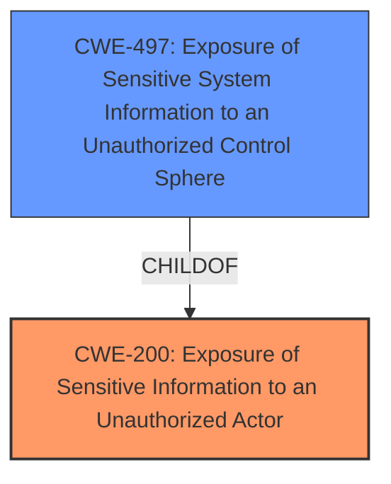

# Enhanced Analysis for CVE-2025-41230

# Summary

| CWE ID | CWE Name | Confidence | CWE Abstraction Level | CWE Vulnerability Mapping Label | CWE-Vulnerability Mapping Notes |
|---|---|---|---|---|---|
| CWE-200 | Exposure of Sensitive Information to an Unauthorized Actor | 0.9 | Class | Primary | Discouraged |
| CWE-497 | Exposure of Sensitive System Information to an Unauthorized Control Sphere | 0.6 | Base | Secondary | Allowed |

## Evidence and Confidence

*   **Confidence Score:** 0.8
*   **Evidence Strength:** MEDIUM

## Relationship Analysis

The primary relationship to consider here is the parent-child relationship between CWE-200 and CWE-497. CWE-497 is a more specific type of information exposure that relates to system-level information. Given that the description doesn't specify *what* sensitive information is exposed, the general CWE-200 is more appropriate, but if more system-level details were specified CWE-497 would be a better fit. Also, the retriever results give a slightly higher score for CWE-497 from sparse analysis and a lower score from graph analysis.



## Vulnerability Chain

The vulnerability chain is relatively simple:

1.  **WEAKNESS**: **Information disclosure vulnerability** (**CWE-200**)
2.  Impact: Gain access to sensitive information.

The initial flaw is the information disclosure vulnerability itself, which directly leads to the impact of gaining access to sensitive information.

## Summary of Analysis

The initial analysis focused on identifying the root cause and impact of the vulnerability. The vulnerability description clearly states an **information disclosure vulnerability**, which aligns with **CWE-200** (Exposure of Sensitive Information to an Unauthorized Actor). The impact is that a malicious actor gains access to sensitive information, reinforcing **CWE-200**.

The retriever results also suggest **CWE-200** as a potential match, along with other CWEs related to authentication and access control. However, since the description focuses on the **information disclosure** aspect, **CWE-200** is the most relevant.

While **CWE-200** is discouraged because it is high-level and often misused, in this case, the provided evidence doesn't allow for a more specific CWE selection. The description doesn't elaborate on the type of information being disclosed or the underlying cause of the disclosure. If further details were available, a more specific CWE might be selected.

The decision to map **CWE-200** is based on the **information disclosure vulnerability** described and the resulting impact of gaining access to sensitive information. The graph relationships show that more specific types of information exposure exist, such as **CWE-497** (Exposure of Sensitive System Information to an Unauthorized Control Sphere), but the current description doesn't provide enough detail to warrant using it.

# Enhanced Context (25 CWEs)
The following CWEs were identified as potentially relevant to this vulnerability:

## CWE-497: Exposure of Sensitive System Information to an Unauthorized Control Sphere
**Abstraction Level**: Base
**Similarity Score**: 0.80
**Source**: dense

**Description**:
The product does not properly prevent sensitive system-level information from being accessed by unauthorized actors who do not have the same level of access to the underlying system as the product does.

**Mapping Guidance**:
- Usage: Allowed
- Rationale: This CWE entry is at the Base level of abstraction, which is a preferred level of abstraction for mapping to the root causes of vulnerabilities.

*CWE-497 was considered as a potential secondary weakness since it relates to system-level information, but was rejected because the vulnerability description lacks enough detail to confirm that the sensitive information being exposed is system-level.*

## CWE-200: Exposure of Sensitive Information to an Unauthorized Actor
**Abstraction Level**: Class
**Similarity Score**: 0.75
**Source**: dense

**Description**:
The product exposes sensitive information to an actor that is not explicitly authorized to have access to that information.

**Mapping Guidance**:
- Usage: Discouraged
- Rationale: CWE-200 is commonly misused to represent the loss of confidentiality in a vulnerability, but confidentiality loss is a technical impact - not a root cause error. As of CWE 4.9, over 400 CWE entries can lead to a loss of confidentiality. Other options are often available. [REF-1287].

*CWE-200 is the primary weakness.*

## CWE-532: Insertion of Sensitive Information into Log File
**Abstraction Level**: Base
**Similarity Score**: 0.74
**Source**: dense

**Description**:
The product writes sensitive information to a log file.

**Mapping Guidance**:
- Usage: Allowed
- Rationale: This CWE entry is at the Base level of abstraction, which is a preferred level of abstraction for mapping to the root causes of vulnerabilities.

*CWE-532 was considered as a potential secondary weakness since it relates to logging sensitive information, but was rejected because the vulnerability description lacks enough detail to confirm that the sensitive information is being exposed through log files.*

## CWE-1391: Use of Weak Credentials
**Abstraction Level**: Class
**Similarity Score**: 0.73
**Source**: dense

**Description**:
The product uses weak credentials (such as a default key or hard-coded password) that can be calculated, derived, reused, or guessed by an attacker.

**Mapping Guidance**:
- Usage: Allowed-with-Review
- Rationale: This CWE entry is a Class and might have Base-level children that would be more appropriate

*CWE-1391 was considered as a potential secondary weakness, but was rejected because the vulnerability description lacks enough detail to confirm that the information disclosure is related to weak credentials.*

## CWE-303: Incorrect Implementation of Authentication Algorithm
**Abstraction Level**: Base
**Similarity Score**: 0.73
**Source**: dense

**Description**:
The requirements for the product dictate the use of an established authentication algorithm, but the implementation of the algorithm is incorrect.

**Mapping Guidance**:
- Usage: Allowed
- Rationale: This CWE entry is at the Base level of abstraction, which is a preferred level of abstraction for mapping to the root causes of vulnerabilities.

*CWE-303 was considered as a potential secondary weakness, but was rejected because the vulnerability description lacks enough detail to confirm that the information disclosure is related to authentication algorithms.*

## CWE-212: Improper Removal of Sensitive Information Before Storage or Transfer
**Abstraction Level**: Base
**Similarity Score**: 0.73
**Source**: dense

**Description**:
The product stores, transfers, or shares a resource that contains sensitive information, but it does not properly remove that information before the product makes the resource available to unauthorized actors.

**Mapping Guidance**:
- Usage: Allowed
- Rationale: This CWE entry is at the Base level of abstraction, which is a preferred level of abstraction for mapping to the root causes of vulnerabilities.

*CWE-212 was considered as a potential secondary weakness, but was rejected because the vulnerability description lacks enough detail to confirm that the information disclosure is related to improper removal of sensitive information.*

## CWE-288: Authentication Bypass Using an Alternate Path or Channel
**Abstraction Level**: Base
**Similarity Score**: 0.73
**Source**: dense

**Description**:
The product requires authentication, but the product has an alternate path or channel that does not require authentication.

**Mapping Guidance**:
- Usage: Allowed
- Rationale: This CWE entry is at the Base level of abstraction, which is a preferred level of abstraction for mapping to the root causes of vulnerabilities.

*CWE-288 was considered as a potential secondary weakness, but was rejected because the vulnerability description lacks enough detail to confirm that the information disclosure is related to authentication bypass.*

## CWE-209: Generation of Error Message Containing Sensitive Information
**Abstraction Level**: Base
**Similarity Score**: 0.73
**Source**: dense

**Description**:
The product generates an error message that includes sensitive information about its environment, users, or associated data.

**Mapping Guidance**:
- Usage: Allowed
- Rationale: This CWE entry is at the Base level of abstraction, which is a preferred level of abstraction for mapping to the root causes of vulnerabilities.

*CWE-209 was considered as a potential secondary weakness, but was rejected because the vulnerability description lacks enough detail to confirm that the information disclosure is related to error messages.*

## CWE-203: Observable Discrepancy
**Abstraction Level**: Base
**Similarity Score**: 0.72
**Source**: dense

**Description**:
The product behaves differently or sends different responses under different circumstances in a way that is observable to an unauthorized actor, which exposes security-relevant information about the state of the product, such as whether a particular operation was


## CWE Relationship Analysis

Current CWEs represent these abstraction levels: .


### Vulnerability Chain Analysis

**Chain starting from CWE-288:**
- 288 (Authentication Bypass Using an Alternate Path or Channel) - ROOT


**Chain starting from CWE-203:**
- 203 (Observable Discrepancy) - ROOT


### CWE Relationship Diagram

```mermaid
graph TD
    classDef primary fill:#f96,stroke:#333,stroke-width:2px
    classDef secondary fill:#69f,stroke:#333
    classDef tertiary fill:#9e9,stroke:#333
```