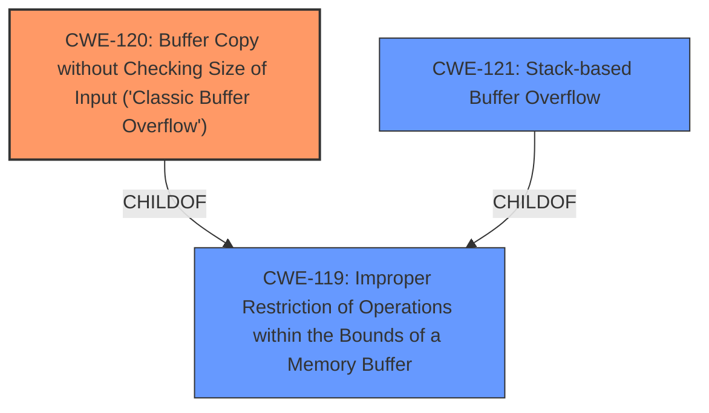

# Analysis Report for CVE-2025-4145

# Vulnerability Analysis Report: CVE-2025-4145

## Description

A vulnerability, which was classified as critical, has been found in Netgear EX6200 1.0.3.94. This issue affects the function sub_3D0BC. The manipulation of the argument host leads to **buffer overflow**. The attack may be initiated remotely. The vendor was contacted early about this disclosure but did not respond in any way.

## Vulnerability Description Key Phrases

- **Weakness:** buffer overflow
- **Vector:** manipulation of argument host
- **Product:** Netgear EX6200
- **Version:** 1.0.3.94
- **Component:** sub_3D0BC function

## Analysis (with Relationship Data)

# Summary
| CWE ID | CWE Name | Confidence | CWE Abstraction Level | CWE Vulnerability Mapping Label | CWE-Vulnerability Mapping Notes |
|---|---|---|---|---|---|
| **CWE-120** | Buffer Copy without Checking Size of Input ('Classic Buffer Overflow') | 0.8 | Base | Primary | Allowed-with-Review |
| CWE-119 | Improper Restriction of Operations within the Bounds of a Memory Buffer | 0.6 | Class | Secondary | Discouraged |
| CWE-121 | Stack-based Buffer Overflow | 0.5 | Variant | Secondary | Allowed |

## Evidence and Confidence

*   **Confidence Score:** 0.7
*   **Evidence Strength:** MEDIUM

## Relationship Analysis
The primary relationship influencing the selection is the parent-child relationship where CWE-120 Buffer Copy without Checking Size of Input ('Classic Buffer Overflow') is a specific type of CWE-119 Improper Restriction of Operations within the Bounds of a Memory Buffer. CWE-121 Stack-based Buffer Overflow is a variant of CWE-119. The vulnerability description mentions "**buffer overflow**" due to manipulation of the host argument, suggesting a potential buffer copy issue. Therefore, CWE-120 is more specific and appropriate, while CWE-119 serves as a broader category. If the buffer is allocated on the stack, CWE-121 could be considered.



## Vulnerability Chain
The vulnerability chain starts with the **buffer overflow** due to the manipulation of the host argument. This leads to a potential crash or arbitrary code execution.

## Summary of Analysis
The initial analysis focused on identifying the root cause of the vulnerability. The vulnerability description mentions "**buffer overflow**" as the weakness. Based on this information and the retriever results, CWE-120 seems to be the most appropriate primary CWE. However, the description lacks specific details on whether it's a stack or heap overflow. The description provides evidence of a **buffer overflow** when manipulating the host argument in the sub_3D0BC function of the Netgear EX6200 router. This suggests that the software does not properly validate the size of the input being copied into a buffer, leading to a buffer overflow.
CWE-119 is a more general case, and while technically correct, CWE-120 is a more precise classification.

The retriever results also suggested other CWEs like CWE-190 (Integer Overflow or Wraparound), CWE-89 (Improper Neutralization of Special Elements used in an SQL Command ('SQL Injection')), and CWE-125 (Out-of-bounds Read), but these are not directly related to the provided vulnerability description, which specifically indicates a **buffer overflow**.

The final decision is based on the evidence of "**buffer overflow**" and the retriever results, leading to the selection of CWE-120 as the primary CWE, with CWE-119 and CWE-121 being considered as secondary options based on the potential for a stack-based overflow if the buffer is allocated on the stack.

Relevant CWE Information:

# Enhanced Context (25 CWEs)
The following CWEs were identified as potentially relevant to this vulnerability:

## CWE-134: Use of Externally-Controlled Format String
**Abstraction Level**: Base
**Similarity Score**: 0.71
**Source**: dense

**Description**:
The product uses a function that accepts a format string as an argument, but the format string originates from an external source.

**Mapping Guidance**:
- Usage: Allowed
- Rationale: This CWE entry is at the Base level of abstraction, which is a preferred level of abstraction for mapping to the root causes of vulnerabilities.

*This CWE is not selected because the vulnerability description indicates a **buffer overflow**, not a format string issue.*

## CWE-77: Improper Neutralization of Special Elements used in a Command ('Command Injection')
**Abstraction Level**: Class
**Similarity Score**: 0.71
**Source**: dense

**Description**:
The product constructs all or part of a command using externally-influenced input from an upstream component, but it does not neutralize or incorrectly neutralizes special elements that could modify the intended command when it is sent to a downstream component.

**Mapping Guidance**:
- Usage: Allowed-with-Review
- Rationale: CWE-77 is often misused when OS command injection (CWE-78) was intended instead [REF-1287].

*This CWE is not selected because the vulnerability description indicates a **buffer overflow**, not a command injection issue.*

## CWE-121: Stack-based Buffer Overflow
**Abstraction Level**: Variant
**Similarity Score**: 0.71
**Source**: dense

**Description**:
A stack-based buffer overflow condition is a condition where the buffer being overwritten is allocated on the stack (i.e., is a local variable or, rarely, a parameter to a function).

**Mapping Guidance**:
- Usage: Allowed
- Rationale: This CWE entry is at the Variant level of abstraction, which is a preferred level of abstraction for mapping to the root causes of vulnerabilities.

*This CWE is selected as a secondary candidate because the type of buffer overflow (stack vs heap) is not specified in the vulnerability description.*

## CWE-497: Exposure of Sensitive System Information to an Unauthorized Control Sphere
**Abstraction Level**: Base
**Similarity Score**: 0.70
**Source**: dense

**Description**:
The product does not properly prevent sensitive system-level information from being accessed by unauthorized actors who do not have the same level of access to the underlying system as the product does.

**Mapping Guidance**:
- Usage: Allowed
- Rationale: This CWE entry is at the Base level of abstraction, which is a preferred level of abstraction for mapping to the root causes of vulnerabilities.

*This CWE is not selected because the vulnerability description indicates a **buffer overflow**, not an information exposure issue.*

## CWE-755: Improper Handling of Exceptional Conditions
**Abstraction Level**: Class
**Similarity Score**: 0.70
**Source**: dense

**Description**:
The product does not handle or incorrectly handles an exceptional condition.

**Mapping Guidance**:
- Usage: Discouraged
- Rationale: This CWE entry is a level-1 Class (i.e., a child of a Pillar). It might have lower-level children that would be more appropriate

*This CWE is not selected because the vulnerability description indicates a **buffer overflow**, not a general exception handling issue.*

## CWE-131: Incorrect Calculation of Buffer Size
**Abstraction Level**: Base
**Similarity Score**: 0.70
**Source**: dense

**Description**:
The product does not correctly calculate the size to be used when allocating a buffer, which could lead to a buffer overflow.

**Mapping Guidance**:
- Usage: Allowed
- Rationale: This CWE entry is at the Base level of abstraction, which is a preferred level of abstraction for mapping to the root causes of vulnerabilities.

*This CWE could be related, as an incorrect buffer size calculation could lead to a **buffer overflow**, but the description only says "buffer overflow", not root cause.*

## CWE-119: Improper Restriction of Operations within the Bounds of a Memory Buffer
**Abstraction Level**: Class
**Similarity Score**: 0.70
**Source**: dense

**Description**:
The product performs operations on a memory buffer, but it reads from or writes to a memory location outside the buffer's intended boundary. This may result in read or write operations on unexpected memory locations that could be linked to other variables, data structures, or internal program data.

**Mapping Guidance**:
- Usage: Discouraged
- Rationale: CWE-119 is commonly misused in low-information vulnerability reports when lower-level CWEs could be used instead, or when more details about the vulnerability are available.

*This CWE is selected as a secondary candidate because it is a general **buffer overflow** issue, but it's discouraged when more details are available, such as CWE-120.*

## CWE-74: Improper Neutralization of Special Elements in Output Used by a Downstream Component ('Injection')
**Abstraction Level**: Class
**Similarity Score**: 0.69
**Source**: dense

**Description**:
The product constructs all or part of a command, data structure, or record using externally-influenced input from an upstream component, but it does not neutralize or incorrectly neutralizes special elements that could modify how it is parsed or interpreted when it is sent to a downstream component.

**Mapping Guidance**:
- Usage: Discouraged
- Rationale: CWE-


## CWE Relationship Analysis

Current CWEs represent these abstraction levels: .


### Vulnerability Chain Analysis

**Chain starting from CWE-89:**
- 89 (Improper Neutralization of Special Elements used in an SQL Command ('SQL Injection')) - ROOT


**Chain starting from CWE-121:**
- 121 (Stack-based Buffer Overflow) - ROOT


### CWE Relationship Diagram

```mermaid
graph TD
    classDef primary fill:#f96,stroke:#333,stroke-width:2px
    classDef secondary fill:#69f,stroke:#333
    classDef tertiary fill:#9e9,stroke:#333
```


*Report generated on 2025-07-14 23:14:52*
