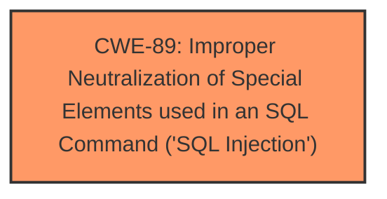

# Raw Analyzer Response for CVE-2025-4152

# Summary
| CWE ID  | CWE Name                                                                                                         | Confidence | CWE Abstraction Level | CWE Vulnerability Mapping Label | CWE-Vulnerability Mapping Notes |
| :------- | :--------------------------------------------------------------------------------------------------------------- | :--------- | :---------------------- | :------------------------------ | :------------------------------ |
| CWE-89   | Improper Neutralization of Special Elements used in an SQL Command ('SQL Injection')                             | 1.0        | Base                    | Primary                         | Allowed                         |

## Evidence and Confidence

*   **Confidence Score:** 1.0
*   **Evidence Strength:** HIGH

## Relationship Analysis
The primary relationship is that CWE-89 is a base-level weakness describing the specific **improper neutralization** leading to **SQL Injection**. There are no parent or child relationships that are more appropriate in this context, as the description directly aligns with the base weakness. The other CWEs considered were broader (CWE-74) or focused on different attack vectors (CWE-79, CWE-434).

## Vulnerability Chain
The vulnerability chain is straightforward:

1.  **Root Cause:** CWE-89 - Improper Neutralization of Special Elements used in an SQL Command ('SQL Injection') due to lack of input validation on the `fromdate` parameter.
2.  **Impact:** Unauthorized database access, sensitive data leakage, data tampering, comprehensive system control, and even service interruption.

## Summary of Analysis
The vulnerability description clearly states that the `fromdate` parameter in `/admin/bwdates-reports-details.php` is vulnerable to **SQL Injection**. The CVE Reference Links Content Summary confirms this, stating that the **root cause** is the lack of proper cleaning or validation of the `fromdate` parameter before using it in SQL queries.

The retriever results strongly suggest CWE-89 as the primary candidate, with a score of 1.0. The Complete CWE Specifications for CWE-89 accurately describe the vulnerability: "The product constructs all or part of an SQL command using externally-influenced input... but it does not neutralize or incorrectly neutralizes special elements that could modify the intended SQL command."

Other CWEs were considered but deemed less appropriate:

*   CWE-79 (Cross-Site Scripting): While also related to improper neutralization, it focuses on web page generation, not SQL commands.
*   CWE-434 (Unrestricted Upload of File with Dangerous Type): Not relevant as the vulnerability is related to SQL injection, not file uploads.
*   CWE-74 (Improper Neutralization of Special Elements in Output Used by a Downstream Component ('Injection')): Too generic. CWE-89 is a specific type of injection.

The final decision to select CWE-89 is based on the clear evidence of **SQL Injection** in the vulnerability description, the confirmation in the CVE Reference Links Content Summary, the high score in the retriever results, and the accurate description of the weakness in the CWE-89 specification. CWE-89 is at the appropriate level of specificity (Base) and accurately represents the **root cause** of the vulnerability.