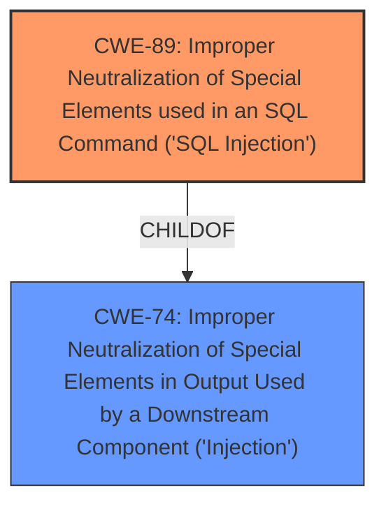

# Enhanced Analysis for CVE-2025-4153

# Summary
| CWE ID | CWE Name | Confidence | CWE Abstraction Level | CWE Vulnerability Mapping Label | CWE-Vulnerability Mapping Notes |
|---|---|---|---|---|---|
| CWE-89 | Improper Neutralization of Special Elements used in an SQL Command ('SQL Injection') | 1.0 | Base | Allowed | Primary CWE. The vulnerability is caused by **insufficient validation of user input** leading to **SQL injection**. |

## Evidence and Confidence

*   **Confidence Score:** 1.0
*   **Evidence Strength:** HIGH

## Relationship Analysis
The primary relationship considered was the parent-child relationship within the CWE hierarchy. Although CWE-74 (Improper Neutralization of Special Elements in Output Used by a Downstream Component ('Injection')) is a parent Class of CWE-89, the specific nature of the vulnerability being SQL injection makes CWE-89 the more appropriate and specific choice. There are no other direct relationships which clearly improve the classification in this case.



## Vulnerability Chain
The vulnerability chain consists of the following:
1.  **Root Cause:** **Improper Neutralization of Special Elements used in an SQL Command ('SQL Injection')** (CWE-89) due to **insufficient validation of user input**.
2.  **Impact:** Attackers can gain unauthorized database access, leading to data leakage, data tampering, system control, and service disruption.

## Summary of Analysis
The initial analysis strongly suggested CWE-89 due to the clear description of the **SQL injection vulnerability**. The CVE Reference Links Content Summary explicitly states that the vulnerability is caused by **insufficient validation of user input** for the "adminname" parameter, allowing attackers to inject malicious SQL queries.

The retriever results also strongly supported CWE-89 as the primary candidate. While other CWEs like CWE-79 (Improper Neutralization of Input During Web Page Generation ('Cross-site Scripting')) and CWE-434 (Unrestricted Upload of File with Dangerous Type) were considered, they did not accurately reflect the specific nature of the vulnerability.

The final decision to assign CWE-89 was based on:
1.  Direct evidence from the vulnerability description and CVE Reference Links Content Summary.
2.  The high relevance score of CWE-89 in the retriever results.
3.  The MITRE mapping guidance, which allows the use of Base-level CWEs like CWE-89.

The selected CWE is at the optimal level of specificity because it directly addresses the root cause of the vulnerability, which is the **improper neutralization of special elements used in an SQL command**.

Relevant CWE Information:
-   **CWE-89:** The product constructs all or part of an SQL command using externally-influenced input, but it does not neutralize or incorrectly neutralizes special elements that could modify the intended SQL command.


## CWE Relationship Analysis

Current CWEs represent these abstraction levels: .


### Vulnerability Chain Analysis

**Chain starting from CWE-89:**
- 89 (Improper Neutralization of Special Elements used in an SQL Command ('SQL Injection')) - ROOT


**Chain starting from CWE-79:**
- 79 (Improper Neutralization of Input During Web Page Generation ('Cross-site Scripting')) - ROOT


### CWE Relationship Diagram

```mermaid
graph TD
    classDef primary fill:#f96,stroke:#333,stroke-width:2px
    classDef secondary fill:#69f,stroke:#333
    classDef tertiary fill:#9e9,stroke:#333
```