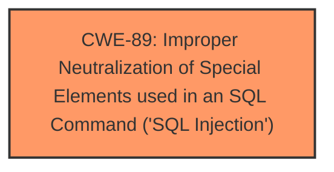

# Analysis for CVE-2025-4164

# Summary
| CWE ID | CWE Name | Confidence | CWE Abstraction Level | CWE Vulnerability Mapping Label | CWE-Vulnerability Mapping Notes |
|---|---|---|---|---|---|
| CWE-89 | Improper Neutralization of Special Elements used in an SQL Command ('SQL Injection') | 1.0 | Base | Allowed | Primary CWE |

## Evidence and Confidence

*   **Confidence Score:** 1.0
*   **Evidence Strength:** HIGH

## Relationship Analysis
The primary relationship that impacted my decision was the direct match of the vulnerability description to CWE-89, which is a Base level CWE. There are no parent or child relationships that influenced the selection in this case as the evidence is very clear.

## Vulnerability Chain
The vulnerability chain consists of a single step:
1.  **Root Cause:** **CWE-89** - Improper Neutralization of Special Elements used in an SQL Command ('SQL Injection') due to the **manipulation of the argument currentpassword** leading to **sql injection**.

## Summary of Analysis
The vulnerability description clearly states that the **manipulation of the argument currentpassword leads to sql injection**. This directly corresponds to CWE-89, "Improper Neutralization of Special Elements used in an SQL Command ('SQL Injection')". The CVE Reference Links Content Summary section does not provide any additional information, but the **Vulnerability Description Key Phrases** confirms the presence of the **weakness sql injection**, solidifying the classification. The retriever results also list CWE-89 as the top candidate with a score of 1.0, confirming that this is the most relevant CWE. All other CWEs were considered but did not fit the vulnerability description as accurately as CWE-89.

Relevant CWE Information:

# Enhanced Context (25 CWEs)
The following CWEs were identified as potentially relevant to this vulnerability:

## CWE-89: Improper Neutralization of Special Elements used in an SQL Command ('SQL Injection')
**Abstraction Level**: Base
**Similarity Score**: 0.77
**Source**: dense

**Description**:
The product constructs all or part of an SQL command using externally-influenced input from an upstream component, but it does not neutralize or incorrectly neutralizes special elements that could modify the intended SQL command when it is sent to a downstream component. Without sufficient removal or quoting of SQL syntax in user-controllable inputs, the generated SQL query can cause those inputs to be interpreted as SQL instead of ordinary user data.

**Mapping Guidance**:
- Usage: Allowed
- Rationale: This CWE entry is at the Base level of abstraction, which is a preferred level of abstraction for mapping to the root causes of vulnerabilities.