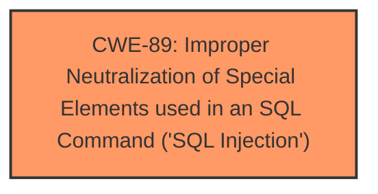

# Raw Analyzer Response for CVE-2025-4193

# Summary
| CWE ID | CWE Name | Confidence | CWE Abstraction Level | CWE Vulnerability Mapping Label | CWE-Vulnerability Mapping Notes |
|---|---|---|---|---|---|
| CWE-89 | Improper Neutralization of Special Elements used in an SQL Command ('SQL Injection') | 1.0 | Base | Primary | Allowed |

## Evidence and Confidence

*   **Confidence Score:** 1.0
*   **Evidence Strength:** HIGH

## Relationship Analysis
The primary relationship influencing the CWE selection is that CWE-89 is a **Base** level CWE, which is preferred for root cause analysis. There are no strong parent-child or chain relationships evident in this specific vulnerability description that would suggest a different mapping.

## Vulnerability Chain
The vulnerability chain is straightforward:
1.  **Root Cause:** **Improper Neutralization** of special elements in SQL commands (CWE-89).
2.  **Impact:** SQL Injection leading to unauthorized database access, sensitive data leakage, data tampering, comprehensive system control, and service interruption.

## Summary of Analysis
The analysis is based on the provided evidence, which strongly indicates a SQL Injection vulnerability.

The vulnerability description explicitly states that the **manipulation of the Category argument leads to sql injection**. The CVE Reference Links Content Summary reinforces this, highlighting the **insufficient user input validation of the 'category' parameter**, which allows attackers to inject malicious SQL queries. This is the core characteristic of CWE-89.

The retriever results also strongly support CWE-89 as the primary candidate with a score of 1.0.

Therefore, CWE-89 is selected as the optimal level of specificity for this vulnerability.

Relevant CWE Information:

# Enhanced Context (25 CWEs)
The following CWEs were identified as potentially relevant to this vulnerability:

## CWE-89: Improper Neutralization of Special Elements used in an SQL Command ('SQL Injection')
**Abstraction Level**: Base
**Similarity Score**: 1.00
**Source**: alternate_terms

**Description**:
The product constructs all or part of an SQL command using externally-influenced input from an upstream component, but it does not neutralize or incorrectly neutralizes special elements that could modify the intended SQL command when it is sent to a downstream component. Without sufficient removal or quoting of SQL syntax in user-controllable inputs, the generated SQL query can cause those inputs to be interpreted as SQL instead of ordinary user data.

**Mapping Guidance**:
- Usage: Allowed
- Rationale: This CWE entry is at the Base level of abstraction, which is a preferred level of abstraction for mapping to the root causes of vulnerabilities.

## CWE-89: Improper Neutralization of Special Elements used in an SQL Command ('SQL Injection')
**Abstraction Level**: Base
**Similarity Score**: 863.25
**Source**: sparse

**Description**:
The product constructs all or part of an SQL command using externally-influenced input from an upstream component, but it does not neutralize or incorrectly neutralizes special elements that could modify the intended SQL command when it is sent to a downstream component. Without sufficient removal or quoting of SQL syntax in user-controllable inputs, the generated SQL query can cause those inputs to be interpreted as SQL instead of ordinary user data.

**Mapping Guidance**:
- Usage: Allowed
- Rationale: This CWE entry is at the Base level of abstraction, which is a preferred level of abstraction for mapping to the root causes of vulnerabilities.

CWE-79, CWE-434, CWE-1336, CWE-117, CWE-99, CWE-352, CWE-306, CWE-96, and CWE-425 were considered but are not appropriate because the vulnerability is clearly SQL injection, not related to web page generation, file uploads, template engines, logging, resource control, CSRF, authentication, or static code.