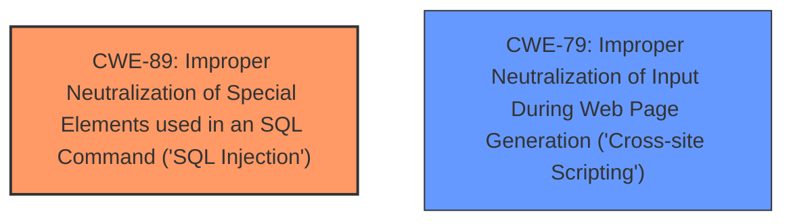

# Analysis Report for CVE-2025-4249

# Vulnerability Analysis Report: CVE-2025-4249

## Description

A vulnerability was found in PHPGurukul e-Diary Management System 1.0 and classified as critical. Affected by this issue is some unknown functionality of the file /manage-categories.php. The manipulation of the argument ID leads to **sql injection**. The attack may be launched remotely. The exploit has been disclosed to the public and may be used.

## Vulnerability Description Key Phrases

- **Weakness:** sql injection
- **Vector:** manipulation of ID argument
- **Product:** PHPGurukul e-Diary Management System
- **Version:** 1
- **Component:** /manage-categories.php

## Analysis (with Relationship Data)

# Summary
| CWE ID | CWE Name | Confidence | CWE Abstraction Level | CWE Vulnerability Mapping Label | CWE-Vulnerability Mapping Notes |
|---|---|---|---|---|---|
| CWE-89 | Improper Neutralization of Special Elements used in an SQL Command ('SQL Injection') | 1.0 | Base | Allowed | Primary CWE |
| CWE-79 | Improper Neutralization of Input During Web Page Generation ('Cross-site Scripting') | 0.3 | Base | Allowed | Secondary Candidate |

## Evidence and Confidence

*   **Confidence Score:** 0.9
*   **Evidence Strength:** HIGH

## Relationship Analysis
The primary relationship is that CWE-89 is a base-level weakness that directly addresses the **SQL Injection** vulnerability. While other CWEs like CWE-79 (Cross-site Scripting) are present in the retriever results, they are not the direct cause of the vulnerability described. The focus is on the improper neutralization of SQL special elements.



## Vulnerability Chain
The vulnerability chain starts with the **improper neutralization** of the ID parameter, leading directly to **SQL Injection**.

`Improper Neutralization` -> `SQL Injection`

CWE-89 directly captures this chain.

## Summary of Analysis
The primary assessment is based on the clear evidence of **SQL Injection** due to **improper neutralization** within the `/manage-categories.php` file. The provided "CVE Reference Links Content Summary" confirms this with the root cause being the direct use of the "id" parameter in an SQL query without proper sanitization or validation. The retriever results also highlight CWE-89 as the top candidate.

The selection of CWE-89 is based on its precise match to the described vulnerability and the provided evidence. It is at the optimal base level of specificity. CWE-79 was considered, but it is not the root cause; rather, SQL injection is.

Relevant CWE Information:

# Enhanced Context (25 CWEs)

## CWE-89: Improper Neutralization of Special Elements used in an SQL Command ('SQL Injection')
**Abstraction Level**: Base
**Similarity Score**: 0.79
**Source**: dense

**Description**:
The product constructs all or part of an SQL command using externally-influenced input from an upstream component, but it does not neutralize or incorrectly neutralizes special elements that could modify the intended SQL command when it is sent to a downstream component. Without sufficient removal or quoting of SQL syntax in user-controllable inputs, the generated SQL query can cause those inputs to be interpreted as SQL instead of ordinary user data.

**Mapping Guidance**:
- Usage: Allowed
- Rationale: This CWE entry is at the Base level of abstraction, which is a preferred level of abstraction for mapping to the root causes of vulnerabilities.
**Technical Explanation:** The vulnerability description clearly states that the manipulation of the `ID` argument leads to **SQL Injection**. This aligns perfectly with CWE-89, which describes the **improper neutralization** of special elements used in an SQL command. An attacker can inject malicious SQL code by manipulating the `ID` parameter, leading to unauthorized database access.
**Security Implications:** Successful exploitation of this vulnerability can lead to unauthorized database access, sensitive data leakage, data tampering, system control, and service interruption.
**Relationship Analysis:** CWE-89 is a base-level CWE, providing a specific description of the SQL injection vulnerability. There are no direct parent-child relationships that significantly influence the mapping in this case.
**Mapping Guidance Influence:** The mapping guidance for CWE-89 states that its usage is "Allowed" and the rationale is that it is at the base level of abstraction, which is appropriate for mapping root causes.

## CWE-79: Improper Neutralization of Input During Web Page Generation ('Cross-site Scripting')
**Abstraction Level**: Base
**Similarity Score**: 0.75
**Source**: dense

**Description**:
The product does not neutralize or incorrectly neutralizes user-controllable input before it is placed in output that is used as a web page that is served to other users.

**Mapping Guidance**:
- Usage: Allowed
- Rationale: This CWE entry is at the Base level of abstraction, which is a preferred level of abstraction for mapping to the root causes of vulnerabilities.
**Technical Explanation:** While the vulnerability involves a web page (`/manage-categories.php`), the core issue is **SQL Injection**, not Cross-site Scripting. CWE-79 is related to the **improper neutralization** of input during web page generation, leading to the execution of malicious scripts in the user's browser. Although the file `/manage-categories.php` is involved, the vulnerability is not directly related to script execution within the web page itself.
**Security Implications:** XSS vulnerabilities can lead to session hijacking, website defacement, or the redirection of users to malicious websites.
**Relationship Analysis:** CWE-79 is a base-level CWE, but it's not the primary weakness in this case.
**Mapping Guidance Influence:** The mapping guidance for CWE-79 states that its usage is "Allowed", but the context of the vulnerability points more towards **SQL Injection**.

**Explanation of why other CWEs were considered but not used:**

*   **CWE-434: Unrestricted Upload of File with Dangerous Type:** This CWE is not relevant because the vulnerability does not involve the uploading of files.
*   **CWE-1336: Improper Neutralization of Special Elements Used in a Template Engine:** This CWE is not relevant because the vulnerability is not related to template engine injection.
*   **CWE-117: Improper Output Neutralization for Logs:** This CWE is not relevant because the vulnerability does not involve log injection.
*   **CWE-99: Improper Control of Resource Identifiers ('Resource Injection'):** This CWE is not relevant because the vulnerability is not about resource injection.
*   **CWE-352: Cross-Site Request Forgery (CSRF):** This CWE is not relevant because the vulnerability does not involve CSRF.
*   **CWE-74: Improper Neutralization of Special Elements in Output Used by a Downstream Component ('Injection'):** This is a class-level CWE and is too broad. CWE-89 provides a more specific and accurate description of the vulnerability.
*   **CWE-96: Improper Neutralization of Directives in Statically Saved Code ('Static Code Injection'):** This CWE is not relevant because the vulnerability does not involve injecting code into statically saved code.
*   **CWE-73: External Control of File Name or Path:** This CWE is not relevant because the vulnerability does not involve file path manipulation.


## CWE Relationship Analysis

Current CWEs represent these abstraction levels: .


### Vulnerability Chain Analysis

**Chain starting from CWE-89:**
- 89 (Improper Neutralization of Special Elements used in an SQL Command ('SQL Injection')) - ROOT


**Chain starting from CWE-99:**
- 99 (Improper Control of Resource Identifiers ('Resource Injection')) - ROOT


### CWE Relationship Diagram

```mermaid
graph TD
    classDef primary fill:#f96,stroke:#333,stroke-width:2px
    classDef secondary fill:#69f,stroke:#333
    classDef tertiary fill:#9e9,stroke:#333
```


*Report generated on 2025-07-14 23:34:30*
