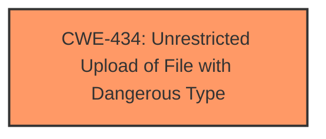

# Raw Analyzer Response for CVE-2025-4259

# Summary

| CWE ID | CWE Name | Confidence | CWE Abstraction Level | CWE Vulnerability Mapping Label | CWE-Vulnerability Mapping Notes |
|---|---|---|---|---|---|
| CWE-434 | Unrestricted Upload of File with Dangerous Type | 1.0 | Base | Allowed | Primary CWE - The vulnerability allows the upload of dangerous file types, which aligns directly with the CWE definition. |

## Evidence and Confidence

*   **Confidence Score:** 1.0
*   **Evidence Strength:** HIGH

## Relationship Analysis
The primary CWE identified is CWE-434 (Unrestricted Upload of File with Dangerous Type). This CWE is a base-level weakness. There are no direct parent-child or chain relationships that significantly influence the selection in this specific case, as the description is very direct.

## Vulnerability Chain
The vulnerability chain is straightforward:

1.  **Root Cause:** **Unrestricted upload** functionality.
2.  **Impact:** Potential execution of malicious code or compromise of the system, though the specific impact isn't detailed in this description.

## Summary of Analysis
The analysis is based on the direct evidence provided in the vulnerability description, which clearly states "**unrestricted upload**" as the **weakness**. The description matches the definition of CWE-434 (Unrestricted Upload of File with Dangerous Type).

The retriever results also support this, listing CWE-434 as the second most relevant CWE.

Relevant CWE Information:

# Enhanced Context (25 CWEs)
The following CWEs were identified as potentially relevant to this vulnerability:

## CWE-434: Unrestricted Upload of File with Dangerous Type
**Abstraction Level**: Base
**Similarity Score**: 0.77
**Source**: dense

**Description**:
The product allows the upload or transfer of dangerous file types that are automatically processed within its environment.

**Mapping Guidance**:
- Usage: Allowed
- Rationale: This CWE entry is at the Base level of abstraction, which is a preferred level of abstraction for mapping to the root causes of vulnerabilities.

The selection of CWE-434 is at the optimal level of specificity because it directly describes the **root cause** of the vulnerability: the ability to upload dangerous file types without proper restrictions.