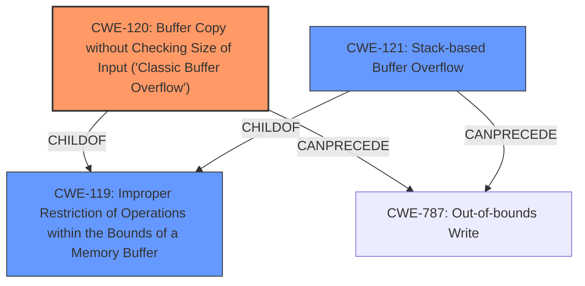

# Analysis Report for CVE-2025-4288

# Vulnerability Analysis Report: CVE-2025-4288

## Description

A vulnerability classified as critical has been found in PCMan FTP Server 2.0.7. This affects an unknown part of the component RNFR Command Handler. The manipulation leads to **buffer overflow**. It is possible to initiate the attack remotely. The exploit has been disclosed to the public and may be used.

## Vulnerability Description Key Phrases

- **Weakness:** buffer overflow
- **Product:** PCMan FTP Server
- **Version:** 2.0.7
- **Component:** RNFR Command Handler

## Analysis (with Relationship Data)

# Summary
| CWE ID | CWE Name | Confidence | CWE Abstraction Level | CWE Vulnerability Mapping Label | CWE-Vulnerability Mapping Notes |
|---|---|---|---|---|---|
| CWE-120 | Buffer Copy without Checking Size of Input ('Classic Buffer Overflow') | 0.9 | Base | Allowed-with-Review | Primary CWE |
| CWE-121 | Stack-based Buffer Overflow | 0.7 | Variant | Allowed | Secondary Candidate |
| CWE-119 | Improper Restriction of Operations within the Bounds of a Memory Buffer | 0.6 | Class | Discouraged | Secondary Candidate |

## Evidence and Confidence

*   **Confidence Score:** 0.9
*   **Evidence Strength:** HIGH

## Relationship Analysis
The primary relationship influencing the CWE selection is the parent-child relationship, where CWE-120 is a more specific type of CWE-119. Also, CWE-121 is a variant of buffer overflow that occurs on the stack. The CanPrecede relationship from CWE-120 and CWE-121 to CWE-787 (Out-of-bounds Write, not listed in the enhanced context) suggests a potential chain of vulnerabilities. Abstraction levels were considered to select the most specific CWE, which is CWE-120 at the Base level.



## Vulnerability Chain
The vulnerability chain starts with the **lack of size checking** during the buffer copy operation (CWE-120), which leads to a **buffer overflow**. This overflow can then result in overwriting critical data or code, potentially leading to arbitrary code execution.

## Summary of Analysis
The analysis is strongly based on the provided evidence. The vulnerability description explicitly mentions "**buffer overflow**" in the component "RNFR Command Handler." The CVE reference summary confirms a remote buffer overflow exploit using the `RNFR` command, aiming to overwrite the instruction pointer (EIP). This aligns directly with the characteristics of CWE-120, "**Buffer Copy without Checking Size of Input ('Classic Buffer Overflow')**," which occurs when data is copied to a buffer without validating the size of the input, causing it to write past the end of the buffer.

CWE-120 is selected as the primary CWE due to the explicit mention of a buffer copy operation and the **lack of size checking**. This is a Base level CWE, which is preferred. While CWE-119 ("Improper Restriction of Operations within the Bounds of a Memory Buffer") is a broader category, CWE-120 provides a more specific description of the vulnerability. The exploit details mention the target of the overflow is to overwrite EIP, which typically occurs on the stack. Therefore CWE-121 (Stack-based Buffer Overflow) is a candidate.

CWE-20 ("Improper Input Validation") was considered but deemed too general. The issue isn't simply a lack of validation, but the specific problem of not checking the size during a copy operation. Similarly, CWE-74 ("Improper Neutralization of Special Elements in Output Used by a Downstream Component ('Injection')") was considered, but it's more related to injection vulnerabilities, not direct buffer overflows.

Relevant CWE Information:

# Enhanced Context (25 CWEs)
The following CWEs were identified as potentially relevant to this vulnerability:

## CWE-434: Unrestricted Upload of File with Dangerous Type
**Abstraction Level**: Base
**Similarity Score**: 0.73
**Source**: dense

**Description**:
The product allows the upload or transfer of dangerous file types that are automatically processed within its environment.

**Mapping Guidance**:
- Usage: Allowed
- Rationale: This CWE entry is at the Base level of abstraction, which is a preferred level of abstraction for mapping to the root causes of vulnerabilities.

*Not Selected*: This CWE is irrelevant as it relates to file uploads, which is not the case in this vulnerability.

## CWE-134: Use of Externally-Controlled Format String
**Abstraction Level**: Base
**Similarity Score**: 0.72
**Source**: dense

**Description**:
The product uses a function that accepts a format string as an argument, but the format string originates from an external source.

**Mapping Guidance**:
- Usage: Allowed
- Rationale: This CWE entry is at the Base level of abstraction, which is a preferred level of abstraction for mapping to the root causes of vulnerabilities.

*Not Selected*: The vulnerability is about buffer overflow and not format string related issues.

## CWE-918: Server-Side Request Forgery (SSRF)
**Abstraction Level**: Base
**Similarity Score**: 0.71
**Source**: dense

**Description**:
The web server receives a URL or similar request from an upstream component and retrieves the contents of this URL, but it does not sufficiently ensure that the request is being sent to the expected destination.

**Mapping Guidance**:
- Usage: Allowed
- Rationale: This CWE entry is at the Base level of abstraction, which is a preferred level of abstraction for mapping to the root causes of vulnerabilities.

*Not Selected*: This CWE is not relevant because the vulnerability is not related to server-side request forgery.

## CWE-425: Direct Request ('Forced Browsing')
**Abstraction Level**: Base
**Similarity Score**: 0.71
**Source**: dense

**Description**:
The web application does not adequately enforce appropriate authorization on all restricted URLs, scripts, or files.

**Mapping Guidance**:
- Usage: Allowed
- Rationale: This CWE entry is at the Base level of abstraction, which is a preferred level of abstraction for mapping to the root causes of vulnerabilities.

*Not Selected*: This CWE is not relevant as it is related to authorization issues, which are not part of the vulnerability.

## CWE-119: Improper Restriction of Operations within the Bounds of a Memory Buffer
**Abstraction Level**: Class
**Similarity Score**: 0.70
**Source**: dense

**Description**:
The product performs operations on a memory buffer, but it reads from or writes to a memory location outside the buffer's intended boundary. This may result in read or write operations on unexpected memory locations that could be linked to other variables, data structures, or internal program data.

**Mapping Guidance**:
- Usage: Discouraged
- Rationale: CWE-119 is commonly misused in low-information vulnerability reports when lower-level CWEs could be used instead, or when more details about the vulnerability are available.

*Selected as Secondary Candidate*: This is a broader category that applies to the vulnerability, but CWE-120 is a more specific and appropriate choice.

## CWE-121: Stack-based Buffer Overflow
**Abstraction Level**: Variant
**Similarity Score**: 0.70
**Source**: dense

**Description**:
A stack-based buffer overflow condition is a condition where the buffer being overwritten is allocated on the stack (i.e., is a local variable or, rarely, a parameter to a function).

**Mapping Guidance**:
- Usage: Allowed
- Rationale: This CWE entry is at the Variant level of abstraction, which is a preferred level of abstraction for mapping to the root causes of vulnerabilities.

*Selected as Secondary Candidate*: The exploit details mention the target of the overflow is to overwrite EIP, which typically occurs on the stack.

## CWE-790: Improper Filtering of Special Elements
**Abstraction Level**: Class
**Similarity Score**: 0.70
**Source**: dense

**Description**:
The product receives data from an upstream component, but does not filter or incorrectly filters special elements before sending it to a downstream component.

**Mapping Guidance**:
- Usage: Allowed-with-Review
- Rationale: This CWE entry is a Class and might have Base-level children that would be more appropriate

*Not Selected*: This CWE is not relevant as it relates to filtering issues, which are not part of the vulnerability.

## CWE-74: Improper Neutralization of Special Elements in Output Used by a Downstream Component ('Injection')
**Abstraction Level**: Class
**Similarity Score**: 0.70
**Source**: dense

**Description**:
The product constructs all or part of a command, data structure, or record using externally-influenced input from an upstream component, but it does not neutralize or incorrectly neutralizes special elements that could modify how it is parsed or interpreted when it is sent to


## CWE Relationship Analysis

Current CWEs represent these abstraction levels: .


### Vulnerability Chain Analysis

**Chain starting from CWE-121:**
- 121 (Stack-based Buffer Overflow) - ROOT


**Chain starting from CWE-787:**
- 787 (Out-of-bounds Write) - ROOT


### CWE Relationship Diagram

```mermaid
graph TD
    classDef primary fill:#f96,stroke:#333,stroke-width:2px
    classDef secondary fill:#69f,stroke:#333
    classDef tertiary fill:#9e9,stroke:#333
```


*Report generated on 2025-07-14 23:42:39*
