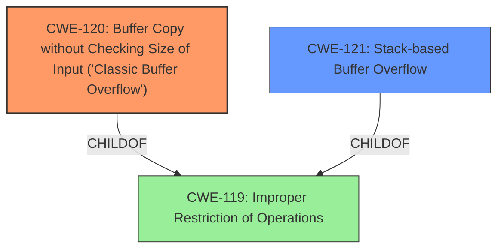

# Analysis Report for CVE-2025-4289

# Vulnerability Analysis Report: CVE-2025-4289

## Description

A vulnerability classified as critical was found in PCMan FTP Server 2.0.7. This vulnerability affects unknown code of the component RNTO Command Handler. The manipulation leads to **buffer overflow**. The attack can be initiated remotely. The exploit has been disclosed to the public and may be used.

## Vulnerability Description Key Phrases

- **Weakness:** buffer overflow
- **Product:** PCMan FTP Server
- **Version:** 2.0.7
- **Component:** RNTO Command Handler

## Analysis (with Relationship Data)

# Summary
| CWE ID | CWE Name | Confidence | CWE Abstraction Level | CWE Vulnerability Mapping Label | CWE-Vulnerability Mapping Notes |
|---|---|---|---|---|---|
| CWE-120 | Buffer Copy without Checking Size of Input ('Classic Buffer Overflow') | 0.9 | Base | Allowed-with-Review | Primary CWE. The vulnerability is due to a buffer copy without proper size checking, leading to a buffer overflow. |
| CWE-121 | Stack-based Buffer Overflow | 0.7 | Variant | Allowed | Secondary Candidate. The exploit is on Windows XP SP3 which means it is likely a stack-based buffer overflow. |
| CWE-119 | Improper Restriction of Operations within the Bounds of a Memory Buffer | 0.5 | Class | Discouraged | Secondary Candidate. This is a more general CWE, but applicable as a parent of CWE-120 and CWE-121. |

## Evidence and Confidence

*   **Confidence Score:** 0.8
*   **Evidence Strength:** HIGH

## Relationship Analysis
The primary weakness is CWE-120, which describes a buffer copy without checking the size of the input. CWE-121 is a more specific variant describing a stack-based buffer overflow, which is possible given the target operating system. CWE-119 is a broader class that encompasses buffer overflows in general. The relationships are:
  - CWE-120 and CWE-121 are both `CHILDOF` CWE-119
  - CWE-120 `CANFOLLOW` other CWEs, potentially indicating steps that precede the buffer overflow



## Vulnerability Chain
The vulnerability chain starts with the **improper handling of the RNTO command**, leading to **a buffer copy operation without proper size validation (CWE-120)**, and resulting in a **buffer overflow**. If the overflow occurs on the stack it would be **CWE-121**. The final impact is the potential for **remote code execution**.

## Summary of Analysis
The initial analysis identified the **buffer overflow** as the primary **weakness**. Based on the provided evidence, particularly the exploit title and the provided exploit code showing a crafted payload being sent via the RNTO command, CWE-120 is the most appropriate primary CWE. The exploit targets Windows XP SP3, which makes CWE-121 a plausible secondary candidate. CWE-119 is a general class encompassing various memory buffer issues and is less specific.

The final selection is based on the evidence of a classic buffer overflow due to a missing size check during a buffer copy operation (CWE-120).

Relevant CWE Information:
- Vulnerability Description Key Phrases: **weakness: buffer overflow**
- CVE Reference Links Content Summary: Remote **buffer overflow** in PCMan FTP Server 2.0.7 when handling the "RNTO" command.
- The exploit code shows a crafted payload being sent via the RNTO command, indicating a buffer copy operation.
- The exploit targets Windows XP SP3, which suggests a stack-based buffer overflow (CWE-121) is possible.

CWEs considered but not used:

*   CWE-20: Improper Input Validation - While input validation is generally related to preventing buffer overflows, the core issue here is the missing size check during the buffer copy, making CWE-120 more precise.
*   CWE-190: Integer Overflow or Wraparound - Not directly related to the described vulnerability.
*   CWE-125: Out-of-bounds Read - The vulnerability is a buffer overflow (write), not a read.
*   CWE-89: Improper Neutralization of Special Elements used in an SQL Command ('SQL Injection') - Not relevant to a buffer overflow vulnerability in an FTP server.
*   CWE-79: Improper Neutralization of Input During Web Page Generation ('Cross-site Scripting') - Not relevant to this vulnerability.
*   CWE-434: Unrestricted Upload of File with Dangerous Type - Not relevant to this vulnerability.
*   CWE-674: Uncontrolled Recursion - Not related to a buffer overflow.
*   CWE-128: Wrap-around Error - Not directly related to the described vulnerability.
*   CWE-193: Off-by-one Error - While this could potentially contribute to a buffer overflow, the primary issue is the missing size check.
*   CWE-74: Improper Neutralization of Special Elements in Output Used by a Downstream Component ('Injection') - Not relevant to a buffer overflow vulnerability in an FTP server.
*   CWE-918: Server-Side Request Forgery (SSRF) - Not relevant to this vulnerability.
*   CWE-191: Integer Underflow (Wrap or Wraparound) - Not directly related to the described vulnerability.
*   CWE-346: Origin Validation Error - Not relevant to this vulnerability.
*   CWE-1339: Insufficient Precision or Accuracy of a Real Number - Not directly related to the described vulnerability.
*   CWE-123: Write-what-where Condition - This is a more general case of out-of-bounds write, but CWE-120 captures the specific reason.
*   CWE-822: Untrusted Pointer Dereference - Not relevant to this vulnerability.
*   CWE-823: Use of Out-of-range Pointer Offset - Not relevant to this vulnerability.
*   CWE-790: Improper Filtering of Special Elements - Not relevant to this vulnerability.


## CWE Relationship Analysis

Current CWEs represent these abstraction levels: .


### Vulnerability Chain Analysis

**Chain starting from CWE-125:**
- 125 (Out-of-bounds Read) - ROOT


**Chain starting from CWE-79:**
- 79 (Improper Neutralization of Input During Web Page Generation ('Cross-site Scripting')) - ROOT


### CWE Relationship Diagram

```mermaid
graph TD
    classDef primary fill:#f96,stroke:#333,stroke-width:2px
    classDef secondary fill:#69f,stroke:#333
    classDef tertiary fill:#9e9,stroke:#333
```


*Report generated on 2025-07-14 23:42:58*
