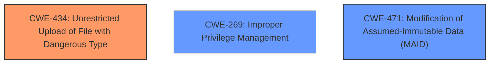

# Analysis for CVE-2025-4291

# Summary

| CWE ID | CWE Name | Confidence | CWE Abstraction Level | CWE Vulnerability Mapping Label | CWE-Vulnerability Mapping Notes |
|---|---|---|---|---|---|
| CWE-434 | Unrestricted Upload of File with Dangerous Type | 1.0 | Base | Allowed | Primary CWE. The root cause is the **unrestricted upload** of files which leads to Remote Code Execution. |
| CWE-269 | Improper Privilege Management | 0.7 | Class | Allowed-with-Review | Secondary CWE. The attacker requires admin access to exploit the vulnerability which indicates an issue with privilege management. |
| CWE-471 | Modification of Assumed-Immutable Data (MAID) | 0.6 | Base | Allowed | Secondary CWE. The configuration file `upload.php` is assumed to be immutable, but the attacker can modify it to allow dangerous file types. |

## Evidence and Confidence

*   **Confidence Score:** 0.9
*   **Evidence Strength:** HIGH

## Relationship Analysis

The primary CWE is CWE-434 (Unrestricted Upload of File with Dangerous Type), which directly reflects the **unrestricted upload** vulnerability described. CWE-269 (Improper Privilege Management) is included because the attacker requires admin access, indicating a problem with how privileges are managed. CWE-471 (Modification of Assumed-Immutable Data (MAID)) is included because the attacker is able to modify the configuration file.

## Vulnerability Chain

The vulnerability chain starts with **unrestricted upload** (CWE-434), then the ability to modify an assumed immutable configuration file (CWE-471), and the need for admin privileges exacerbates the problem (CWE-269). This leads to remote code execution.

## Summary of Analysis

The primary weakness is clearly the **unrestricted upload** of dangerous files, represented by CWE-434. The ability to overwrite the configuration file is represented by CWE-471. The fact that the attacker needs admin access represents improper privilege management, represented by CWE-269.

CWE-434 is the most accurate because the core issue is the lack of restrictions on file uploads, allowing an attacker to upload and execute arbitrary code. The content from gitee.com explicitly mentions the ability to overwrite the `upload.php` configuration file to allow PHP uploads, supporting the need for stronger input validation and prevention of configuration overwrites.

The retriever results show CWE-434 as a strong candidate, along with CWE-79 (Cross-Site Scripting) and CWE-89 (SQL Injection). However, the vulnerability is not directly related to XSS or SQL injection; it stems from the **unrestricted ability to upload files** that can be executed by the server.

The additional CWEs considered but not used include:

*   CWE-79 (Improper Neutralization of Input During Web Page Generation ('Cross-site Scripting')): While input validation is mentioned, the vulnerability is not primarily about XSS.
*   CWE-89 (Improper Neutralization of Special Elements used in an SQL Command ('SQL Injection')): No SQL injection is involved in the exploit.
*   CWE-22 (Improper Limitation of a Pathname to a Restricted Directory ('Path Traversal')): While file uploads involve paths, the core issue is not path traversal but the **unrestricted upload**.
*   CWE-73 (External Control of File Name or Path): Similar to CWE-22, the primary issue is not about controlling the file name or path, but the dangerous file type being uploaded.
*   CWE-96 (Improper Neutralization of Directives in Statically Saved Code ('Static Code Injection')): While related to code, the more appropriate CWE is CWE-434, since the code is uploaded, not injected.
*   CWE-306 (Missing Authentication for Critical Function): Authentication is present since admin access is required but authorization is not.

The selection of CWE-434, CWE-269, and CWE-471 provides the optimal level of specificity for this vulnerability.