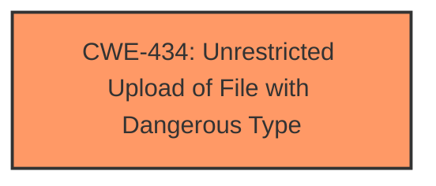

# Analysis Report for CVE-2025-4305

# Vulnerability Analysis Report: CVE-2025-4305

## Description

A vulnerability has been found in kefaming mayi up to 1.3.9 and classified as critical. This vulnerability affects the function Upload of the file app/tools/controller/File.php. The manipulation of the argument File leads to **unrestricted upload**. The attack can be initiated remotely. The exploit has been disclosed to the public and may be used.

## Vulnerability Description Key Phrases

- **Weakness:** unrestricted upload
- **Product:** kefaming mayi
- **Version:** up to 1.3.9
- **Component:** function Upload of the file app/tools/controller/File.php

## Analysis (with Relationship Data)

# Summary
| CWE ID | CWE Name | Confidence | CWE Abstraction Level | CWE Vulnerability Mapping Label | CWE-Vulnerability Mapping Notes |
|---|---|---|---|---|---|
| CWE-434 | Unrestricted Upload of File with Dangerous Type | 1.0 | Base | Allowed | Primary CWE |

## Evidence and Confidence

*   **Confidence Score:** 1.0
*   **Evidence Strength:** HIGH

## Relationship Analysis
The primary relationship considered was the direct match of the vulnerability description to CWE-434. No other relationships were deemed significant enough to influence the decision, as the description clearly points to an unrestricted file upload vulnerability.



## Vulnerability Chain
The vulnerability chain is straightforward:

1.  **Root Cause:** **Unrestricted upload** of files.
2.  **Impact:** Potential for arbitrary code execution or other malicious activities depending on how the uploaded file is processed.

## Summary of Analysis
The vulnerability description explicitly states that the vulnerability is an **unrestricted upload** issue. The description "manipulation of the argument File leads to **unrestricted upload**" is a direct match to CWE-434, which describes a scenario where a product allows the upload or transfer of dangerous file types that are automatically processed within its environment.

The other CWEs listed in the Retriever Results were considered but deemed less relevant. For example, CWE-89 (SQL Injection), CWE-79 (Cross-site Scripting), CWE-22 (Path Traversal) and CWE-1336 (Improper Neutralization of Special Elements Used in a Template Engine) imply other types of vulnerabilities related to data handling or code execution, but they are not directly related to the core issue of unrestricted file upload.

The selection of CWE-434 is based on the clear statement in the vulnerability description and the direct match with the CWE's definition. This provides a high level of confidence in the accuracy of the classification.

Relevant CWE Information:

# Enhanced Context (25 CWEs)
The following CWEs were identified as potentially relevant to this vulnerability:

## CWE-434: Unrestricted Upload of File with Dangerous Type
**Abstraction Level**: Base
**Similarity Score**: 0.78
**Source**: dense

**Description**:
The product allows the upload or transfer of dangerous file types that are automatically processed within its environment.

**Mapping Guidance**:
- Usage: Allowed
- Rationale: This CWE entry is at the Base level of abstraction, which is a preferred level of abstraction for mapping to the root causes of vulnerabilities.


## CWE Relationship Analysis

Current CWEs represent these abstraction levels: .


### Vulnerability Chain Analysis

**Chain starting from CWE-89:**
- 89 (Improper Neutralization of Special Elements used in an SQL Command ('SQL Injection')) - ROOT


**Chain starting from CWE-22:**
- 22 (Improper Limitation of a Pathname to a Restricted Directory ('Path Traversal')) - ROOT


### CWE Relationship Diagram

```mermaid
graph TD
    classDef primary fill:#f96,stroke:#333,stroke-width:2px
    classDef secondary fill:#69f,stroke:#333
    classDef tertiary fill:#9e9,stroke:#333
```


*Report generated on 2025-07-14 23:46:56*
