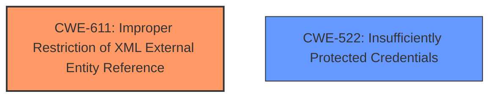

# Raw Analyzer Response for CVE-2025-4338

# Summary

| CWE ID  | CWE Name                                                                | Confidence | CWE Abstraction Level | CWE Vulnerability Mapping Label | CWE-Vulnerability Mapping Notes |
| :-------- | :---------------------------------------------------------------------- | :--------- | :-------------------- | :------------------------------ | :------------------------------ |
| CWE-611 | Improper Restriction of XML External Entity Reference                  | 1          | Base                  | Primary                         | Allowed                         |
| CWE-522 | Insufficiently Protected Credentials                                  | 0.5        | Class                 | Secondary                       | Allowed-with-Review             |

## Evidence and Confidence

*   **Confidence Score:** 0.75
*   **Evidence Strength:** MEDIUM

## Relationship Analysis

The primary relationship influencing the decision is the direct match of the vulnerability description to the definition of CWE-611. CWE-522 is considered as a secondary issue as it could be an impact of successful XXE exploitation. CWE-611 is a Base level CWE, representing a specific type of vulnerability, making it more appropriate than higher-level Class or Pillar CWEs.

## Vulnerability Chain

The vulnerability chain starts with **improper XXE processing** (CWE-611), leading to potential exposure of credentials and access to network devices.

## Summary of Analysis

The vulnerability description clearly indicates an **XXE** (**XML external entity**) attack is possible due to how the Lantronix Device installer processes configuration files. The description states that "Lantronix Device installer is vulnerable to **XML external entity (XXE)** attacks in configuration files read from the network device." This aligns directly with CWE-611, "Improper Restriction of XML External Entity Reference," which describes a weakness where a product processes an XML document that can contain XML entities with URIs that resolve to documents outside of the intended sphere of control. The retriever results also list CWE-611 as the top candidate with a similarity score of 0.800. The suggested usage for CWE-611 is "Allowed" and its abstraction level is "Base".

CWE-522, "Insufficiently Protected Credentials", is considered as a potential secondary CWE. The vulnerability description mentions that an attacker could "obtain credentials" as a consequence of the **XXE** vulnerability. While this is a plausible outcome, it's not the direct root cause. It's more of an impact or potential consequence of successfully exploiting the **XXE** vulnerability. Therefore, CWE-522 is a secondary consideration. The retriever result lists CWE-522 as the second candidate with a similarity score of 0.380. The suggested usage for CWE-522 is "Allowed-with-Review" and its abstraction level is "Class".

Other CWEs were considered, but ultimately deemed less relevant. For example, CWE-798 (Use of Hard-coded Credentials) was considered because credentials could be exposed, but the root cause is the **XXE** vulnerability, not the presence of hard-coded credentials. Similarly, CWE-532 (Insertion of Sensitive Information into Log File) and CWE-256 (Plaintext Storage of a Password) were considered but rejected because the core issue is not about logging or storage, but about **improper XML processing**.

The final decision to primarily map to CWE-611 is based on the clear evidence of **XXE** vulnerability, the high similarity score in the retriever results, and the appropriateness of the Base abstraction level.