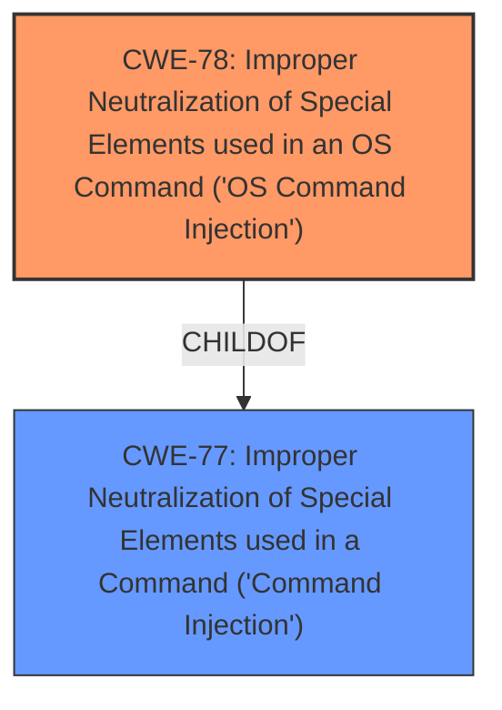

# Analysis Report for CVE-2025-4349

# Vulnerability Analysis Report: CVE-2025-4349

## Description

A vulnerability classified as critical has been found in D-Link DIR-600L up to 2.07B01. This affects the function formSysCmd. The manipulation of the argument host leads to **command injection**. It is possible to initiate the attack remotely. This vulnerability only affects products that are no longer supported by the maintainer.

## Vulnerability Description Key Phrases

- **Weakness:** command injection
- **Vector:** manipulation of the argument host
- **Product:** D-Link DIR-600L
- **Version:** up to 2.07B01
- **Component:** formSysCmd function

## Analysis (with Relationship Data)

# Summary
| CWE ID | CWE Name | Confidence | CWE Abstraction Level | CWE Vulnerability Mapping Label | CWE-Vulnerability Mapping Notes |
|---|---|---|---|---|---|
| CWE-78 | Improper Neutralization of Special Elements used in an OS Command ('OS Command Injection') | 1.0 | Base | Primary | Allowed |

## Evidence and Confidence

*   **Confidence Score:** 1.0
*   **Evidence Strength:** HIGH

## Relationship Analysis
The primary relationship is that CWE-78 [Improper Neutralization of Special Elements used in an OS Command ('OS Command Injection')] is a more specific child of CWE-77 [Improper Neutralization of Special Elements used in a Command ('Command Injection')]. Both relate to command injection, but CWE-78 is specific to OS commands, which aligns with the vulnerability description.



## Vulnerability Chain
The vulnerability chain starts with **improper neutralization** of special elements in the `host` argument, leading to **command injection**.

## Summary of Analysis
The vulnerability description clearly states that the manipulation of the `host` argument leads to **command injection** in the `formSysCmd` function of D-Link DIR-600L. The Retriever Results identify both CWE-77 [Improper Neutralization of Special Elements used in a Command ('Command Injection')] and CWE-78 [Improper Neutralization of Special Elements used in an OS Command ('OS Command Injection')] as potential matches. However, CWE-78 is more specific because it explicitly refers to "OS Command Injection," which aligns perfectly with the vulnerability description. The evidence strongly supports this classification, as the vulnerability allows for the execution of arbitrary OS commands through the **improper handling** of the `host` argument.

Relevant CWE Information:

# Enhanced Context (25 CWEs)
The following CWEs were identified as potentially relevant to this vulnerability:

## CWE-78: Improper Neutralization of Special Elements used in an OS Command ('OS Command Injection')
**Abstraction Level**: Base
**Similarity Score**: 0.76
**Source**: dense

**Description**:
The product constructs all or part of an OS command using externally-influenced input from an upstream component, but it does not neutralize or incorrectly neutralizes special elements that could modify the intended OS command when it is sent to a downstream component.

**Mapping Guidance**:
- Usage: Allowed
- Rationale: This CWE entry is at the Base level of abstraction, which is a preferred level of abstraction for mapping to the root causes of vulnerabilities.


## CWE-77: Improper Neutralization of Special Elements used in a Command ('Command Injection')
**Abstraction Level**: Class
**Similarity Score**: 0.73
**Source**: dense

**Description**:
The product constructs all or part of a command using externally-influenced input from an upstream component, but it does not neutralize or incorrectly neutralizes special elements that could modify the intended command when it is sent to a downstream component.

**Mapping Guidance**:
- Usage: Allowed-with-Review
- Rationale: CWE-77 is often misused when OS command injection (CWE-78) was intended instead [REF-1287].


## CWE Relationship Analysis

Current CWEs represent these abstraction levels: .


### Vulnerability Chain Analysis

**Chain starting from CWE-77:**
- 77 (Improper Neutralization of Special Elements used in a Command ('Command Injection')) - ROOT


**Chain starting from CWE-78:**
- 78 (Improper Neutralization of Special Elements used in an OS Command ('OS Command Injection')) - ROOT


### CWE Relationship Diagram

```mermaid
graph TD
    classDef primary fill:#f96,stroke:#333,stroke-width:2px
    classDef secondary fill:#69f,stroke:#333
    classDef tertiary fill:#9e9,stroke:#333
```


*Report generated on 2025-07-14 23:55:30*
