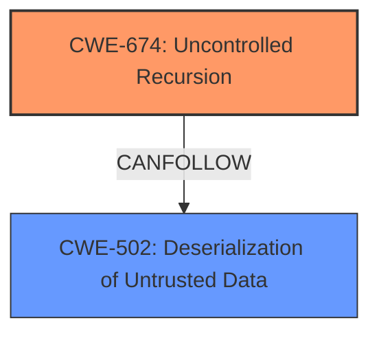

# Enhanced Analysis for CVE-2025-43708

# Summary
| CWE ID | CWE Name | Confidence | CWE Abstraction Level | CWE Vulnerability Mapping Label | CWE-Vulnerability Mapping Notes |
|---|---|---|---|---|---|
| CWE-674 | Uncontrolled Recursion | 0.9 | Class | Primary | Allowed-with-Review |
| CWE-502 | Deserialization of Untrusted Data | 0.7 | Base | Secondary | Allowed |

## Evidence and Confidence

*   **Confidence Score:** 0.8
*   **Evidence Strength:** MEDIUM

## Relationship Analysis
The primary relationship that influenced the selection was that CWE-674 [CWE-674: Uncontrolled Recursion] is a common consequence of insecure deserialization, as reflected in the analysis of the 'deserialization' **weakness** which lists CWE-674 [CWE-674: Uncontrolled Recursion] and CWE-502 [CWE-502: Deserialization of Untrusted Data]. Though not a direct parent or child, it is a common outcome when **deserialization** is handled improperly. CWE-502 [CWE-502: Deserialization of Untrusted Data] is considered secondary as it describes the mechanism that allows the recursion to occur, but the actual vulnerability is caused by the recursion itself.mermaid



## Vulnerability Chain
The vulnerability chain begins with **insecure deserialization** (CWE-502 [CWE-502: Deserialization of Untrusted Data]), where untrusted XML data is deserialized. This leads to the construction of nested set elements, which in turn trigger **uncontrolled recursion** (CWE-674 [CWE-674: Uncontrolled Recursion]) and ultimately a StackOverflowError.

## Summary of Analysis
The primary CWE is CWE-674 [CWE-674: Uncontrolled Recursion] as it directly reflects the **stack consumption** and resulting **StackOverflowError**. The vulnerability description explicitly mentions **stack consumption via an XML document with nested set elements**, which aligns with the definition of **uncontrolled recursion** leading to resource exhaustion. The secondary CWE is CWE-502 [CWE-502: Deserialization of Untrusted Data] since the **insecure deserialization** is what allows the attacker to introduce the malicious XML structure that triggers the recursion.

The evidence "VisiCut 2.1 allows **stack consumption via an XML document with nested set elements**, as demonstrated by a java.util.HashMap **StackOverflowError** when reference=../../../set/set[2] is used, aka an **insecure deserialization** issue." shows direct evidence of the **stack consumption** leading to a **StackOverflowError**. This directly supports the selection of CWE-674 [CWE-674: Uncontrolled Recursion]. The phrase "**insecure deserialization**" points to CWE-502 [CWE-502: Deserialization of Untrusted Data] as a contributing factor.

The retriever results consistently highlight CWE-674 [CWE-674: Uncontrolled Recursion] as the top candidate for the **ROOTCAUSE** and **WEAKNESS** keyphrases. While CWE-776 [CWE-776: Improper Restriction of Recursive Entity References in DTDs ('XML Entity Expansion')] is also suggested for the XML aspect, CWE-674 [CWE-674: Uncontrolled Recursion] is more directly related to the observed outcome (**StackOverflowError**).

CWE-674 [CWE-674: Uncontrolled Recursion] is a Class, but it is the most accurate high-level representation of the core vulnerability.

Relevant CWE Information:

# Enhanced Context (25 CWEs)
The following CWEs were identified as potentially relevant to this vulnerability:

## CWE-668: Exposure of Resource to Wrong Sphere
**Abstraction Level**: Class
**Similarity Score**: 0.73
**Source**: dense

**Description**:
The product exposes a resource to the wrong control sphere, providing unintended actors with inappropriate access to the resource.

**Mapping Guidance**:
- Usage: Discouraged
- Rationale: CWE-668 is high-level and is often misused as a catch-all when lower-level CWE IDs might be applicable. It is sometimes used for low-information vulnerability reports [REF-1287]. It is a level-1 Class (i.e., a child of a Pillar). It is not useful for trend analysis.

*CWE-668 [CWE-668: Exposure of Resource to Wrong Sphere] was considered but not selected because the vulnerability is more specific than simply exposing a resource to the wrong sphere.*

## CWE-138: Improper Neutralization of Special Elements
**Abstraction Level**: Class
**Similarity Score**: 0.72
**Source**: dense

**Description**:
The product receives input from an upstream component, but it does not neutralize or incorrectly neutralizes special elements that could be interpreted as control elements or syntactic markers when they are sent to a downstream component.

**Mapping Guidance**:
- Usage: Discouraged
- Rationale: This CWE entry is a level-1 Class (i.e., a child of a Pillar). It might have lower-level children that would be more appropriate

*CWE-138 [CWE-138: Improper Neutralization of Special Elements] was considered, but it does not directly apply to the **stack consumption** issue. It is more related to injection vulnerabilities.*

## CWE-497: Exposure of Sensitive System Information to an Unauthorized Control Sphere
**Abstraction Level**: Base
**Similarity Score**: 0.72
**Source**: dense

**Description**:
The product does not properly prevent sensitive system-level information from being accessed by unauthorized actors who do not have the same level of access to the underlying system as the product does.

**Mapping Guidance**:
- Usage: Allowed
- Rationale: This CWE entry is at the Base level of abstraction, which is a preferred level of abstraction for mapping to the root causes of vulnerabilities.

*CWE-497 [CWE-497: Exposure of Sensitive System Information to an Unauthorized Control Sphere] was considered, but this vulnerability does not primarily involve information exposure.*

## CWE-345: Insufficient Verification of Data Authenticity
**Abstraction Level**: Class
**Similarity Score**: 0.72
**Source**: dense

**Description**:
The product does not sufficiently verify the origin or authenticity of data, in a way that causes it to accept invalid data.

**Mapping Guidance**:
- Usage: Discouraged
- Rationale: This CWE entry is a level-1 Class (i.e., a child of a Pillar). It might have lower-level children that would be more appropriate

*CWE-345 [CWE-345: Insufficient Verification of Data Authenticity] was considered but does not directly apply since the core issue is not about verifying data authenticity but rather the handling of potentially malicious data during **deserialization**.*

## CWE-41: Improper Resolution of Path Equivalence
**Abstraction Level**: Base
**Similarity Score**: 0.72
**Source**: dense

**Description**:
The product is vulnerable to file system contents disclosure through path equivalence. Path equivalence involves the use of special characters in file and directory names. The associated manipulations are intended to generate multiple names for the same object.

**Mapping Guidance**:
- Usage: Allowed
- Rationale: This CWE entry is at the Base level of abstraction, which is a preferred level of abstraction for mapping to the root causes of vulnerabilities.

*CWE-41 [CWE-41: Improper Resolution of Path Equivalence] was considered but does not apply as it is specific to path equivalence issues, which are not the focus of this vulnerability.*

## CWE-611: Improper Restriction of XML External Entity Reference
**Abstraction Level**: Base
**Similarity Score**: 0.71
**Source**: dense

**Description**:
The product processes an XML document that can contain XML entities with URIs that resolve to documents outside of the intended sphere of control, causing the product to embed incorrect documents into its output.

**Mapping Guidance**:
- Usage: Allowed
- Rationale: This CWE entry is at the Base level of abstraction, which is a preferred level of abstraction for mapping to the root causes of vulnerabilities.

*CWE-611 [CWE-611: Improper Restriction of XML External Entity Reference] was considered. While XML is involved, the issue isn't specifically about external entity references but rather about the structure and handling of nested elements leading to recursion.*

## CWE-696: Incorrect Behavior Order
**Abstraction Level**: Class
**Similarity Score**: 0.71
**Source**: dense

**Description**:
The product performs multiple related behaviors


## CWE Relationship Analysis

Current CWEs represent these abstraction levels: .


### Vulnerability Chain Analysis

**Chain starting from CWE-502:**
- 502 (Deserialization of Untrusted Data) - ROOT


**Chain starting from CWE-611:**
- 611 (Improper Restriction of XML External Entity Reference) - ROOT


### CWE Relationship Diagram

```mermaid
graph TD
    classDef primary fill:#f96,stroke:#333,stroke-width:2px
    classDef secondary fill:#69f,stroke:#333
    classDef tertiary fill:#9e9,stroke:#333
```