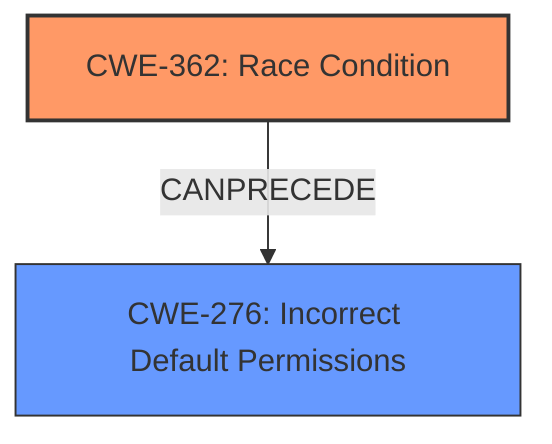

# Analysis for CVE-2025-43715

# Summary
| CWE ID  | CWE Name                                                                      | Confidence | CWE Abstraction Level | CWE Vulnerability Mapping Label | CWE-Vulnerability Mapping Notes |
| :------- | :---------------------------------------------------------------------------- | :--------- | :-------------------- | :------------------------------ | :------------------------------ |
| CWE-362 | Concurrent Execution using Shared Resource with Improper Synchronization ('**Race Condition**') | 0.9      | Class                 | Primary                         | Allowed-with-Review           |
| CWE-276 | Incorrect Default Permissions                                                   | 0.7      | Base                  | Secondary                       | Allowed                       |

## Evidence and Confidence

*   **Confidence Score:** 0.8
*   **Evidence Strength:** MEDIUM

## Relationship Analysis
The primary weakness is a **race condition**, which falls under CWE-362. The **race condition** allows a local user to place a crafted executable file in a directory with **incorrect permissions**, enabling privilege escalation. CWE-276, which describes **incorrect default permissions**, is a contributing factor as the directory should have restricted permissions to prevent unauthorized file placement.

## Vulnerability Chain
The vulnerability chain starts with **incorrect default permissions** (CWE-276) on the temporary plugins directory, creating an opportunity for a **race condition** (CWE-362). By winning the **race condition**, an unprivileged user can place a crafted executable file into the directory. This leads to privilege escalation because the crafted executable is executed during the installation process with SYSTEM privileges. The **root cause** is the **race condition** and the contributing factor is the **incorrect permissions**.

## Summary of Analysis
The analysis identifies a **race condition** (CWE-362) as the primary vulnerability, facilitated by **incorrect default permissions** (CWE-276). The evidence supports this classification, as the vulnerability description explicitly mentions a **race condition** that allows local users to escalate privileges. The root cause is that **EW_CREATEDIR does not always set the CreateRestrictedDirectory error flag**. The relationship between these CWEs is that the **incorrect permissions** create the environment where the **race condition** can be exploited, leading to privilege escalation. CWE-362 is the most specific CWE to describe the **race condition**. CWE-276 contributes to describing the environment for the race. Other CWEs considered were deemed less relevant as they didn't directly address the root cause of the **race condition** or the specific issue of **incorrect permissions** on the temporary directory.

Relevant CWE Information:

# Enhanced Context (25 CWEs)
The following CWEs were identified as potentially relevant to this vulnerability:

## CWE-266: Incorrect Privilege Assignment
**Abstraction Level**: Base
**Similarity Score**: 0.78
**Source**: dense

**Description**:
A product incorrectly assigns a privilege to a particular actor, creating an unintended sphere of control for that actor.

**Mapping Guidance**:
- Usage: Allowed
- Rationale: This CWE entry is at the Base level of abstraction, which is a preferred level of abstraction for mapping to the root causes of vulnerabilities.

*Not Selected:* This CWE relates to privilege assignment. The vulnerability isn't about assigning wrong privilege, but exploiting **incorrect permissions** via a **race condition**.

## CWE-59: Improper Link Resolution Before File Access ('Link Following')
**Abstraction Level**: Base
**Similarity Score**: 0.78
**Source**: dense

**Description**:
The product attempts to access a file based on the filename, but it does not properly prevent that filename from identifying a link or shortcut that resolves to an unintended resource.

**Mapping Guidance**:
- Usage: Allowed
- Rationale: This CWE entry is at the Base level of abstraction, which is a preferred level of abstraction for mapping to the root causes of vulnerabilities.

*Not Selected:* This CWE relates to link following. The vulnerability is about exploiting **incorrect permissions** via a **race condition** and not link following.

## CWE-267: Privilege Defined With Unsafe Actions
**Abstraction Level**: Base
**Similarity Score**: 0.77
**Source**: dense

**Description**:
A particular privilege, role, capability, or right can be used to perform unsafe actions that were not intended, even when it is assigned to the correct entity.

**Mapping Guidance**:
- Usage: Allowed
- Rationale: This CWE entry is at the Base level of abstraction, which is a preferred level of abstraction for mapping to the root causes of vulnerabilities.

*Not Selected:* This CWE relates to privileges defined with unsafe actions. The vulnerability is about exploiting **incorrect permissions** via a **race condition** and not specifically about unsafe actions.

## CWE-276: Incorrect Default Permissions
**Abstraction Level**: Base
**Similarity Score**: 0.77
**Source**: dense

**Description**:
During installation, installed file permissions are set to allow anyone to modify those files.

**Mapping Guidance**:
- Usage: Allowed
- Rationale: This CWE entry is at the Base level of abstraction, which is a preferred level of abstraction for mapping to the root causes of vulnerabilities.

*Selected:* This CWE relates to **incorrect default permissions** for the temporary directory created. This allows unprivileged users to place crafted files there, which contributes to the **race condition** and privilege escalation.

## CWE-280: Improper Handling of Insufficient Permissions or Privileges
**Abstraction Level**: Base
**Similarity Score**: 0.76
**Source**: dense

**Description**:
The product does not handle or incorrectly handles when it has insufficient privileges to access resources or functionality as specified by their permissions. This may cause it to follow unexpected code paths that may leave the product in an invalid state.

**Mapping Guidance**:
- Usage: Allowed
- Rationale: This CWE entry is at the Base level of abstraction, which is a preferred level of abstraction for mapping to the root causes of vulnerabilities.

*Not Selected:* This CWE relates to improper handling of insufficient permissions. The vulnerability is about exploiting **incorrect permissions** via a **race condition** and not related to handling insufficient permissions.

## CWE-41: Improper Resolution of Path Equivalence
**Abstraction Level**: Base
**Similarity Score**: 0.76
**Source**: dense

**Description**:
The product is vulnerable to file system contents disclosure through path equivalence. Path equivalence involves the use of special characters in file and directory names. The associated manipulations are intended to generate multiple names for the same object.

**Mapping Guidance**:
- Usage: Allowed
- Rationale: This CWE entry is at the Base level of abstraction, which is a preferred level of abstraction for mapping to the root causes of vulnerabilities.

*Not Selected:* This CWE relates to improper resolution of path equivalence. The vulnerability is about exploiting **incorrect permissions** via a **race condition** and not path equivalence.

## CWE-274: Improper Handling of Insufficient Privileges
**Abstraction Level**: Base
**Similarity Score**: 0.76
**Source**: dense

**Description**:
The product does not handle or incorrectly handles when it has insufficient privileges to perform an operation, leading to resultant weaknesses.

**Mapping Guidance**:
- Usage: Discouraged
- Rationale: This CWE entry could be deprecated in a future version of CWE.

*Not Selected:* This CWE relates to improper handling of insufficient privileges. The vulnerability is about exploiting **incorrect permissions** via a **race condition** and is not related to handling insufficient privileges. This CWE is also discouraged.

## CWE-427: Uncontrolled Search Path Element
**Abstraction Level**: Base
**Similarity Score**: 0.75
**Source**: dense

**Description**:
The product uses a fixed or controlled search path to find resources, but one or more locations in that path can be under the control of unintended actors.

**Mapping Guidance**:
- Usage: Allowed
- Rationale: This CWE entry is at the Base level of abstraction, which is a preferred level of abstraction for mapping to the root causes of vulnerabilities.

*Not Selected:* This CWE relates to uncontrolled search path element. The vulnerability is about exploiting **incorrect permissions** via a **race condition** and is not about the search path.

## CWE-73: External Control of File Name or Path
**Abstraction Level**: Base
**Similarity Score**: 0.75
**Source**: dense

**Description**:
The product allows user input to control or influence paths or file names that are used in filesystem operations.

**Mapping Guidance**:
- Usage: Allowed
- Rationale: This CWE entry is at the Base level of abstraction, which is a preferred level of abstraction for mapping to the root causes of vulnerabilities.

*Not Selected:* This CWE relates to external control of file name or path. The vulnerability is about exploiting **incorrect permissions** via a **race condition** and is not directly related to external control of file names or paths.

## CWE-668: Exposure of Resource to Wrong Sphere
**Abstraction Level**: Class
**Similarity Score**: 0.74
**Source**: