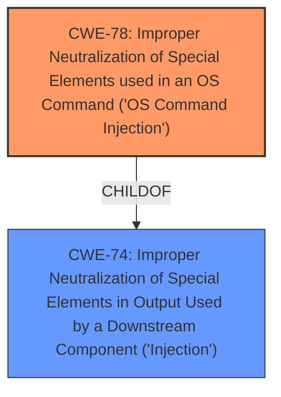

# Analysis for CVE-2025-43844

# Summary
| CWE ID | CWE Name | Confidence | CWE Abstraction Level | CWE Vulnerability Mapping Label | CWE-Vulnerability Mapping Notes |
|---|---|---|---|---|---|
| CWE-78 | Improper Neutralization of Special Elements used in an OS Command ('OS Command Injection') | 1.0 | Base | Allowed | Primary CWE. The **command injection** vulnerability allows an attacker to execute arbitrary commands on the server. |
| CWE-74 | Improper Neutralization of Special Elements in Output Used by a Downstream Component ('Injection') | 0.5 | Class | Discouraged | Secondary candidate. This is a more general form of injection. |

## Evidence and Confidence

*   **Confidence Score:** 1.0
*   **Evidence Strength:** HIGH

## Relationship Analysis
The primary CWE is CWE-78, which is a base-level CWE and a child of CWE-74. CWE-78 is more specific and accurately describes the vulnerability, involving OS command injection.

## Vulnerability Chain
The vulnerability chain starts with user input being passed to the `click_train` function. This function then concatenates the user input into a command without proper neutralization, leading to **command injection**. The impact is arbitrary command execution on the server.

User Input -> click_train Function -> **Improper Neutralization** (CWE-78) -> Arbitrary Command Execution

## Summary of Analysis
The analysis is based on the provided vulnerability description and CVE reference. The description clearly states that the application is vulnerable to **command injection** because user-provided input is concatenated into a command and executed on the server without proper neutralization.

The selection of CWE-78 is supported by the vulnerability description: "The variables `exp_dir1`, among others, take user input and pass it to the `click_train` function, which concatenates them into a command that is run on the server." This aligns perfectly with the description of CWE-78, which involves constructing an OS command using externally-influenced input without proper neutralization.

CWE-78 is at the optimal level of specificity because it clearly defines the type of injection occurring, which is OS command injection. While CWE-74 is a parent class, CWE-78 provides a more accurate and detailed representation of the vulnerability.

Relevant CWE Information:
CWE-78: Improper Neutralization of Special Elements used in an OS Command ('OS Command Injection') - The product constructs all or part of an OS command using externally-influenced input from an upstream component, but it does not neutralize or incorrectly neutralizes special elements that could modify the intended OS command when it is sent to a downstream component.