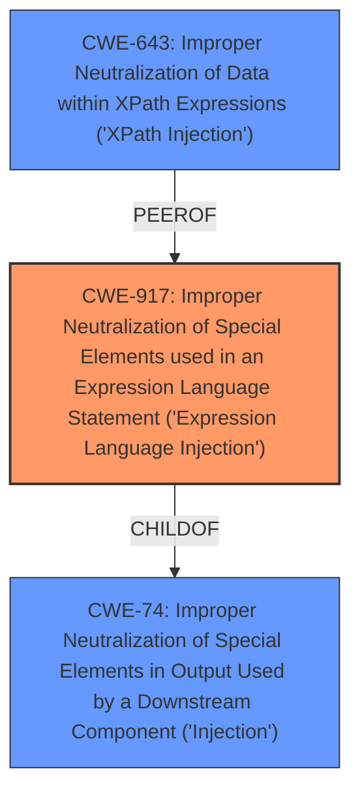

# Raw Analyzer Response for CVE-2025-43955

# Summary
| CWE ID | CWE Name | Confidence | CWE Abstraction Level | CWE Vulnerability Mapping Label | CWE-Vulnerability Mapping Notes |
|---|---|---|---|---|---|
| **CWE-917** | **Improper Neutralization of Special Elements used in an Expression Language Statement ('Expression Language Injection')** | 1.0 | Base | Primary | Allowed |
| CWE-643 | Improper Neutralization of Data within XPath Expressions ('XPath Injection') | 0.7 | Base | Secondary Candidate | Allowed |
| CWE-74 | Improper Neutralization of Special Elements in Output Used by a Downstream Component ('Injection') | 0.5 | Class | Secondary Candidate | Discouraged |

## Evidence and Confidence

*   **Confidence Score:** 0.9
*   **Evidence Strength:** HIGH

## Relationship Analysis
The primary CWE is CWE-917, which is a base-level CWE that describes **improper neutralization** in expression languages. CWE-643 is also related as it is specific to XPath expressions, while CWE-74 is a more general injection CWE. CWE-917 is a better fit because the vulnerability description mentions that the product **does not restrict the use of commons-jxpath APIs**, which allows excessively powerful expression parsing and evaluation.

## Vulnerability Chain
The vulnerability chain starts with the **lack of restriction on commons-jxpath APIs** (CWE-917), leading to the possibility of crafting malicious XPath expressions, which can then result in remote code execution (RCE).

## Summary of Analysis
The primary assessment is based on the provided evidence, which clearly states that the root cause is the **failure to restrict the use of commons-jxpath APIs**. This **allows excessively powerful expression parsing and evaluation**, leading to potential remote code execution. The mitigation involves setting an empty function library for the `JXPathContext` to prevent function calls, which directly addresses the **improper neutralization** issue.

The graph relationships influenced the final selection by highlighting the connection between expression language injection (CWE-917) and the more general injection category (CWE-74), as well as the specific case of XPath injection (CWE-643). The selected CWEs are at the optimal level of specificity because CWE-917 directly addresses the root cause. While CWE-643 is more specific to XPath, CWE-917 is better because the root cause is the **lack of restriction** on the expression language itself.

Relevant CWE Information:

# Enhanced Context (25 CWEs)
The following CWEs were identified as potentially relevant to this vulnerability:

## CWE-116: Improper Encoding or Escaping of Output
**Abstraction Level**: Class
**Similarity Score**: 0.78

## CWE-611: Improper Restriction of XML External Entity Reference
**Abstraction Level**: Base
**Similarity Score**: 0.78

## CWE-917: Improper Neutralization of Special Elements used in an Expression Language Statement ('Expression Language Injection')
**Abstraction Level**: Base
**Similarity Score**: 0.77

## CWE-80: Improper Neutralization of Script-Related HTML Tags in a Web Page (Basic XSS)
**Abstraction Level**: Variant
**Similarity Score**: 0.76

## CWE-923: Improper Restriction of Communication Channel to Intended Endpoints
**Abstraction Level**: Class
**Similarity Score**: 0.75

## CWE-425: Direct Request ('Forced Browsing')
**Abstraction Level**: Base
**Similarity Score**: 0.75

## CWE-74: Improper Neutralization of Special Elements in Output Used by a Downstream Component ('Injection')
**Abstraction Level**: Class
**Similarity Score**: 0.75

## CWE-41: Improper Resolution of Path Equivalence
**Abstraction Level**: Base
**Similarity Score**: 0.75

## CWE-79: Improper Neutralization of Input During Web Page Generation ('Cross-site Scripting')
**Abstraction Level**: Base
**Similarity Score**: 0.75

## CWE-184: Incomplete List of Disallowed Inputs
**Abstraction Level**: Base
**Similarity Score**: 0.75

## CWE-22: Improper Limitation of a Pathname to a Restricted Directory ('Path Traversal')
**Abstraction Level**: Base
**Similarity Score**: 686.45

## CWE-276: Incorrect Default Permissions
**Abstraction Level**: Base
**Similarity Score**: 662.36

## CWE-1336: Improper Neutralization of Special Elements Used in a Template Engine
**Abstraction Level**: Base
**Similarity Score**: 659.78

## CWE-863: Incorrect Authorization
**Abstraction Level**: Class
**Similarity Score**: 656.10

## CWE-295: Improper Certificate Validation
**Abstraction Level**: Base
**Similarity Score**: 655.94

## CWE-22: Improper Limitation of a Pathname to a Restricted Directory ('Path Traversal')
**Abstraction Level**: base
**Similarity Score**: 3.89

## CWE-1336: Improper Neutralization of Special Elements Used in a Template Engine
**Abstraction Level**: base
**Similarity Score**: 3.64

## CWE-322: Key Exchange without Entity Authentication
**Abstraction Level**: base
**Similarity Score**: 3.57

## CWE-295: Improper Certificate Validation
**Abstraction Level**: base
**Similarity Score**: 2.77

## CWE-183: Permissive List of Allowed Inputs
**Abstraction Level**: base
**Similarity Score**: 2.72

## CWE-434: Unrestricted Upload of File with Dangerous Type
**Abstraction Level**: Base
**Similarity Score**: 2.63

## CWE-917: Improper Neutralization of Special Elements used in an Expression Language Statement ('Expression Language Injection')
**Abstraction Level**: Base
**Similarity Score**: 2.49

## CWE-276: Incorrect Default Permissions
**Abstraction Level**: base
**Similarity Score**: 2.40

## CWE-306: Missing Authentication for Critical Function
**Abstraction Level**: base
**Similarity Score**: 2.40

## CWE-379: Creation of Temporary File in Directory with Insecure Permissions
**Abstraction Level**: base
**Similarity Score**: 2.33

CWE-116, CWE-611, CWE-80, CWE-923, CWE-425, CWE-41, CWE-79, CWE-184, CWE-22, CWE-276, CWE-1336, CWE-863, CWE-295, CWE-322, CWE-183, CWE-434, CWE-306, and CWE-379 were considered, but they did not match the specific vulnerability as closely as CWE-917, CWE-643 and CWE-74. These alternative CWEs represent different types of weaknesses, such as encoding issues, authorization problems, or path traversal vulnerabilities, which are not the primary concern in this case.