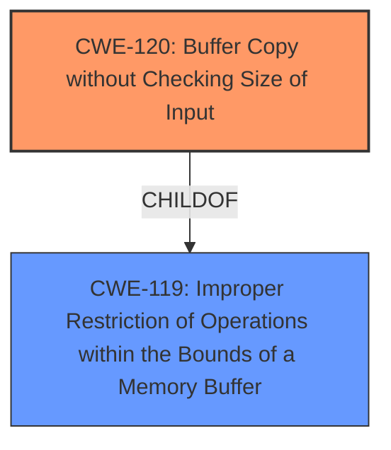

# Analysis for CVE-2025-4440

# Summary
| CWE ID | CWE Name | Confidence | CWE Abstraction Level | CWE Vulnerability Mapping Label | CWE-Vulnerability Mapping Notes |
|---|---|---|---|---|---|
| CWE-120 | Buffer Copy without Checking Size of Input ('Classic Buffer Overflow') | 0.9 | Base | Allowed-with-Review | Primary CWE. The vulnerability description explicitly states a **buffer overflow** due to manipulation of an argument, which aligns with the characteristics of CWE-120. |
| CWE-119 | Improper Restriction of Operations within the Bounds of a Memory Buffer | 0.6 | Class | Discouraged | Secondary candidate. While CWE-119 broadly covers buffer overflows, CWE-120 is more specific to buffer copy operations without size checking. |

## Evidence and Confidence

*   **Confidence Score:** 0.9
*   **Evidence Strength:** HIGH

## Relationship Analysis
The primary relationship influencing the CWE selection is the parent-child relationship between CWE-119 and CWE-120. CWE-120 is a specific type of CWE-119. Given the provided information about a **buffer overflow** occurring due to unchecked input size during a copy operation, CWE-120 is a more precise and relevant classification than its parent, CWE-119.

## Vulnerability Chain
The vulnerability chain consists of the following:
1.  **Root Cause:** **Buffer overflow** in the `EnableIpv6` function due to manipulation of the `param` argument. Specifically, the code copies data into a buffer without proper size validation. (CWE-120)
2.  **Impact:** Potential for arbitrary code execution, denial of service, or other security breaches due to the ability to overwrite memory.

## Summary of Analysis
The primary selection of CWE-120 is based on the explicit mention of a **buffer overflow** resulting from unchecked input size during a copy operation within the `EnableIpv6` function. The vulnerability description clearly points to a classic **buffer overflow** scenario where data is copied into a buffer without proper bounds checking. The Retriever Results also lists CWE-120 with a good score.

The evidence, "The manipulation of the argument param leads to **buffer overflow**" directly supports the selection of CWE-120. The relationship analysis further reinforces this choice, as CWE-120 is a more specific variant of CWE-119, which broadly covers buffer overflows. Choosing CWE-120 provides a more accurate and granular representation of the vulnerability.

CWE-119 was considered as a broader classification but was deemed less specific than CWE-120. Other CWEs like Integer Overflow (CWE-190), SQL Injection (CWE-89), and Cross-Site Scripting (CWE-79) were ruled out as they did not align with the described **buffer overflow** vulnerability.