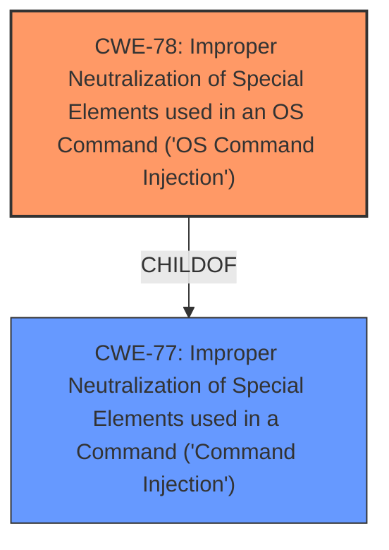

# Raw Analyzer Response for CVE-2025-4445

# Summary
| CWE ID | CWE Name | Confidence | CWE Abstraction Level | CWE Vulnerability Mapping Label | CWE-Vulnerability Mapping Notes |
|---|---|---|---|---|---|
| CWE-78 | Improper Neutralization of Special Elements used in an OS Command ('OS Command Injection') | 1.0 | Base | Primary | Allowed |

## Evidence and Confidence

*   **Confidence Score:** 1.0
*   **Evidence Strength:** HIGH

## Relationship Analysis
The primary relationship that influenced the CWE selection is the hierarchical relationship between CWE-77 (Class) and CWE-78 (Base). CWE-78 is a child of CWE-77, providing a more specific classification for OS Command Injection. There is no information to consider any chain relationship.

## Vulnerability Chain
The vulnerability chain consists of:
1.  **Root Cause:** Improper neutralization of special elements in the `mac` argument within the `wake_on_lan` function leading to **command injection**.
2.  **Impact:** Remote attackers can execute arbitrary OS commands on the affected system.

## Summary of Analysis
The vulnerability description clearly states that manipulating the `mac` argument in the `wake_on_lan` function leads to **command injection**. This is strong evidence for classifying the vulnerability as related to command injection.

The Retriever Results list CWE-77 and CWE-78 as top candidates. CWE-77 is a Class-level CWE, while CWE-78 is a Base-level CWE. Since the vulnerability specifically involves OS commands, CWE-78, "Improper Neutralization of Special Elements used in an OS Command ('OS Command Injection')", is the more appropriate and specific choice.

The selection of CWE-78 is further supported by its description: "The product constructs all or part of an OS command using externally-influenced input from an upstream component, but it does not neutralize or incorrectly neutralizes special elements that could modify the intended OS command when it is sent to a downstream component." This aligns perfectly with the vulnerability description, where the `mac` argument (externally-influenced input) is not properly neutralized, leading to OS command execution.

Other CWEs were considered but deemed less relevant:

*   CWE-89 (SQL Injection) - Not applicable as the vulnerability involves OS commands, not SQL queries.
*   CWE-79 (Cross-site Scripting) - Not applicable as the vulnerability does not involve injecting scripts into web pages.
*   CWE-426 (Untrusted Search Path) - Not directly relevant, as the vulnerability involves improper neutralization rather than an untrusted search path.

The choice of CWE-78 is at the optimal level of specificity (Base) and directly reflects the **root cause** of the vulnerability.

Relevant CWE Information:

# Enhanced Context (25 CWEs)
The following CWEs were identified as potentially relevant to this vulnerability:

## CWE-78: Improper Neutralization of Special Elements used in an OS Command ('OS Command Injection')
**Abstraction Level**: Base
**Similarity Score**: 0.75
**Source**: dense

**Description**:
The product constructs all or part of an OS command using externally-influenced input from an upstream component, but it does not neutralize or incorrectly neutralizes special elements that could modify the intended OS command when it is sent to a downstream component.

**Mapping Guidance**:
- Usage: Allowed
- Rationale: This CWE entry is at the Base level of abstraction, which is a preferred level of abstraction for mapping to the root causes of vulnerabilities.

## CWE-77: Improper Neutralization of Special Elements used in a Command ('Command Injection')
**Abstraction Level**: Class
**Similarity Score**: 1.0
**Source**: alternate_terms

**Description**:
The product constructs all or part of a command using externally-influenced input from an upstream component, but it does not neutralize or incorrectly neutralizes special elements that could modify the intended command when it is sent to a downstream component. The command is interpreted as a command by a command interpreter, such as a shell, that is part of the operating system.

**Mapping Guidance**:
- Usage: Allowed-with-Review
- Rationale: This entry covers many different types of command injection, and it might have children that are more appropriate. Use caution if you choose this entry.

## CWE-89: Improper Neutralization of Special Elements used in an SQL Command ('SQL Injection')
**Abstraction Level**: Base
**Similarity Score**: 0.367
**Source**: sparse

**Description**:
The product constructs all or part of an SQL command using externally-influenced input from an upstream component, but it does not neutralize or incorrectly neutralizes special elements that could modify the intended SQL command when it is sent to a downstream component. Without sufficient removal or quoting of SQL syntax in user-controllable inputs, the generated SQL query can cause those inputs to be interpreted as SQL instead of ordinary user data.

**Mapping Guidance**:
- Usage: Allowed
- Rationale: This CWE entry is at the Base level of abstraction, which is a preferred level of abstraction for mapping to the root causes of vulnerabilities.

## CWE-79: Improper Neutralization of Input During Web Page Generation ('Cross-site Scripting')
**Abstraction Level**: Base
**Similarity Score**: 0.363
**Source**: sparse

**Description**:
The product does not neutralize or incorrectly neutralizes user-controllable input before it is placed in output that is used as a web page that is served to other users.

**Mapping Guidance**:
- Usage: Allowed
- Rationale: This CWE entry is at the Base level of abstraction, which is a preferred level of abstraction for mapping to the root causes of vulnerabilities.

## CWE-426: Untrusted Search Path
**Abstraction Level**: Base
**Similarity Score**: 0.322
**Source**: sparse

**Description**:
The application or system uses a search path that includes an untrusted directory. Consequently, an attacker can place a malicious executable in the untrusted directory that will be executed instead of the intended program.

**Mapping Guidance**:
- Usage: Allowed
- Rationale: This CWE entry is at the Base level of abstraction, which is a preferred level of abstraction for mapping to the root causes of vulnerabilities.