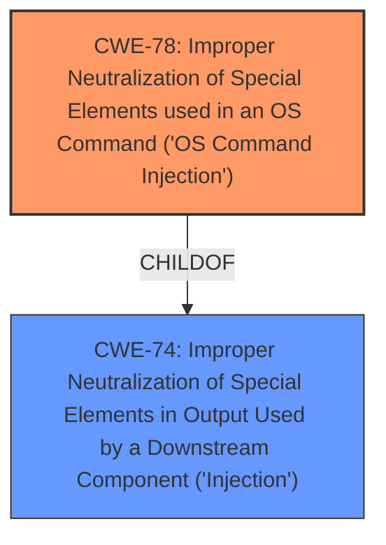

# Analysis Report for CVE-2025-4454

# Vulnerability Analysis Report: CVE-2025-4454

## Description

A vulnerability was found in D-Link DIR-619L 2.04B04. It has been declared as critical. This vulnerability affects the function wake_on_lan. The manipulation of the argument mac leads to **command injection**. The attack can be initiated remotely. The vendor was contacted early about this disclosure. This vulnerability only affects products that are no longer supported by the maintainer.

## Vulnerability Description Key Phrases

- **Weakness:** command injection
- **Vector:** manipulation of the mac argument
- **Product:** D-Link DIR-619L
- **Version:** 2.04B04
- **Component:** wake_on_lan function

## Analysis (with Relationship Data)

# Summary
| CWE ID | CWE Name | Confidence | CWE Abstraction Level | CWE Vulnerability Mapping Label | CWE-Vulnerability Mapping Notes |
|---|---|---|---|---|---|
| CWE-78 | Improper Neutralization of Special Elements used in an OS Command ('OS Command Injection') | 1.0 | Base | Primary | Allowed |

## Evidence and Confidence

*   **Confidence Score:** 1.0
*   **Evidence Strength:** HIGH

## Relationship Analysis
The primary CWE is CWE-78, which is a Base level CWE. CWE-78 is a child of CWE-74 (Improper Neutralization of Special Elements in Output Used by a Downstream Component ('Injection')). While CWE-77 (Improper Neutralization of Special Elements used in a Command ('Command Injection')) is a Class that encompasses command injection, CWE-78 is more specific as it focuses on OS commands, aligning perfectly with the vulnerability description.



## Vulnerability Chain
The vulnerability chain involves **command injection** due to the **improper neutralization** of the 'mac' argument in the `wake_on_lan` function, leading to remote code execution. The chain starts with the lack of proper input validation, proceeds to command construction with untrusted data, and culminates in the execution of the injected command by the operating system.
  - Root Cause: Improper Neutralization of Input
  - Weakness: Command Injection
  - Impact: Remote Code Execution

## Summary of Analysis
The vulnerability description clearly states that the manipulation of the 'mac' argument in the `wake_on_lan` function leads to **command injection**. The key phrase "command injection" directly aligns with CWE-78 (Improper Neutralization of Special Elements used in an OS Command ('OS Command Injection')). The retriever results also list CWE-78 as a top candidate.

The evidence supporting this mapping is the explicit mention of "command injection" in the vulnerability description: "The manipulation of the argument mac leads to **command injection**."

CWE-77 (Improper Neutralization of Special Elements used in a Command ('Command Injection')) was considered but deemed less specific than CWE-78. CWE-77 is a class-level CWE, while CWE-78 is a base-level CWE, which is preferred when applicable. The vulnerability involves OS commands, making CWE-78 a more accurate representation.

CWE-89 (Improper Neutralization of Special Elements used in an SQL Command ('SQL Injection')) and CWE-79 (Improper Neutralization of Input During Web Page Generation ('Cross-site Scripting')) were also considered, but they are not relevant since the vulnerability involves OS commands and not SQL or web page generation.

Based on the vulnerability description and the retriever results, CWE-78 is the most appropriate CWE.


## CWE Relationship Analysis

Current CWEs represent these abstraction levels: .


### Vulnerability Chain Analysis

**Chain starting from CWE-89:**
- 89 (Improper Neutralization of Special Elements used in an SQL Command ('SQL Injection')) - ROOT


**Chain starting from CWE-77:**
- 77 (Improper Neutralization of Special Elements used in a Command ('Command Injection')) - ROOT


### CWE Relationship Diagram

```mermaid
graph TD
    classDef primary fill:#f96,stroke:#333,stroke-width:2px
    classDef secondary fill:#69f,stroke:#333
    classDef tertiary fill:#9e9,stroke:#333
```


*Report generated on 2025-07-15 00:17:56*
