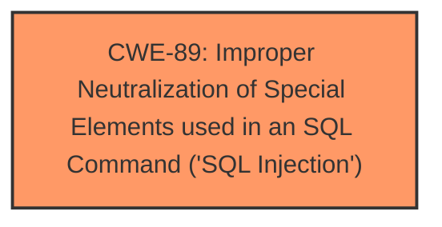

# Analysis for CVE-2025-4459

# Summary
| CWE ID | CWE Name | Confidence | CWE Abstraction Level | CWE Vulnerability Mapping Label | CWE-Vulnerability Mapping Notes |
|---|---|---|---|---|---|
| CWE-89 | Improper Neutralization of Special Elements used in an SQL Command ('SQL Injection') | 1.0 | Base | Allowed | Primary CWE |

## Evidence and Confidence

*   **Confidence Score:** 1.0
*   **Evidence Strength:** HIGH

## Relationship Analysis
The primary relationship that influenced the selection was the direct match of the vulnerability to the definition of CWE-89. There are no other relevant relationships to consider in this case. The abstraction level is Base, which is appropriate for this type of vulnerability.

## Vulnerability Chain
The vulnerability chain starts with the **improper neutralization** of input, leading directly to **SQL Injection**.
  - Root Cause: Improper Neutralization
  - Impact: SQL Injection

## Summary of Analysis
The vulnerability description clearly states that the manipulation of the argument itr_no leads to **SQL Injection**. This aligns directly with the definition of CWE-89, "Improper Neutralization of Special Elements used in an SQL Command ('SQL Injection')". The retriever results also strongly suggest CWE-89 as the primary candidate.

The evidence is strong because the vulnerability description explicitly mentions **SQL Injection** as the **weakness**, and the manipulation of the argument 'itr_no' is the cause.

The selection of CWE-89 is at the optimal level of specificity, as it directly reflects the nature of the vulnerability described.

Relevant CWE Information:

# Enhanced Context (25 CWEs)

## CWE-89: Improper Neutralization of Special Elements used in an SQL Command ('SQL Injection')
**Abstraction Level**: Base
**Similarity Score**: 0.78
**Source**: dense

**Description**:
The product constructs all or part of an SQL command using externally-influenced input from an upstream component, but it does not neutralize or incorrectly neutralizes special elements that could modify the intended SQL command when it is sent to a downstream component. Without sufficient removal or quoting of SQL syntax in user-controllable inputs, the generated SQL query can cause those inputs to be interpreted as SQL instead of ordinary user data.

**Mapping Guidance**:
- Usage: Allowed
- Rationale: This CWE entry is at the Base level of abstraction, which is a preferred level of abstraction for mapping to the root causes of vulnerabilities.