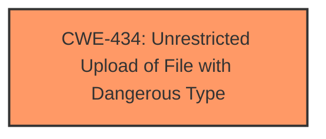

# Raw Analyzer Response for CVE-2025-4468

# Summary

| CWE ID | CWE Name | Confidence | CWE Abstraction Level | CWE Vulnerability Mapping Label | CWE-Vulnerability Mapping Notes |
|---|---|---|---|---|---|
| CWE-434 | Unrestricted Upload of File with Dangerous Type | 1.0 | Base | Allowed | Primary CWE |

## Evidence and Confidence

*   **Confidence Score:** 1.0
*   **Evidence Strength:** HIGH

## Relationship Analysis

The primary relationship to consider here is the direct identification of the **unrestricted upload** weakness, which directly maps to CWE-434. There aren't any significant parent-child or chain relationships that would suggest a different or more specific CWE.

## Vulnerability Chain

The vulnerability chain is relatively simple:

1.  **Root Cause:** **Unrestricted upload** vulnerability (CWE-434) due to **missing** or **improper** input validation on the `userImage` argument in `/edit-photo.php`.
2.  **Impact:** An attacker can upload arbitrary files, potentially leading to remote code execution or other malicious activities.

## Summary of Analysis

The vulnerability description clearly states that the issue involves an **unrestricted upload** in the `/edit-photo.php` file through manipulation of the `userImage` argument. This directly corresponds to CWE-434, "Unrestricted Upload of File with Dangerous Type." The evidence is strong and directly supports this classification. The retriever results also list CWE-434 as a highly relevant candidate.

Relevant CWE Information:

# Enhanced Context (25 CWEs)
The following CWEs were identified as potentially relevant to this vulnerability:

## CWE-434: Unrestricted Upload of File with Dangerous Type
**Abstraction Level**: Base
**Similarity Score**: 0.82
**Source**: dense

**Description**:
The product allows the upload or transfer of dangerous file types that are automatically processed within its environment.

**Mapping Guidance**:
- Usage: Allowed
- Rationale: This CWE entry is at the Base level of abstraction, which is a preferred level of abstraction for mapping to the root causes of vulnerabilities.

The vulnerability description explicitly mentions "**unrestricted upload**" as the **weakness**, aligning perfectly with the description of CWE-434. The confidence is high because the description directly matches the CWE.