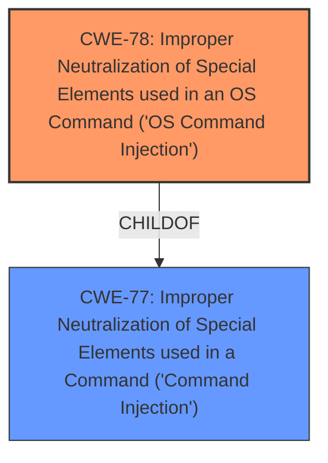

# Raw Analyzer Response for CVE-2025-44872

# Summary

| CWE ID | CWE Name | Confidence | CWE Abstraction Level | CWE Vulnerability Mapping Label | CWE-Vulnerability Mapping Notes |
|---|---|---|---|---|---|
| CWE-78 | Improper Neutralization of Special Elements used in an OS Command ('OS Command Injection') | 1.0 | Base | Primary | Allowed |
| CWE-77 | Improper Neutralization of Special Elements used in a Command ('Command Injection') | 0.7 | Class | Secondary Candidate | Allowed-with-Review |

## Evidence and Confidence

*   **Confidence Score:** 0.9
*   **Evidence Strength:** HIGH

## Relationship Analysis
The primary relationship influencing the CWE selection is the ChildOf relationship between CWE-78 and CWE-77. CWE-78 is a specific type of command injection that occurs at the operating system level and is a child of the more general CWE-77. Since the vulnerability description explicitly mentions command injection in the context of the OS, CWE-78 is a more precise and appropriate classification.

## Vulnerability Chain
The vulnerability chain starts with the **improper neutralization** of special elements in the `deviceName` parameter within the `formsetUsbUnload` function. This leads directly to the ability to execute arbitrary commands on the operating system.
  - Root Cause: **Improper Neutralization** (CWE-78)
  - Impact: Arbitrary command execution

## Summary of Analysis
The initial analysis identified command injection as the root cause, supported by the vulnerability description and key phrases. The retriever results also highlighted CWE-77 and CWE-78 as top candidates. The final decision to select CWE-78 over CWE-77 is based on the specific context of the vulnerability, which involves operating system commands. CWE-78 is a base level CWE, which is the preferred level of abstraction.

The vulnerability description explicitly mentions a "**command injection** vulnerability in the formsetUsbUnload function via the deviceName parameter. This vulnerability allows attackers to execute arbitrary commands via a crafted request." This clearly indicates that the root cause is related to the **improper handling of input** that leads to command execution. The evidence and the retriever results support this conclusion.

Relevant CWE Information:

# Enhanced Context (25 CWEs)
The following CWEs were identified as potentially relevant to this vulnerability:

## CWE-78: Improper Neutralization of Special Elements used in an OS Command ('OS Command Injection')
**Abstraction Level**: Base
**Similarity Score**: 0.74
**Source**: dense

**Description**:
The product constructs all or part of an OS command using externally-influenced input from an upstream component, but it does not neutralize or incorrectly neutralizes special elements that could modify the intended OS command when it is sent to a downstream component.

**Mapping Guidance**:
- Usage: Allowed
- Rationale: This CWE entry is at the Base level of abstraction, which is a preferred level of abstraction for mapping to the root causes of vulnerabilities.

## CWE-77: Improper Neutralization of Special Elements used in a Command ('Command Injection')
**Abstraction Level**: Class
**Similarity Score**: 0.71
**Source**: dense

**Description**:
The product constructs all or part of a command using externally-influenced input from an upstream component, but it does not neutralize or incorrectly neutralizes special elements that could modify the intended command when it is sent to a downstream component.

**Mapping Guidance**:
- Usage: Allowed-with-Review
- Rationale: CWE-77 is often misused when OS command injection (CWE-78) was intended instead [REF-1287].

### CWE Selection Details:

*   **CWE-78 Improper Neutralization of Special Elements used in an OS Command ('OS Command Injection')**
    *   **Technical Explanation:** The vulnerability involves the **improper neutralization** of special elements within the `deviceName` parameter, allowing attackers to inject and execute arbitrary OS commands. This aligns directly with the description of CWE-78.
    *   **Security Implications:** Attackers can execute arbitrary commands on the system, potentially leading to complete system compromise.
    *   **Relationship and Chain Patterns:** CWE-78 is a child of CWE-77, but it's more specific because it targets OS commands.
    *   **Mapping Guidance Influence:** The MITRE mapping guidance allows for the use of CWE-78, as it is a Base level CWE.
    *   **Primary/Secondary:** Primary CWE.
    *   **Confidence:** 1.0
*   **CWE-77 Improper Neutralization of Special Elements used in a Command ('Command Injection')**
    *   **Technical Explanation:** CWE-77 is a more general form of command injection. While it applies to the vulnerability, CWE-78 is a more precise classification.
    *   **Security Implications:** Similar to CWE-78, but less specific to OS commands.
    *   **Relationship and Chain Patterns:** Parent of CWE-78.
    *   **Mapping Guidance Influence:** The MITRE mapping guidance allows for the use of CWE-77 but suggests considering CWE-78 when OS command injection is involved.
    *   **Primary/Secondary:** Secondary Candidate.
    *   **Confidence:** 0.7

### Other CWEs Considered but Not Used:
*   CWE-89 (SQL Injection), CWE-93 (CRLF Injection), CWE-88 (Argument Injection), CWE-1336 (Improper Neutralization of Special Elements Used in a Template Engine), CWE-79 (Cross-site Scripting), CWE-434 (Unrestricted Upload of File with Dangerous Type): These CWEs were considered but deemed not applicable because the vulnerability specifically involves command injection, not SQL queries, CRLF sequences, template engines, web page generation, or file uploads.
*   CWE-184 (Incomplete List of Disallowed Inputs): This CWE describes a scenario where not all dangerous inputs are blocked. While this might be a contributing factor, the core issue is the **improper neutralization** of the inputs that *are* processed, making CWE-78 more accurate.
*   CWE-425 (Direct Request ('Forced Browsing')): This CWE is related to authorization issues, which are not explicitly mentioned in the vulnerability description.
*   CWE-259 (Use of Hard-coded Password): This CWE is related to the use of weak credentials, which is not applicable to the vulnerability.
*   CWE-94 (Improper Control of Generation of Code ('Code Injection')): While command injection can lead to code execution, the root cause is the **improper neutralization** of input, not the code generation itself. Thus, CWE-78 is a more accurate root cause.