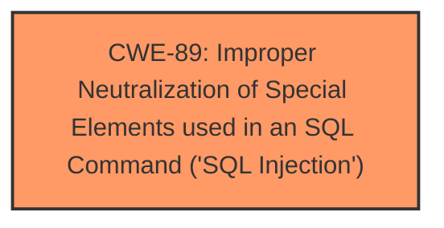

# Analysis for CVE-2025-4510

# Summary
| CWE ID | CWE Name | Confidence | CWE Abstraction Level | CWE Vulnerability Mapping Label | CWE-Vulnerability Mapping Notes |
|---|---|---|---|---|---|
| CWE-89 | Improper Neutralization of Special Elements used in an SQL Command ('SQL Injection') | 1.0 | Base | Allowed | Primary CWE |

## Evidence and Confidence

*   **Confidence Score:** 1.0
*   **Evidence Strength:** HIGH

## Relationship Analysis
The primary relationship is that CWE-89 is a Base level CWE, which is the preferred level for root cause analysis. There are no parent-child or chain relationships that significantly influence the selection in this case, as the evidence directly points to SQL injection.

## Vulnerability Chain
The vulnerability chain starts with **improper neutralization** of special elements in the `gblOrgID` parameter, leading directly to **SQL Injection**.

## Summary of Analysis
The vulnerability description clearly states that the manipulation of the `gblOrgID` argument leads to **SQL Injection** (CWE-89). The "CVE Reference Links Content Summary" section reinforces this by highlighting the root cause as a SQL injection in the `optnty/optntyday.php` file. The provided proof-of-concept (PoC) further confirms the presence of a time-based blind SQL injection.

The Retriever Results also strongly support CWE-89, with a score of 1.0.

I considered other CWEs from the Retriever Results, such as:

*   CWE-79 (Improper Neutralization of Input During Web Page Generation ('Cross-site Scripting')): While neutralization is a common theme, the specific vulnerability is SQL injection, not XSS.
*   CWE-434 (Unrestricted Upload of File with Dangerous Type): This is not relevant as the vulnerability does not involve file uploads.
*   CWE-74 (Improper Neutralization of Special Elements in Output Used by a Downstream Component ('Injection')): This is too general, and CWE-89 is a more specific and appropriate choice.

Based on the strong evidence and the specificity of CWE-89, it is the most appropriate CWE for this vulnerability. The evidence is very direct.

Relevant CWE Information:

# Enhanced Context (25 CWEs)
The following CWEs were identified as potentially relevant to this vulnerability:

## CWE-89: Improper Neutralization of Special Elements used in an SQL Command ('SQL Injection')
**Abstraction Level**: Base
**Similarity Score**: 0.77
**Source**: dense

**Description**:
The product constructs all or part of an SQL command using externally-influenced input from an upstream component, but it does not neutralize or incorrectly neutralizes special elements that could modify the intended SQL command when it is sent to a downstream component. Without sufficient removal or quoting of SQL syntax in user-controllable inputs, the generated SQL query can cause those inputs to be interpreted as SQL instead of ordinary user data.

**Mapping Guidance**:
- Usage: Allowed
- Rationale: This CWE entry is at the Base level of abstraction, which is a preferred level of abstraction for mapping to the root causes of vulnerabilities.