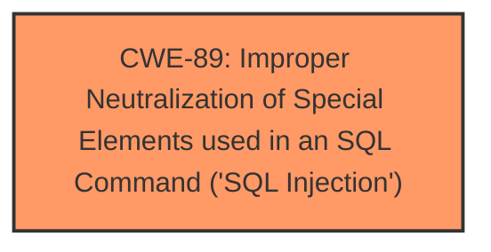

# Raw Analyzer Response for CVE-2025-4549

# Summary
| CWE ID | CWE Name | Confidence | CWE Abstraction Level | CWE Vulnerability Mapping Label | CWE-Vulnerability Mapping Notes |
|---|---|---|---|---|---|
| CWE-89 | Improper Neutralization of Special Elements used in an SQL Command ('SQL Injection') | 1.0 | Base | Allowed | Primary CWE. The root cause is that the application does not neutralize or incorrectly neutralizes special elements used in an SQL command.|

## Evidence and Confidence

*   **Confidence Score:** 1.0
*   **Evidence Strength:** HIGH

## Relationship Analysis
The primary identified CWE is CWE-89. It's a base-level CWE, which is appropriate. There are no direct parent-child or chain relationships directly relevant in this specific case based on the provided information. The abstraction level is appropriate as it's a Base level CWE.

## Vulnerability Chain
The vulnerability chain is straightforward:
1.  Root Cause: **Improper Neutralization of Special Elements used in an SQL Command ('SQL Injection')** (CWE-89) due to the application's failure to sanitize user input.
2.  Impact: Unauthorized database access, sensitive data leakage, data tampering, comprehensive system control, and even service interruption.

## Summary of Analysis
The primary weakness is clearly SQL injection, as the application directly uses unsanitized user input in SQL queries. The evidence for this is strong, as the vulnerability description states that the manipulation of the "Name" argument leads to **SQL injection**. The CVE reference confirms this, noting the root cause as the injection of malicious code from the 'name' parameter directly into SQL queries without proper cleaning or validation.

The "Retriever Results" also strongly suggest CWE-89 as the top candidate. The "Complete CWE Specifications" for CWE-89 aligns perfectly with the vulnerability description.

CWE-79 was considered due to the presence of user-supplied data, but it is not applicable here because the data is not being used to generate a web page; it's being used directly in an SQL query. CWE-434 (Unrestricted Upload of File with Dangerous Type) is not relevant as there is no file upload involved.

The selection of CWE-89 is at the optimal level of specificity because it directly addresses the root cause of the vulnerability which is the **improper neutralization of input in an SQL query**.