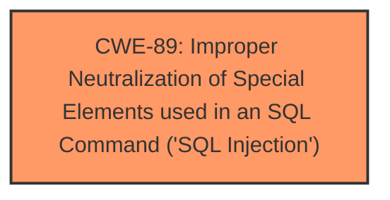

# Analysis Report for CVE-2025-4553

# Vulnerability Analysis Report: CVE-2025-4553

## Description

A vulnerability was found in PHPGurukul Apartment Visitors Management System 1.0 and classified as critical. Affected by this issue is some unknown functionality of the file /admin/bwdates-reports-details.php. The manipulation of the argument fromdate/todate leads to sql injection. The attack may be launched remotely. The exploit has been disclosed to the public and may be used.

## Vulnerability Description Key Phrases

- **Component:** /admin/bwdates-reports-details.php
- **Vector:** manipulation of argument fromdate/todate
- **Weakness:** sql injection, unauthenticated sql injection
- **Product:** PHPGurukul Apartment Visitors Management System
- **Version:** 1

## Analysis (with Relationship Data)

# Summary
| CWE ID | CWE Name | Confidence | CWE Abstraction Level | CWE Vulnerability Mapping Label | CWE-Vulnerability Mapping Notes |
|---|---|---|---|---|---|
| CWE-89 | Improper Neutralization of Special Elements used in an SQL Command ('SQL Injection') | 1.0 | Base | Primary | Allowed |

## Evidence and Confidence

*   **Confidence Score:** 1.0
*   **Evidence Strength:** HIGH

## Relationship Analysis
The primary relationship influencing the decision is the direct match of the vulnerability to the description of CWE-89. There are no child or parent relationships that are more appropriate. The vulnerability description explicitly mentions **SQL Injection**, which aligns directly with CWE-89.



## Vulnerability Chain
The vulnerability chain consists of a single element:

1.  **Root Cause:** **Improper Neutralization of Special Elements used in an SQL Command ('SQL Injection')** (CWE-89)

The chain starts with the lack of proper input validation, leading directly to the SQL injection vulnerability.

## Summary of Analysis
The analysis is heavily based on the provided evidence, particularly the explicit mention of "**SQL injection**" in the "Vulnerability Description Key Phrases". This aligns perfectly with CWE-89, which describes the **improper neutralization of special elements used in an SQL command**.

The graph relationships confirm that CWE-89 is the most specific and relevant CWE. All evidence points towards this classification with high confidence. The vulnerability involves the manipulation of the `fromdate/todate` arguments, directly leading to SQL injection.

Relevant CWE Information:

# Enhanced Context (25 CWEs)
The following CWEs were identified as potentially relevant to this vulnerability:

## CWE-89: Improper Neutralization of Special Elements used in an SQL Command ('SQL Injection')
**Abstraction Level**: Base
**Similarity Score**: 0.79
**Source**: dense

**Description**:
The product constructs all or part of an SQL command using externally-influenced input from an upstream component, but it does not neutralize or incorrectly neutralizes special elements that could modify the intended SQL command when it is sent to a downstream component. Without sufficient removal or quoting of SQL syntax in user-controllable inputs, the generated SQL query can cause those inputs to be interpreted as SQL instead of ordinary user data.

**Mapping Guidance**:
- Usage: Allowed
- Rationale: This CWE entry is at the Base level of abstraction, which is a preferred level of abstraction for mapping to the root causes of vulnerabilities.


## CWE Relationship Analysis

Current CWEs represent these abstraction levels: .


### Vulnerability Chain Analysis

**Chain starting from CWE-89:**
- 89 (Improper Neutralization of Special Elements used in an SQL Command ('SQL Injection')) - ROOT


### CWE Relationship Diagram

```mermaid
graph TD
    classDef primary fill:#f96,stroke:#333,stroke-width:2px
    classDef secondary fill:#69f,stroke:#333
    classDef tertiary fill:#9e9,stroke:#333
```


*Report generated on 2025-07-15 00:49:23*
