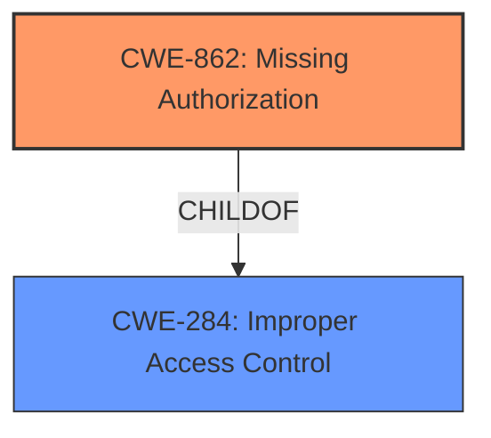

# Analysis Report for CVE-2025-45610

# Vulnerability Analysis Report: CVE-2025-45610

## Description

Incorrect access control in the component /scheduleLog/info/1 of PassJava-Platform v3.0.0 allows attackers to access sensitive information via a crafted payload.

## Vulnerability Description Key Phrases

- **Rootcause:** incorrect access control
- **Impact:** access sensitive information
- **Vector:** crafted payload
- **Attacker:** attackers
- **Product:** PassJava-Platform
- **Version:** v3.0.0
- **Component:** /scheduleLog/info/1

## Analysis (with Relationship Data)

# Summary
| CWE ID | CWE Name | Confidence | CWE Abstraction Level | CWE Vulnerability Mapping Label | CWE-Vulnerability Mapping Notes |
|---|---|---|---|---|---|
| CWE-862 | Missing Authorization | 0.9 | Base | Allowed | Primary CWE |
| CWE-284 | Improper Access Control | 0.6 | Class | Discouraged | Secondary Candidate |

## Evidence and Confidence

*   **Confidence Score:** 0.8
*   **Evidence Strength:** HIGH

## Relationship Analysis
The primary relationship impacting the CWE selection is the parent-child relationship between CWE-284 (Improper Access Control) and CWE-862 (Missing Authorization). CWE-862 is a more specific type of access control issue and a child of CWE-284. The analysis suggests that the vulnerability involves a missing authorization check, making CWE-862 a more appropriate classification.



## Vulnerability Chain
The vulnerability chain consists of:
1.  **Root Cause:** Missing Authorization (CWE-862) - The application lacks a proper check to verify if the user is authorized to access a specific resource.
2.  **Impact:** Access to Sensitive Information - Due to the missing authorization, attackers can access sensitive information.

## Summary of Analysis
The initial analysis considered CWE-284 due to the **incorrect access control** mentioned in the vulnerability description. However, the detailed analysis of the CVE reference link summary indicates that the vulnerability stems from the absence of an authorization check. The `/sys/scheduleLog/info/1` API is accessible without proper authorization, leading to unauthorized access to sensitive information.

Given this evidence, CWE-862 (Missing Authorization) is a more accurate and specific classification. It directly addresses the root cause of the vulnerability, which is the lack of an authorization check for a critical function.

CWE-284, while related, is a broader category and less specific. The MITRE guidelines discourage its use when a more specific child CWE like 862 is applicable. The evidence strongly supports that there is a missing authorization check, therefore the specific CWE-862 is favored.

The selection of CWE-862 is at the optimal level of specificity. It's a Base level CWE, which is preferred for mapping to the root causes of vulnerabilities.

Relevant CWE Information:

# Enhanced Context (10 CWEs)
The following CWEs were identified as potentially relevant to this vulnerability:

## CWE-284: Improper Access Control
**Abstraction Level**: Class
**Similarity Score**: 0.144

**Description**:
The product does not adequately control access to resources or privileges.

**Mapping Guidance**:
- Usage: Discouraged
- Rationale: CWE-284 is high-level and lower-level CWEs can frequently be used instead. It is a level-1 Class (i.e., a child of a Pillar).

## CWE-862: Missing Authorization
**Abstraction Level**: Base
**Similarity Score**: 0.144

**Description**:
The product does not perform any authorization checks when an actor attempts to access a resource or perform an action.

**Mapping Guidance**:
- Usage: Allowed
- Rationale: This CWE entry is at the Base level of abstraction, which is a preferred level of abstraction for mapping to the root causes of vulnerabilities.

## CWE-306: Missing Authentication for Critical Function
**Abstraction Level**: Base
**Similarity Score**: 0.149

**Description**:
The product does not perform any authentication for functionality that requires a provable user identity or consumes a significant amount of resources.

**Mapping Guidance**:
- Usage: Allowed
- Rationale: This CWE entry is at the Base level of abstraction, which is a preferred level of abstraction for mapping to the root causes of vulnerabilities.


## CWE Relationship Analysis

Current CWEs represent these abstraction levels: .


### Vulnerability Chain Analysis

**Chain starting from CWE-284:**
- 284 (Improper Access Control) - ROOT


**Chain starting from CWE-306:**
- 306 (Missing Authentication for Critical Function) - ROOT


### CWE Relationship Diagram

```mermaid
graph TD
    classDef primary fill:#f96,stroke:#333,stroke-width:2px
    classDef secondary fill:#69f,stroke:#333
    classDef tertiary fill:#9e9,stroke:#333
```


*Report generated on 2025-07-15 00:50:49*
