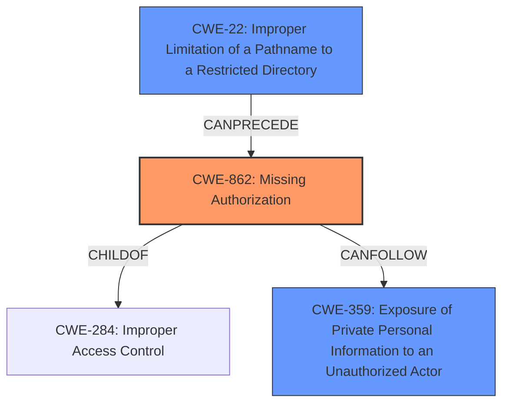

# Raw Analyzer Response for CVE-2025-45613

# Summary

| CWE ID | CWE Name | Confidence | CWE Abstraction Level | CWE Vulnerability Mapping Label | CWE-Vulnerability Mapping Notes |
|---|---|---|---|---|---|
| CWE-862 | Missing Authorization | 0.9 | Base | Primary CWE | Allowed |
| CWE-22 | Improper Limitation of a Pathname to a Restricted Directory ('Path Traversal') | 0.7 | Base | Secondary Candidate | Allowed |
| CWE-359 | Exposure of Private Personal Information to an Unauthorized Actor | 0.6 | Base | Secondary Candidate | Allowed |

## Evidence and Confidence

*   **Confidence Score:** 0.8
*   **Evidence Strength:** HIGH

## Relationship Analysis

The primary relationship influencing the CWE selection is the hierarchical relationship. CWE-862 (Missing Authorization) is a base CWE and child of CWE-284 (Improper Access Control). The vulnerability description clearly indicates a missing authorization check, making CWE-862 a more specific and appropriate choice than its parent. Additionally, CWE-22 (Path Traversal) can precede CWE-862 in a vulnerability chain, representing the input manipulation aspect of the attack. CWE-359 (Exposure of Private Personal Information to an Unauthorized Actor) represents the impact of the vulnerability.

## Vulnerability Chain

The vulnerability chain starts with **CWE-22 (Improper Limitation of a Pathname to a Restricted Directory ('Path Traversal'))**, where a crafted payload with path traversal sequences is used to bypass authentication. This leads to **CWE-862 (Missing Authorization)**, as the application fails to perform the necessary authorization checks. The chain culminates in **CWE-359 (Exposure of Private Personal Information to an Unauthorized Actor)**, as the attacker gains access to sensitive user data.

## Summary of Analysis

The initial analysis identified **incorrect access control** as the main issue, and this was supported by the CVE reference summary which pointed towards insufficient input validation, specifically path traversal, combined with **incorrect access control**. The analysis was refined by considering the MITRE guidelines, specifically the section on Authentication vs Authorization vs Access Control. The guidance highlights that when there is no role or privilege check after login, CWE-862 is most appropriate.

The vulnerability description states "**Incorrect access control** in the component /user/list of Shiro-Action v0.6 allows attackers to access sensitive information via a crafted payload." The CVE Reference Links Content Summary indicates that the application fails to perform proper authorization checks. This evidence strongly supports the selection of CWE-862 (Missing Authorization) as the primary CWE.

CWE-22 (Improper Limitation of a Pathname to a Restricted Directory ('Path Traversal')) was considered because the attack vector involves a crafted payload that includes path traversal sequences. This allows the attacker to bypass authentication and reach the /user/list endpoint.
CWE-359 (Exposure of Private Personal Information to an Unauthorized Actor) was considered because the impact of the vulnerability is the leakage of sensitive user information.

These CWEs are at the optimal level of specificity because they accurately describe the root cause, attack vector, and impact of the vulnerability. CWE-862 specifically addresses the lack of authorization, CWE-22 describes the path traversal technique, and CWE-359 captures the resulting information exposure.

Relevant CWE Information:
# Enhanced Context (25 CWEs)
The following CWEs were identified as potentially relevant to this vulnerability:

## CWE-41: Improper Resolution of Path Equivalence
**Abstraction Level**: Base
**Similarity Score**: 0.74
**Source**: dense

**Description**:
The product is vulnerable to file system contents disclosure through path equivalence. Path equivalence involves the use of special characters in file and directory names. The associated manipulations are intended to generate multiple names for the same object.

**Mapping Guidance**:
- Usage: Allowed
- Rationale: This CWE entry is at the Base level of abstraction, which is a preferred level of abstraction for mapping to the root causes of vulnerabilities.

## CWE-807: Reliance on Untrusted Inputs in a Security Decision
**Abstraction Level**: Base
**Similarity Score**: 0.74
**Source**: dense

**Description**:
The product uses a protection mechanism that relies on the existence or values of an input, but the input can be modified by an untrusted actor in a way that bypasses the protection mechanism.

**Mapping Guidance**:
- Usage: Allowed
- Rationale: This CWE entry is at the Base level of abstraction, which is a preferred level of abstraction for mapping to the root causes of vulnerabilities.

## CWE-639: Authorization Bypass Through User-Controlled Key
**Abstraction Level**: Base
**Similarity Score**: 0.74
**Source**: dense

**Description**:
The system's authorization functionality does not prevent one user from gaining access to another user's data or record by modifying the key value identifying the data.

**Mapping Guidance**:
- Usage: Allowed
- Rationale: This CWE entry is at the Base level of abstraction, which is a preferred level of abstraction for mapping to the root causes of vulnerabilities.

## CWE-668: Exposure of Resource to Wrong Sphere
**Abstraction Level**: Class
**Similarity Score**: 0.74
**Source**: dense

**Description**:
The product exposes a resource to the wrong control sphere, providing unintended actors with inappropriate access to the resource.

**Mapping Guidance**:
- Usage: Discouraged
- Rationale: CWE-668 is high-level and is often misused as a catch-all when lower-level CWE IDs might be applicable. It is sometimes used for low-information vulnerability reports [REF-1287]. It is a level-1 Class (i.e., a child of a Pillar). It is not useful for trend analysis.

CWE-668 was not chosen because it is a high-level class.

## CWE-74: Improper Neutralization of Special Elements in Output Used by a Downstream Component ('Injection')
**Abstraction Level**: Class
**Similarity Score**: 0.74
**Source**: dense

**Description**:
The product constructs all or part of a command, data structure, or record using externally-influenced input from an upstream component, but it does not neutralize or incorrectly neutralizes special elements that could modify how it is parsed or interpreted when it is sent to a downstream component.

**Mapping Guidance**:
- Usage: Discouraged
- Rationale: CWE-74 is high-level and often misused when lower-level weaknesses are more appropriate.

CWE-74 was not chosen because it is a high-level class.

## CWE-472: External Control of Assumed-Immutable Web Parameter
**Abstraction Level**: Base
**Similarity Score**: 0.74
**Source**: dense

**Description**:
The web application does not sufficiently verify inputs that are assumed to be immutable but are actually externally controllable, such as hidden form fields.

**Mapping Guidance**:
- Usage: Allowed
- Rationale: This CWE entry is at the Base level of abstraction, which is a preferred level of abstraction for mapping to the root causes of vulnerabilities.

## CWE-425: Direct Request ('Forced Browsing')
**Abstraction Level**: Base
**Similarity Score**: 0.73
**Source**: dense

**Description**:
The web application does not adequately enforce appropriate authorization on all restricted URLs, scripts, or files.

**Mapping Guidance**:
- Usage: Allowed
- Rationale: This CWE entry is at the Base level of abstraction, which is a preferred level of abstraction for mapping to the root causes of vulnerabilities.

## CWE-1390: Weak Authentication
**Abstraction Level**: Class
**Similarity Score**: 0.73
**Source**: dense

**Description**:
The product uses an authentication mechanism to restrict access to specific users or identities, but the mechanism does not sufficiently prove that the claimed identity is correct.

**Mapping Guidance**:
- Usage: Allowed-with-Review
- Rationale: This CWE entry is a Class and might have Base-level children that would be more appropriate

## CWE-212: Improper Removal of Sensitive Information Before Storage or Transfer
**Abstraction Level**: Base
**Similarity Score**: 0.73
**Source**: dense

**Description**:
The product stores, transfers, or shares a resource that contains sensitive information, but it does not properly remove that information before the product makes the resource available to unauthorized actors.

**Mapping Guidance**:
- Usage: Allowed