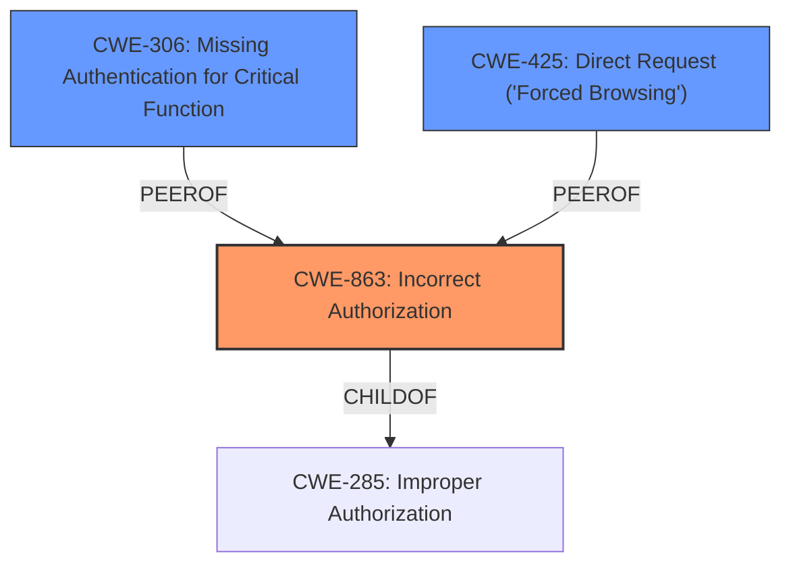

# Analysis Report for CVE-2025-45616

# Vulnerability Analysis Report: CVE-2025-45616

## Description

**Incorrect access control** in the /admin/** API of brcc v1.2.0 allows attackers to gain access to Admin rights via a crafted request.

## Vulnerability Description Key Phrases

- **Rootcause:** Incorrect access control
- **Impact:** gain access to Admin rights
- **Vector:** crafted request
- **Attacker:** attackers
- **Product:** brcc
- **Version:** v1.2.0
- **Component:** /admin/** API

## Analysis (with Relationship Data)

# Summary
| CWE ID | CWE Name | Confidence | CWE Abstraction Level | CWE Vulnerability Mapping Label | CWE-Vulnerability Mapping Notes |
|---|---|---|---|---|---|
| CWE-863 | Incorrect Authorization | 0.9 | Class | Primary | Allowed-with-Review |
| CWE-306 | Missing Authentication for Critical Function | 0.7 | Base | Secondary | Allowed |
| CWE-425 | Direct Request ('Forced Browsing') | 0.6 | Base | Secondary | Allowed |

## Evidence and Confidence

*   **Confidence Score:** 0.8
*   **Evidence Strength:** MEDIUM

## Relationship Analysis
The primary CWE, CWE-863 (Incorrect Authorization), is a Class-level CWE. The analysis also identified CWE-306 (Missing Authentication for Critical Function) and CWE-425 (Direct Request ('Forced Browsing')) as secondary CWEs, both at the Base level. These are all related to access control issues, with CWE-306 focusing on the absence of authentication and CWE-425 focusing on direct requests bypassing authorization.



## Vulnerability Chain
The vulnerability chain starts with **incorrect access control**, leading to the ability to gain admin rights. The chain involves a misconfigured context path that results in authentication bypass.

**Chain:** **Incorrect Access Control** (CWE-863) -> Missing Authentication (CWE-306) -> Direct Request bypassing Authorization (CWE-425) -> Gain Admin Rights (Impact).

## Summary of Analysis
The initial assessment points to an access control issue in the brcc application's /admin/** API. The key phrase "**Incorrect access control**" strongly indicates a problem with how permissions are managed. The vulnerability allows attackers to "gain access to Admin rights via a crafted request."

The CVE Reference Links Content Summary provides significant additional details. The root cause is the use of `request.getRequestURI()` without proper parsing, combined with a misconfigured `contextPath`. This allows bypassing authentication checks and accessing /admin/** endpoints without a token.

The Retriever Results suggest several candidate CWEs. CWE-425 (Direct Request ('Forced Browsing')) has a high rank, but the core issue is not simply a direct request; it's the **incorrect authorization** that allows the request to succeed. CWE-306 (Missing Authentication for Critical Function) is also a possibility, but the evidence suggests that the application attempts to authenticate, but the authentication is bypassed due to the misconfiguration. CWE-863 (Incorrect Authorization) seems more fitting as the primary cause.

Given this additional context, CWE-863 (Incorrect Authorization) is the most appropriate primary CWE. The application performs an authorization check, but it does so incorrectly, allowing unauthorized access. CWE-306 (Missing Authentication for Critical Function) and CWE-425 (Direct Request ('Forced Browsing')) are secondary issues.

*   **CWE-863: Incorrect Authorization**
    *   **Technical Explanation:** The application attempts to perform authorization but fails to do so correctly. In this case, the vulnerability description and content summary reveal that the `request.getRequestURI()` function is being used without proper parsing, combined with a misconfigured `contextPath`, which leads to bypassing the authentication. The application logic intended to restrict access to the `/admin/**` API is present but flawed.
    *   **Security Implications:** Attackers can bypass intended access controls and gain administrative privileges.
    *   **Relationship Analysis:** CWE-863 is a child of CWE-285 (Improper Authorization), indicating a more specific type of authorization failure.
    *   **Mapping Guidance Influence:** The guidance suggests using CWE-863 when the authorization check exists but is flawed.
*   **CWE-306: Missing Authentication for Critical Function**
    *   **Technical Explanation:** While not the primary cause, the authentication bypass due to the misconfigured `contextPath` means that, effectively, no authentication is performed for the `/admin/**` API in certain cases.
    *   **Security Implications:** Attackers can access sensitive functionality without providing credentials.
    *   **Relationship Analysis:** CWE-306 is a base-level CWE indicating a lack of authentication.
    *   **Mapping Guidance Influence:** The guidance suggests using CWE-306 when no identity validation is enforced for sensitive functionality.
*   **CWE-425: Direct Request ('Forced Browsing')**
    *   **Technical Explanation:** The attackers can directly access the admin API endpoints with the `contextPath` prefix, which bypasses the authentication checks.
    *   **Security Implications:** Unauthorized access to sensitive resources.
    *   **Relationship Analysis:** Child of CWE-288 (Improper Authentication) and CWE-862 (Missing Authorization).
    *   **Mapping Guidance Influence:** The guidance suggests using CWE-425 when the web application does not adequately enforce appropriate authorization on all restricted URLs, scripts, or files.

CWEs Considered but Not Used:

*   CWE-284: Improper Access Control - This is a high-level CWE and less specific than CWE-863, making CWE-863 a better fit.
*   CWE-285: Improper Authorization - While related to authorization, CWE-863 is a more specific type of authorization failure, making it a better choice.
*   CWE-472: External Control of Assumed-Immutable Web Parameter - This doesn't seem to be applicable to the vulnerability description.
*   CWE-807: Reliance on Untrusted Inputs in a Security Decision - While relevant, the core issue here is the **incorrect authorization**, so CWE-863 is more appropriate.


## CWE Relationship Analysis

Current CWEs represent these abstraction levels: .


### Vulnerability Chain Analysis

**Chain starting from CWE-288:**
- 288 (Authentication Bypass Using an Alternate Path or Channel) - ROOT


**Chain starting from CWE-863:**
- 863 (Incorrect Authorization) - ROOT


### CWE Relationship Diagram

```mermaid
graph TD
    classDef primary fill:#f96,stroke:#333,stroke-width:2px
    classDef secondary fill:#69f,stroke:#333
    classDef tertiary fill:#9e9,stroke:#333
```


*Report generated on 2025-07-15 00:52:51*
