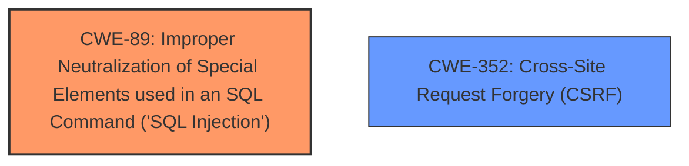

# Enhanced Analysis for CVE-2025-46241

# Summary
| CWE ID | CWE Name | Confidence | CWE Abstraction Level | CWE Vulnerability Mapping Label | CWE-Vulnerability Mapping Notes |
|---|---|---|---|---|---|
| CWE-89 | Improper Neutralization of Special Elements used in an SQL Command ('SQL Injection') | 1.0 | Base | Primary | Allowed |
| CWE-352 | Cross-Site Request Forgery (CSRF) | 1.0 | Compound | Secondary | Allowed |

## Evidence and Confidence

*   **Confidence Score:** 1.0
*   **Evidence Strength:** HIGH

## Relationship Analysis
The primary relationship that impacts the decision is that CWE-89 is a Base level CWE which is the preferred level of abstraction for mapping to the root causes of vulnerabilities. CWE-352 is a Compound weakness representing multiple weaknesses. The vulnerability description clearly states both Cross-Site Request Forgery (CSRF) and SQL Injection vulnerabilities.



## Vulnerability Chain
The vulnerability chain starts with the **Improper Neutralization** of SQL special elements leading to **SQL Injection**, and the **lack** of CSRF protection which allows an attacker to force higher privileged users to execute unwanted actions.

## Summary of Analysis
The initial assessment and resulting conclusion are based on a comprehensive analysis of the vulnerability description, the retriever results, and the complete CWE specifications. The vulnerability description explicitly mentions "Cross-Site Request Forgery (CSRF) vulnerability" and "**SQL Injection**". The retriever results confirm that CWE-89 and CWE-352 are the top candidates.

The graph relationships are simple, as the two vulnerabilities are distinct.

CWE-89 and CWE-352 are at the optimal level of specificity, representing the specific weaknesses identified in the vulnerability.

Relevant CWE Information:

# Enhanced Context (25 CWEs)
The following CWEs were identified as potentially relevant to this vulnerability:

## CWE-352: Cross-Site Request Forgery (CSRF)
**Abstraction Level**: Compound
**Similarity Score**: 0.76
**Source**: dense

**Description**:
The web application does not, or can not, sufficiently verify whether a well-formed, valid, consistent request was intentionally provided by the user who submitted the request.

**Mapping Guidance**:
- Usage: Allowed
- Rationale: This is a well-known Composite of multiple weaknesses that must all occur simultaneously, although it is attack-oriented in nature.

## CWE-89: Improper Neutralization of Special Elements used in an SQL Command ('SQL Injection')
**Abstraction Level**: Base
**Similarity Score**: 1.000
**Source**: alternate_terms

**Description**:
The product constructs all or part of an SQL command using externally-influenced input from an upstream component, but it does not neutralize or incorrectly neutralizes special elements that could modify the intended SQL command when it is sent to a downstream component. Without sufficient removal or quoting of SQL syntax in user-controllable inputs, the generated SQL query can cause those inputs to be interpreted as SQL instead of ordinary user data.

**Mapping Guidance**:
- Usage: Allowed
- Rationale: This CWE entry is at the Base level of abstraction, which is a preferred level of abstraction for mapping to the root causes of vulnerabilities.

### CWE-89: Improper Neutralization of Special Elements used in an SQL Command ('SQL Injection')
*   **Explanation:** The vulnerability description explicitly states "SQL Injection". This aligns directly with CWE-89, which describes the improper neutralization of special elements used in an SQL command.
*   **Security Implications:** Exploitation of this vulnerability can allow attackers to execute arbitrary SQL commands, potentially leading to data breaches, data manipulation, or complete system compromise.
*   **Relationship:** This is the primary weakness as it directly reflects the **SQL Injection** vulnerability.
*   **Mapping Guidance:** The MITRE mapping guidance allows for this mapping.

### CWE-352: Cross-Site Request Forgery (CSRF)
*   **Explanation:** The vulnerability description also explicitly states "Cross-Site Request Forgery (CSRF) vulnerability". This aligns directly with CWE-352, which describes the web application not sufficiently verifying whether a well-formed, valid, consistent request was intentionally provided by the user who submitted the request.
*   **Security Implications:** Exploitation of this vulnerability can allow attackers to force authenticated users to perform actions against their will, potentially leading to unauthorized modifications or data breaches.
*   **Relationship:** This is a secondary weakness as it represents another distinct vulnerability present in the software.
*   **Mapping Guidance:** The MITRE mapping guidance allows for this mapping.


## CWE Relationship Analysis

Current CWEs represent these abstraction levels: .


### Vulnerability Chain Analysis

**Chain starting from CWE-89:**
- 89 (Improper Neutralization of Special Elements used in an SQL Command ('SQL Injection')) - ROOT


**Chain starting from CWE-352:**
- 352 (Cross-Site Request Forgery (CSRF)) - ROOT


### CWE Relationship Diagram

```mermaid
graph TD
    classDef primary fill:#f96,stroke:#333,stroke-width:2px
    classDef secondary fill:#69f,stroke:#333
    classDef tertiary fill:#9e9,stroke:#333
```