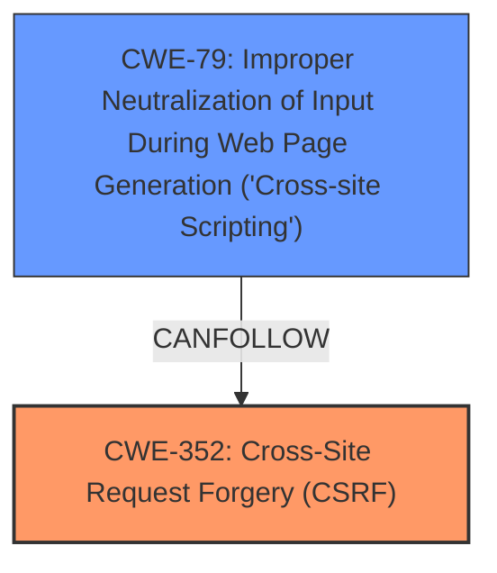

# Analysis for CVE-2025-46457

# Summary
| CWE ID | CWE Name | Confidence | CWE Abstraction Level | CWE Vulnerability Mapping Label | CWE-Vulnerability Mapping Notes |
|---|---|---|---|---|---|
| CWE-352 | Cross-Site Request Forgery (CSRF) | 1.0 | Compound | Primary | Allowed |
| CWE-79 | Improper Neutralization of Input During Web Page Generation ('Cross-site Scripting') | 1.0 | Base | Secondary | Allowed |

## Evidence and Confidence

*   **Confidence Score:** 1.0
*   **Evidence Strength:** HIGH

## Relationship Analysis
The primary weakness is CWE-352 [Cross-Site Request Forgery (CSRF)], which can lead to other vulnerabilities. In this instance, the CSRF vulnerability allows for Stored XSS (CWE-79 [Improper Neutralization of Input During Web Page Generation ('Cross-site Scripting')]). CWE-79 is a base level CWE, while CWE-352 is a compound CWE.

## Vulnerability Chain
The vulnerability chain starts with the **Cross-Site Request Forgery (CSRF)** vulnerability (CWE-352). A successful CSRF attack can then be leveraged to inject malicious scripts, resulting in Stored XSS (CWE-79 [Improper Neutralization of Input During Web Page Generation ('Cross-site Scripting')]).

## Summary of Analysis
The primary vulnerability is a **Cross-Site Request Forgery (CSRF)** (CWE-352). The **CSRF vulnerability** allows an attacker to force a user to perform actions they did not intend to, in this case, leading to stored XSS. The vulnerability description clearly states "Cross-Site Request Forgery (CSRF) vulnerability in digontoahsan Wp Custom CMS Block allows Stored XSS."

The retriever results listed CWE-79 [Improper Neutralization of Input During Web Page Generation ('Cross-site Scripting')] and CWE-352 [Cross-Site Request Forgery (CSRF)] as the top 2 matches. The graph relationships show that CWE-79 can follow CWE-352.

The selection of CWE-352 [Cross-Site Request Forgery (CSRF)] as the primary CWE is based on the fact that the CSRF vulnerability is the root cause that allows for the subsequent Stored XSS vulnerability. CWE-79 [Improper Neutralization of Input During Web Page Generation ('Cross-site Scripting')] is a secondary CWE, as it is a consequence of the CSRF vulnerability.

CWE-434 [Unrestricted Upload of File with Dangerous Type] and CWE-89 [Improper Neutralization of Special Elements used in an SQL Command ('SQL Injection')] were considered but not selected, as they do not directly relate to the described vulnerability.