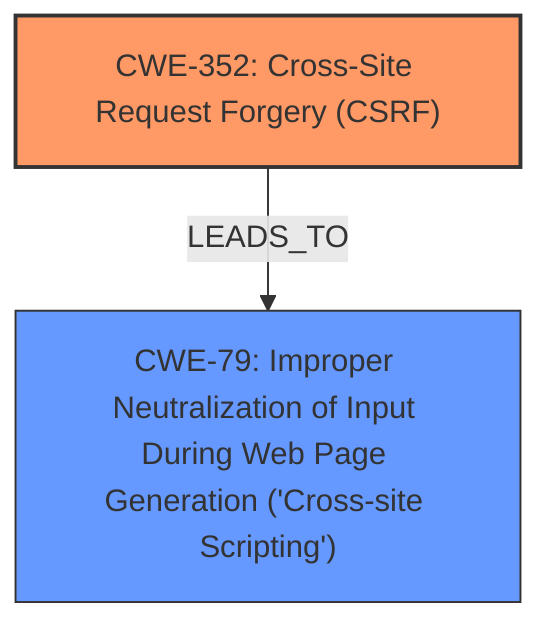

# Raw Analyzer Response for CVE-2025-46465

# Summary
| CWE ID | CWE Name | Confidence | CWE Abstraction Level | CWE Vulnerability Mapping Label | CWE-Vulnerability Mapping Notes |
|---|---|---|---|---|---|
| CWE-352 | Cross-Site Request Forgery (CSRF) | 1.0 | Compound | Primary | Allowed |
| CWE-79 | Improper Neutralization of Input During Web Page Generation ('Cross-site Scripting') | 1.0 | Base | Secondary | Allowed |

## Evidence and Confidence

*   **Confidence Score:** 1.0
*   **Evidence Strength:** HIGH

## Relationship Analysis
The primary weakness is identified as CWE-352 [Cross-Site Request Forgery (CSRF)], a compound weakness. The secondary weakness is identified as CWE-79 [Improper Neutralization of Input During Web Page Generation ('Cross-site Scripting')], a base weakness. The Retriever Results indicate that CWE-352 can lead to other weaknesses, including CWE-79, which accurately represents the described vulnerability. The relationship between CWE-352 and CWE-79 isn't directly defined in terms of parent-child or CanPrecede/CanFollow, but the vulnerability description clearly states that the **CSRF** leads to **Stored XSS**, making CWE-79 a consequence of the **CSRF** vulnerability.

## Vulnerability Chain
The vulnerability chain begins with the **lack of CSRF protection** (CWE-352), which allows an attacker to perform actions on behalf of an authenticated user. This leads to the injection of malicious code that is then stored and executed in the context of other users (CWE-79). The root cause is the **missing CSRF protection**, and the impact is **Stored XSS**.

## Summary of Analysis
The initial assessment focused on identifying the root cause and resulting weaknesses based on the provided vulnerability description and CVE details. The description clearly indicates a **Cross-Site Request Forgery (CSRF)** vulnerability leading to **Stored XSS**.

The evidence from the CVE Reference Links Content Summary strongly supports this analysis:
*   "The vulnerability is a Cross-Site Request Forgery (CSRF). The root cause is the **lack of proper CSRF protection** in the Print Science Designer plugin."
*   "Cross-Site Request Forgery (CSRF) - allowing malicious actors to execute unwanted actions on behalf of authenticated users."
*   "A malicious actor can force higher privileged users to execute unwanted actions under their current authentication."

These points confirm that CWE-352 [Cross-Site Request Forgery (CSRF)] is the primary vulnerability. The vulnerability description also highlights that this leads to **Stored XSS**, making CWE-79 [Improper Neutralization of Input During Web Page Generation ('Cross-site Scripting')] a secondary consequence.

The Retriever Results further support this, with CWE-79 and CWE-352 being the top candidates.

The selection of CWE-352 as primary and CWE-79 as secondary is based on the evidence that the **CSRF** vulnerability allows attackers to inject malicious scripts, which are then stored and executed, resulting in **XSS**. This accurately reflects the chain of events and the root cause of the vulnerability.

Other CWEs considered but not used:

*   CWE-89 [Improper Neutralization of Special Elements used in an SQL Command ('SQL Injection')]: While injection is involved, the specific type of injection is Cross-Site Scripting (XSS), making CWE-79 a more accurate fit.
*   CWE-601 [URL Redirection to Untrusted Site ('Open Redirect')]: This is not relevant as the vulnerability involves injecting and storing malicious scripts, not redirecting users to untrusted sites.
*   CWE-918 [Server-Side Request Forgery (SSRF)]: This is not relevant as the vulnerability is client-side, not server-side.
*   CWE-425 [Direct Request ('Forced Browsing')]: This is not the primary issue, as the core problem is the ability to perform actions on behalf of another user due to the **lack of CSRF protection**.