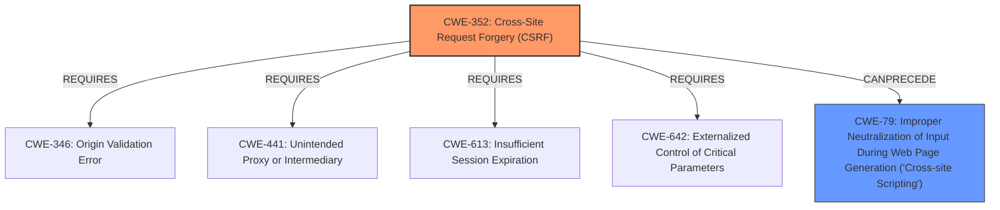

# Raw Analyzer Response for CVE-2025-46466

# Summary
| CWE ID | CWE Name | Confidence | CWE Abstraction Level | CWE Vulnerability Mapping Label | CWE-Vulnerability Mapping Notes |
|---|---|---|---|---|---|
| CWE-352 | Cross-Site Request Forgery (CSRF) | 1.0 | Compound | Primary | Allowed |
| CWE-79 | Improper Neutralization of Input During Web Page Generation ('Cross-site Scripting') | 1.0 | Base | Secondary | Allowed |

## Evidence and Confidence

*   **Confidence Score:** 1.0
*   **Evidence Strength:** HIGH

## Relationship Analysis
The primary weakness is identified as CWE-352 [Cross-Site Request Forgery (CSRF)], which can lead to other vulnerabilities. The vulnerability description also mentions Stored XSS. In the graph, CWE-352 [Cross-Site Request Forgery (CSRF)] has relationships that REQUIRE CWE-346 [Origin Validation Error], CWE-441 [Unintended Proxy or Intermediary], CWE-613 [Insufficient Session Expiration], and CWE-642 [Externalized Control of Critical Parameters]. The resulting XSS is best represented by CWE-79 [Improper Neutralization of Input During Web Page Generation ('Cross-site Scripting')].

## Vulnerability Chain
The vulnerability chain starts with **Cross-Site Request Forgery (CSRF)** (CWE-352), which allows an attacker to force a user to perform actions they did not intend to. In this case, the forced action leads to Stored XSS, where malicious scripts are injected into the web application (CWE-79).

## Summary of Analysis
The vulnerability is a **Cross-Site Request Forgery (CSRF)** (CWE-352) that allows for Stored XSS (CWE-79). The primary weakness is the **CSRF**, as it is the entry point for the attack. The **CSRF** allows an attacker to force a user to perform actions they did not intend, such as injecting malicious scripts into the web application. The evidence for this mapping is found in the "Vulnerability Description Key Phrases" section:
- **rootcause:** **Cross-Site Request Forgery**
- **weakness:** **Cross-Site Scripting**
- **impact:** Stored XSS

CWE-352 [Cross-Site Request Forgery (CSRF)] is a Compound CWE, while CWE-79 [Improper Neutralization of Input During Web Page Generation ('Cross-site Scripting')] is a Base CWE. Both are at appropriate levels of specificity.

CWEs considered but not used:
- CWE-89 [Improper Neutralization of Special Elements used in an SQL Command ('SQL Injection')]: Not selected because there is no indication of SQL injection in the vulnerability description.
- CWE-918 [Server-Side Request Forgery (SSRF)]: Not selected because there is no indication of Server-Side Request Forgery in the vulnerability description.
- CWE-601 [URL Redirection to Untrusted Site ('Open Redirect')]: Not selected because there is no indication of URL redirection in the vulnerability description.
- CWE-80 [Improper Neutralization of Script-Related HTML Tags in a Web Page (Basic XSS)]: Not selected because CWE-79 is more appropriate for stored XSS.
- CWE-95 [Improper Neutralization of Directives in Dynamically Evaluated Code ('Eval Injection')]: Not selected because there is no indication of Eval Injection in the vulnerability description.