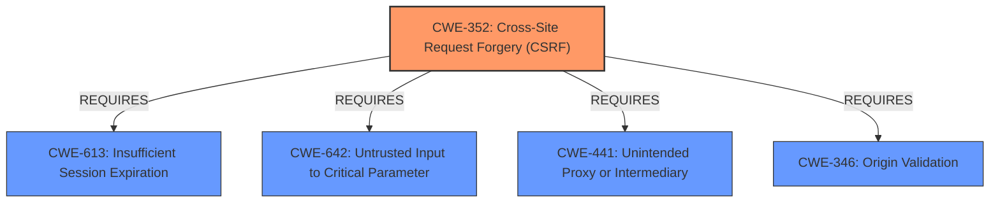

# Analysis for CVE-2025-46547

# Summary
| CWE ID | CWE Name | Confidence | CWE Abstraction Level | CWE Vulnerability Mapping Label | CWE-Vulnerability Mapping Notes |
|---|---|---|---|---|---|
| CWE-352 | Cross-Site Request Forgery (CSRF) | 1.0 | Compound | Primary | Allowed |

## Evidence and Confidence

*   **Confidence Score:** 1.0
*   **Evidence Strength:** HIGH

## Relationship Analysis
The primary CWE is CWE-352, which is a compound weakness. There are no direct parent-child or peer relationships that significantly influence the selection in this case. The CANFOLLOW relationship to CWE-1275 is not applicable given the information provided. The REQUIRES relationships (CWE-613, CWE-642, CWE-441, CWE-346) highlight conditions often needed for CSRF to be exploitable.

## Vulnerability Chain
The vulnerability chain starts with the **lack of CSRF protection**, which is the root cause. This **weakness** allows attackers to perform actions on behalf of legitimate users without their consent, potentially leading to XSS attacks, unauthorized user/role creation, or SQL injection vulnerabilities depending on the application's specific functionality and how it handles requests.

## Summary of Analysis
The vulnerability description explicitly states that the web application **lacks protection against CSRF attacks**. This aligns directly with CWE-352. The description also mentions potential impacts such as XSS, adding new users/roles, and SQL injection. These are consequences of a successful CSRF attack rather than root causes themselves.

The primary CWE selection is based on the direct statement in the vulnerability description. The retriever results also list CWE-352 as the top candidate.

CWE-352 is at the Compound level, which is appropriate given that CSRF inherently involves multiple factors and conditions.

Other CWEs were considered but not selected as primary because they represent potential consequences or contributing factors rather than the root cause:

*   CWE-79 (Improper Neutralization of Input During Web Page Generation ('Cross-site Scripting')): XSS is mentioned as a possible impact, but it's not the direct cause.
*   CWE-89 (Improper Neutralization of Special Elements used in an SQL Command ('SQL Injection')): SQL injection is also mentioned as a potential impact.
*   CWE-613 (Insufficient Session Expiration): This could be a contributing factor, but the main issue is the **lack of CSRF protection**.
*   CWE-434 (Unrestricted Upload of File with Dangerous Type): Not directly related to the described vulnerability.
*   CWE-601 (URL Redirection to Untrusted Site ('Open Redirect')): Not directly related to the described vulnerability.