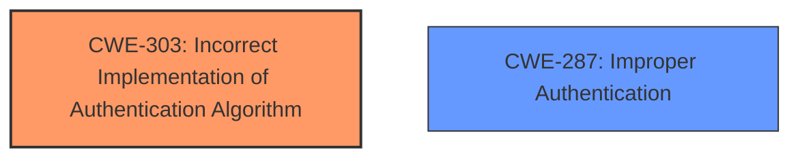

# Analysis Report for CVE-2025-46584

# Vulnerability Analysis Report: CVE-2025-46584

## Description

Vulnerability of **improper authentication logic implementation** in the file system module Impact Successful exploitation of this vulnerability may affect service confidentiality.

## Vulnerability Description Key Phrases

- **Rootcause:** improper authentication logic implementation
- **Impact:** affect service confidentiality
- **Component:** file system module

## Analysis (with Relationship Data)

# Summary
| CWE ID | CWE Name | Confidence | CWE Abstraction Level | CWE Vulnerability Mapping Label | CWE-Vulnerability Mapping Notes |
|---|---|---|---|---|---|
| CWE-303 | Incorrect Implementation of Authentication Algorithm | 0.9 | Base | Primary CWE | Allowed |
| CWE-287 | Improper Authentication | 0.5 | Class | Secondary Candidate | Discouraged |

## Evidence and Confidence

*   **Confidence Score:** 0.9
*   **Evidence Strength:** HIGH

## Relationship Analysis
The primary CWE is CWE-303 which is a Base level CWE. CWE-303 does not have any parent or child relationship with other CWEs except for peer relationships. CWE-287 is a Class level CWE, which is too high level. The relationships between the CWEs guided the selection of the most specific and appropriate CWE.



## Vulnerability Chain
The vulnerability chain starts with an **improper authentication logic implementation** (CWE-303), which leads to a potential impact on service confidentiality. The root cause is the **improper authentication logic implementation**.

## Summary of Analysis
The initial assessment identified CWE-303 as the primary weakness due to the **improper authentication logic implementation** described in the vulnerability. This is further supported by the CVE reference link content summary, which explicitly mentions the same **weakness**.

The retriever results also include CWE-303 with a high score from the dense retriever, further reinforcing this choice. Although CWE-287 "Improper Authentication" is listed, the description specifies the **implementation** of authentication logic, pointing to CWE-303 being a more precise fit.

The selected CWE is at the optimal level of specificity because it directly reflects the **root cause** described in the vulnerability description.

Relevant CWE Information:

# Enhanced Context (25 CWEs)
The following CWEs were identified as potentially relevant to this vulnerability:

## CWE-303: Incorrect Implementation of Authentication Algorithm
**Abstraction Level**: Base
**Similarity Score**: 0.75
**Source**: dense

**Description**:
The requirements for the product dictate the use of an established authentication algorithm, but the implementation of the algorithm is incorrect.

**Mapping Guidance**:
- Usage: Allowed
- Rationale: This CWE entry is at the Base level of abstraction, which is a preferred level of abstraction for mapping to the root causes of vulnerabilities.

**CWE-303** is the most appropriate because the vulnerability description specifically mentions "**improper authentication logic implementation**," indicating an error in how the authentication algorithm was implemented rather than a complete absence of authentication. The **rootcause** explicitly states the implementation is the problem. The description of CWE-303 fits this scenario perfectly.

## CWE-287: Improper Authentication
**Abstraction Level**: class
**Similarity Score**: 2.55
**Source**: graph

**Description**:
CWE-287: Improper Authentication

**Mapping Guidance**:
- Usage: Discouraged
- Rationale: This CWE entry might be misused when lower-level CWE entries are likely to be applicable. It is a level-1 Class (i.e., a child of a Pillar).

CWE-287 is a more general class of weakness, and since we have more specific information pointing towards an implementation issue, CWE-303 is preferred.


## CWE Relationship Analysis

Current CWEs represent these abstraction levels: .


### Vulnerability Chain Analysis

**Chain starting from CWE-287:**
- 287 (Improper Authentication) - ROOT


**Chain starting from CWE-303:**
- 303 (Incorrect Implementation of Authentication Algorithm) - ROOT


### CWE Relationship Diagram

```mermaid
graph TD
    classDef primary fill:#f96,stroke:#333,stroke-width:2px
    classDef secondary fill:#69f,stroke:#333
    classDef tertiary fill:#9e9,stroke:#333
```


*Report generated on 2025-07-15 01:25:42*
