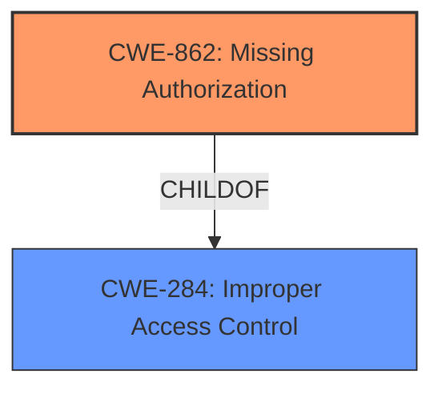

# Enhanced Analysis for CVE-2025-46586

# Summary
| CWE ID | CWE Name | Confidence | CWE Abstraction Level | CWE Vulnerability Mapping Label | CWE-Vulnerability Mapping Notes |
|---|---|---|---|---|---|
| CWE-862 | Missing Authorization | 0.8 | Class | Primary | Allowed-with-Review |
| CWE-284 | Improper Access Control | 0.6 | Pillar | Secondary | Discouraged |

## Evidence and Confidence

*   **Confidence Score:** 0.7
*   **Evidence Strength:** MEDIUM

## Relationship Analysis
The primary CWE is CWE-862, which is a child of CWE-284 (Improper Access Control). CWE-862 is more specific, focusing on the absence of an authorization mechanism, which aligns with the description of a **permission control vulnerability**. CWE-284 is a higher-level, more general weakness.



## Vulnerability Chain
The vulnerability chain starts with the **missing authorization** (**permission control vulnerability**), which then leads to the impact of affecting availability.

## Summary of Analysis
The initial assessment, based on the provided evidence, points towards a **permission control vulnerability**. The "Retriever Results" highlight CWE-862 (Missing Authorization) as a strong candidate. The vulnerability description key phrases identify a "**permission control vulnerability**". The CVE Reference Links Content Summary reinforces this by stating the vulnerability is a "Permission control vulnerability in the contacts module."

CWE-862 is preferred over its parent CWE-284 because CWE-862 is more specific. If there is no authorization, then access control is definitely improper, so the chain would start with **missing authorization**, and then access is improperly controlled.

Relevant CWE Information:

# Enhanced Context (25 CWEs)
The following CWEs were identified as potentially relevant to this vulnerability:

## CWE-862: Missing Authorization
**Abstraction Level**: Class
**Similarity Score**: 0.122
**Source**: sparse

**Description**:
The product does not perform any authorization checks when an actor attempts to access a resource or perform an action.

**Mapping Guidance**:
- Usage: Allowed-with-Review
- Rationale: This CWE entry is a Class and might have Base-level children that would be more appropriate

## CWE-284: Improper Access Control
**Abstraction Level**: Pillar
**Similarity Score**: 0.108
**Source**: sparse

**Description**:
The software does not properly control access to resources.

**Mapping Guidance**:
- Usage: Discouraged
- Rationale: This CWE is very general and is often misused as a catch-all when lower-level CWE IDs might be applicable. It is a level-0 Class (i.e., a child of a Pillar). It is not useful for trend analysis.


## CWE Relationship Analysis

Current CWEs represent these abstraction levels: .


### Vulnerability Chain Analysis

**Chain starting from CWE-284:**
- 284 (Improper Access Control) - ROOT


**Chain starting from CWE-862:**
- 862 (Missing Authorization) - ROOT


### CWE Relationship Diagram

```mermaid
graph TD
    classDef primary fill:#f96,stroke:#333,stroke-width:2px
    classDef secondary fill:#69f,stroke:#333
    classDef tertiary fill:#9e9,stroke:#333
```